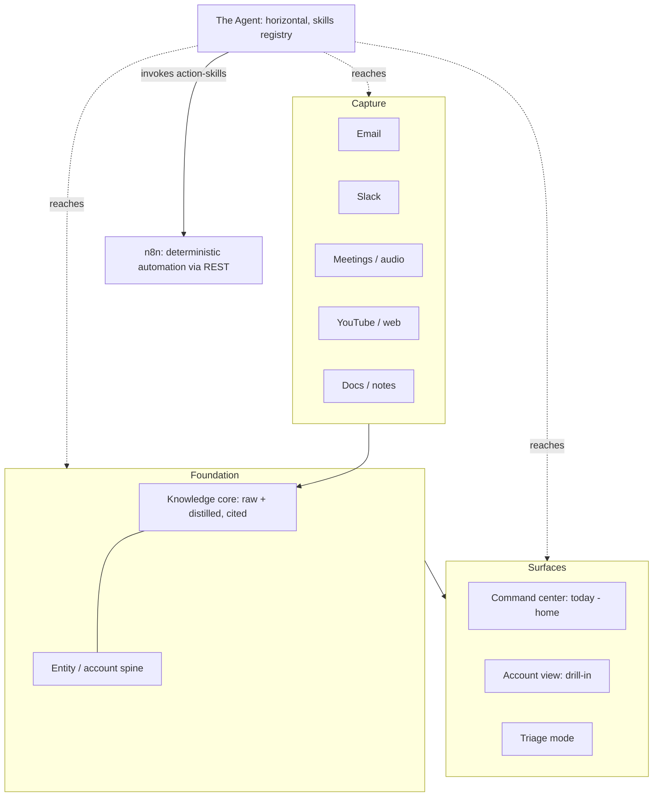

# FelixOS - Plan

## Goal Capsule

- **Objective:** Build FelixOS, a multi-tenant internal operating system for running a Philadelphia MSP — one congruent surface where an AI agent works across email, Slack, meetings, and ingested knowledge, eliminating the manual gluing of 5–6 tools.
- **Product authority:** Tony Myers (founder, operator, and tenant #1).
- **Open blockers:** None. All product decisions resolved; remaining technical choices are deferred to planning.

---

## Product Contract

### Summary

FelixOS is a multi-tenant internal OS for working *on* the MSP (never *in* it). The account/entity is the data spine, a command-center "today" view is home, and an AI agent is a horizontal layer powered by an extensible skills registry. The agent does the thinking; deterministic automation runs on self-hosted n8n. It doubles as the live proof-of-concept demoed to AI-nervous SMB prospects, with a seeded demo tenant that solves the demo-data problem and de-risks future productization.

### Problem Frame

The MSP is being stood up now, at a moment when SMBs are anxious about AI and unsure what to do. The founder has the IT/support background to serve them, but the real friction in running the business is operational: a single prospect or client's reality is smeared across email, Slack, meeting notes, documents, and a pipeline, and pulling it into one coherent picture is constant manual work. Off-the-shelf tools each own a slice and none unify it. The near-term business goal is to package and sell an "AI done right" offering — so the tool that runs the business must also *be* the proof that the offering works, demoable to a skeptical buyer.

### Key Decisions

- **Command-center home, account as the true data spine.** A "today" operator view is the daily landing surface, but every piece of data attaches to an account/entity. Daily focus without fragmenting the data model.
- **Layered knowledge core (raw + distilled, cited) over passive search.** Raw sources are retained and the agent distills durable facts on top, each traceable to its source. The agent cites rather than hallucinates — the difference between "AI that knows your business" and a chatbot — at the cost of more to build.
- **Per-skill autonomy trust ladder over a global dial.** Risk isn't uniform (filing an email vs. sending one), so autonomy is set per skill and earned over time. "The AI earns its autonomy" is itself part of the pitch to nervous buyers.
- **Multi-tenant from day one.** Tony is tenant #1; a seeded demo tenant powers sales and the future site; customers become additional tenants. Solves demo-data exposure, de-risks selling, and avoids the brutal cost of retrofitting tenancy. This work serves Tony's operation, not most customers — a sold instance is normally a single tenant.
- **LLM thinks, n8n executes.** Inference is used only where judgment is required; deterministic automation runs on n8n. Keeps inference cost and the agent's tool context lean.
- **Skills registry as the universal extension seam.** Both the existing YouTube-ingestion skill and n8n workflows are "just skills." Adding a capability is registering a skill, not rebuilding a layer.
- **REST for n8n, not MCP.** Direct same-VPS REST powers a real management surface (read executions and failures, not just trigger) and keeps the agent's context surface small.

### Architecture (layered)

All of the above is scoped within a tenant; tenant isolation wraps every layer.

### Actors

- A1. Tony — operator and tenant #1; runs the MSP from FelixOS and demos it to prospects.
- A2. The Agent — horizontal AI capability that reads the foundation, acts on captured input, and renders into the surfaces.
- A3. Prospects / SMB clients — subjects in the CRM and audience for demos (indirect users).
- A4. n8n — self-hosted deterministic automation engine, invoked and managed by FelixOS.
- A5. Future customers — additional tenants; customer-facing provisioning is deferred.

### Requirements

**Foundation and multi-tenancy**

- R1. FelixOS is multi-tenant from the ground up; every entity, knowledge item, agent memory, and n8n workflow association is scoped to a tenant. Tony's MSP is tenant #1 and a seeded demo tenant exists alongside it.
- R2. Tenant isolation is enforced on every layer (entity spine, knowledge core, agent retrieval and memory, n8n scoping, auth) with no cross-tenant data access.
- R3. The demo tenant is seeded with fictional companies, contacts, and activity sufficient to demonstrate every surface and agent capability.
- R4. All tenants authenticate via passwordless TOTP — a per-tenant secret is provisioned when the tenant is created, the time-based code is the sole login factor, and there are no username/password credentials and no password resets. Recovery is by re-issuing the tenant's secret, with backup recovery codes issued at provisioning to prevent lockout.
- R5. A purchased single-tenant instance ships with the demo tenant's data present but dormant — explorable, clearly marked, and non-interfering with the customer's live data.

**Entity / account spine**

- R6. The account/entity (a client or prospect) is the canonical record; contacts, deal stage, interactions, tasks, notes, and knowledge all attach to an account.
- R7. Prospects and clients are one entity type on a lifecycle continuum, not separate models.

**Knowledge core**

- R8. The knowledge core retains raw ingested source and stores agent-distilled items (facts, decisions with rationale, action items, summaries) layered on top.
- R9. Each distilled item is tagged with its source and the entity or global scope it concerns, and remains traceable back to the raw source.
- R10. Knowledge is organized into entity-scoped memory and global business-wide memory (SOPs/playbooks, the offering, the founder's own decisions, external insights).
- R11. Agent retrieval returns grounded answers cited back to the underlying source.
- R12. Distilled facts are correctable: Tony can edit, reject, or confirm a distilled item, and corrections propagate to future retrieval.

**Capture**

- R13. Capture-skills bring external content into the knowledge core: email, Slack, meeting/audio transcription, YouTube/web ingestion (the existing YouTube skill registers here), and manual doc/note drop-in.

**Agent and skills registry**

- R14. The agent is a horizontal capability reaching every layer — it reads the foundation, acts on captured input, and renders into the surfaces.
- R15. Agent capabilities form a registry of skills with a consistent seam: each skill registers, describes itself to the agent, is invoked uniformly, and routes its results; adding a capability is registering a skill, not modifying a layer.
- R16. Every skill is either a capture-skill (pulls knowledge in) or an action-skill (does work out: draft/send email, create task, schedule, update a record).
- R17. Each skill sits on a per-skill autonomy trust ladder — suggest, draft-and-wait, act-and-log, full-auto — defaulting conservative, with Tony able to promote a skill up the ladder.
- R18. LLM inference is used only where judgment is required; the agent orchestrates and n8n executes deterministic work.

**n8n integration**

- R19. FelixOS integrates the self-hosted n8n instance over its REST API on the same VPS.
- R20. FelixOS provides an n8n management surface showing workflows, active/inactive state, recent executions, and failures.
- R21. n8n workflows are invokable as action-skills on the same trust ladder, and a failed execution surfaces as a "needs you" item linking directly to the failed run.

**Surfaces**

- R22. The command-center "today" view is home, showing what needs Tony, agent-drafted actions awaiting approval (with citations), what the agent already did under act-and-log, today's meetings with prep, and freshly distilled knowledge.
- R23. The account view is the drill-in: one congruent screen pulling an account's email, Slack, notes, meetings, tasks, knowledge, and deal stage.
- R24. Triage is a mode — an agent-ranked queue of incoming work across channels.
- R25. Direct-action principle: any actionable item anywhere links in one click to the exact object (specific email, Slack message, task, failed workflow) in its context — never org → person → thread navigation.

### Key Flows

- F1. Morning command-center triage
  - **Trigger:** Tony opens FelixOS for the day.
  - **Actors:** A1, A2
  - **Steps:** Agent ranks what needs him, presents draft-and-wait actions with citations, logs overnight act-and-log work, surfaces meetings with prep and new distilled knowledge; each item is one click to its source.
  - **Covered by:** R11, R17, R22, R25

- F2. Capture → distill → memory
  - **Trigger:** New content arrives or is ingested (email, Slack, transcript, YouTube, doc).
  - **Actors:** A2
  - **Steps:** A capture-skill lands raw source in the knowledge core; the agent distills facts/decisions/action items, tags them with source and entity/global scope, and links them back to raw.
  - **Covered by:** R8, R9, R10, R13

- F3. Agent drafts an outbound action
  - **Trigger:** An incoming item needs a reply or follow-up.
  - **Actors:** A1, A2
  - **Steps:** A draft-and-wait skill prepares the action grounded in cited knowledge; Tony approves, edits, or dismisses; on approval the action-skill executes.
  - **Covered by:** R11, R16, R17

- F4. Sales demo via the demo tenant
  - **Trigger:** Tony shows FelixOS to a prospect (or the future site loads demo data).
  - **Actors:** A1, A3
  - **Steps:** TOTP-only login opens the demo tenant; seeded data exercises every surface and capability with no exposure of real client data.
  - **Covered by:** R3, R4, R2

- F5. n8n workflow as a skill
  - **Trigger:** The agent needs deterministic automation, or a workflow runs on its own.
  - **Actors:** A2, A4
  - **Steps:** The agent invokes a registered n8n workflow over REST; the management surface tracks executions; a failure becomes a one-click "needs you" item.
  - **Covered by:** R18, R19, R20, R21, R25

### Acceptance Examples

- AE1. **Covers R17.** Given a skill on the draft-and-wait rung, when the agent prepares an outbound email, then it appears in the command center for approval and is not sent until Tony approves.
- AE2. **Covers R12.** Given a distilled fact Tony rejects, when the agent next retrieves for a related query, then the rejected fact is excluded from the grounded answer.
- AE3. **Covers R2, R4.** Given demo-tenant TOTP login, when a viewer browses any surface, then only seeded demo data is visible and no real-tenant data is reachable.
- AE4. **Covers R5.** Given a purchased single-tenant instance, when the customer first logs in, then demo data is present, clearly marked dormant, and does not mix with their live records.
- AE5. **Covers R21, R25.** Given an n8n workflow execution fails, when Tony opens the command center, then a "needs you" item links directly to the failed run.

### Scope Boundaries

**Deferred for later**

- The storefront: billing, self-serve signup, customer-facing tenant provisioning, and per-customer customization.
- The public marketing website (will reuse demo-tenant data once built).

**Outside this product's identity**

- Working *in* the business: client-facing service delivery and end-user IT/MSP ticketing for clients' staff. FelixOS is exclusively for working *on* the business.
- Becoming a generic, breadth-first CRM. The agent and knowledge core are the point; CRM structure exists to serve them, not to compete on feature count.

### Dependencies / Assumptions

- Self-hosted n8n runs on the same VPS as the backend with its REST API reachable.
- The existing YouTube-ingestion skill is available to register as a capture-skill.
- Email and Slack accounts are accessible for capture.
- LLM inference is available for distillation and the agent.
- Assumption: distillation quality is good enough that correction is occasional rather than constant.

### Outstanding Questions

**Deferred to Planning**

- Tech stack: framework, database, and vector/retrieval store.
- Distillation mechanism: extraction pipeline and embedding/retrieval approach.
- Auth implementation for real tenants (and how TOTP-only demo auth coexists).
- The skills-registry technical contract: registration schema, self-description, invocation protocol, result routing.
- How tenant isolation is enforced technically (row-level scoping, schema-per-tenant, or separate databases).
- Meeting/audio transcription provider.
- Demo-data seeding mechanism and the precise semantics of "dormant" demo data in a sold instance.
