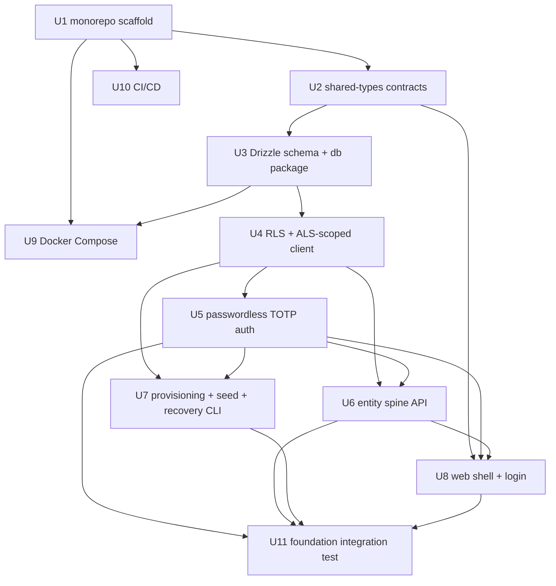

# FelixOS Foundation Phase - Plan

**Target repo:** FelixOS (greenfield). All paths are repo-relative to the FelixOS root.

Architecture record: `docs/plans/2026-06-29-001-feat-felixos-architecture-approach-plan.md` — read it before working any unit here. Product requirements: `docs/plans/2026-06-28-001-feat-felixos-internal-os-plan.md`.

**Product Contract preservation:** The requirements plan's R4 was updated this cycle from demo-only TOTP to passwordless TOTP for all tenants; this plan carries that current R4 with no further change. Per-tenant inference provider choice was added upstream as product-facing but is out of scope for this phase. All other requirements carried unchanged.

---

## Goal Capsule

- **Objective:** Build the Foundation phase of FelixOS — the monorepo, multi-tenant data layer with enforced isolation, passwordless auth, entity spine, seeded demo tenant, shared contracts, and CI — so every later phase (knowledge core, agent, n8n, surfaces) has a stable, collision-safe base.
- **Product authority:** Tony Myers (operator, tenant #1).
- **Execution profile:** Horizontal build via parallel GitHub issues; multiple agents may work different units concurrently. Contracts-first units are dependency-zero and must land before dependent units start.
- **Stop conditions:** Stop and surface if a frozen contract (shared types, DB schema, RLS/isolation strategy) would need to change after dependent work has begun, or if any cross-tenant isolation check fails.
- **Tail ownership:** Each unit lands as its own PR against its issue, gated by CI; the phase closes only when the Foundation integration test (U11) — including the isolation gate — is green.

---

## Product Contract

### Summary

Stand up the FelixOS foundation: a Turborepo TypeScript monorepo on Postgres 18 + pgvector with Drizzle, multi-tenant from the first row via Postgres RLS, passwordless TOTP auth for all tenants, the account/entity spine, a seeded demo tenant, and CI gates. This phase builds no knowledge core, agent, n8n integration, or product surfaces — it builds the ground they stand on.

### Problem Frame

FelixOS is a multi-tenant platform built by a solo founder coordinating multiple AI coding agents. Two facts drive this phase. First, tenant isolation and the shared data/type contracts are load-bearing for everything above them and expensive to retrofit, so they come first and are enforced at the database layer, not just in app code. Second, because parallel agents build different units, the contracts those units share must be frozen before dependent work begins — otherwise concurrent work collides.

### Requirements

Foundation-relevant requirements, carried from the requirements plan with original R-IDs preserved.

**Tenancy and isolation**

- R1. FelixOS is multi-tenant from the ground up; every table carries a `tenant_id`, and the operator's tenant plus a seeded demo tenant exist side by side.
- R2. Tenant isolation is enforced at the database layer so no query can read across tenants even if app code omits a filter.
- R3. The demo tenant is seeded with fictional companies, contacts, and activity sufficient to exercise the entity spine.
- R5. A single-tenant deployment ships with the demo tenant present but dormant — clearly marked and non-interfering with live data.

**Authentication**

- R4. All tenants authenticate via passwordless TOTP — a per-tenant secret provisioned at tenant creation, the time-based code as the sole factor, no username/password and no password resets, with backup recovery codes issued at provisioning and total-lockout recovery via an operator CLI.

**Entity spine**

- R6. The account/entity (client or prospect) is the canonical record; contacts, deal stage, and interactions attach to an account.
- R7. Prospects and clients are one entity type on a lifecycle continuum, not separate models.

### Scope Boundaries

**In scope (this phase):** monorepo + tooling, Postgres/pgvector/Drizzle data layer, RLS isolation, passwordless TOTP auth, tenant provisioning + demo seed + operator recovery CLI, entity spine data + API, a thin authenticated web shell, Docker Compose, CI.

**Deferred to later phases (own plans):** knowledge core and pgvector knowledge tables (Phase 2); agent, skills registry, provider abstraction, trust ladder (Phase 3); n8n integration (Phase 4); command-center/account/triage surfaces (Phase 5).

**Outside this product's identity:** client-facing tenant provisioning/billing UI, per-user accounts within a tenant (this phase is tenant-level identity), and the client-facing inference-provider selection UI — all storefront, deferred.

---

## Planning Contract

### Key Technical Decisions

- KTD1. Passwordless tenant-level TOTP. Tenant is resolved by subdomain/slug, then the current code is validated against that tenant's secret; the code is the sole factor. No passwords, no resets. Recovery has two tiers: single-use backup codes (issued at provisioning), and for total lockout (device + codes lost) an operator CLI run with direct DB access re-issues the secret + codes out-of-band. Rationale: removes all credential/reset management; the CLI keeps the recovery path off the network.
- KTD2. Isolation is defense-in-depth and correct-by-construction. Drizzle expresses tenant-scoped queries; Postgres RLS enforces them. Three correctness rules the implementer must honor: (a) tenant-scoped tables use `FORCE ROW LEVEL SECURITY` and the app connects as a non-owner, non-`BYPASSRLS` role (owner/BYPASSRLS roles silently skip RLS); (b) the per-request `tenant_id` is carried in `AsyncLocalStorage` and applied as `SET LOCAL app.current_tenant` inside an explicit transaction per query, so a pooled connection can never carry a stale GUC; (c) a separate privileged `BYPASSRLS` role is used only by migrations, provisioning, seed, and the recovery CLI, guarded by a CI/lint check that no app route imports the privileged client. `tenants` and `sessions` get a defined system-path read for pre-auth tenant resolution and session validation. Rationale: app-layer scoping slips under parallel development; these three rules close the three classic silent-leak modes (stale GUC, owner-bypass, pre-auth read).
- KTD3. Tenant-level identity for this phase — no per-user accounts within a tenant. Deferred. Rationale: matches the passwordless model and solo-operator reality.
- KTD4. pgvector is enabled in Foundation (extension + DB readiness) but knowledge/embedding tables are not created here — Phase 2. Rationale: lay DB groundwork without committing knowledge-core schema early.
- KTD5. Contracts-first decomposition. `packages/shared-types`, the Drizzle schema, and the RLS strategy are dependency-zero; dependents build against them once frozen. A *minimal* `SkillDescriptor` placeholder (`{ name: string }`) is stubbed so Phase 3 introduces no new top-level type — the trust/side-effect fields are added in Phase 3, not frozen now. Rationale: freeze only what Foundation can justify; frozen contracts make concurrent work collision-safe.
- KTD6. Turborepo monorepo with `apps/*` and `packages/*`, pnpm workspaces. Collapsible later. Rationale: cheap greenfield; keeps cross-package types coherent.
- KTD7. Tests are checkpoint gates, not test-first: each unit ships a passing test gate as its completion criterion; the phase ships one integration test (U11). CI enforces both. Rationale: matches the operator's per-issue/per-phase verification model and gives multi-agent PRs an objective gate.
- KTD8. Runtime and transport. `apps/api` is Node.js + TypeScript (Fastify as the HTTP layer) using `AsyncLocalStorage` for request-scoped context (tenant, session). `apps/web` (Next.js) reaches `apps/api` via a **same-origin proxy** fronted by Cloudflare — no cross-origin CORS. Session cookies are `HttpOnly` + `Secure` + `SameSite`. Rationale: same-origin removes the CORS/cookie ambiguity; ALS is the clean carrier for the RLS tenant context in KTD2.
- KTD9. Auth controls split edge + app. Brute-force is handled at the edge: a Cloudflare rate-limit rule of 20 requests/minute on the login/code-submission path. App-level adds what the edge can't: single-use enforcement on an accepted TOTP code within its window (replay protection), session-ID regeneration on login, high-entropy single-use recovery codes with a defined exhaustion path (operator CLI), and uniform pre-auth responses for valid vs invalid tenant slugs (no enumeration). TOTP secrets are encrypted at rest with an app-managed key sourced from env outside version control, so a DB-only dump does not yield secrets.

### High-Level Technical Design

Unit dependency graph (drives parallel issue assignment — units with no inbound arrows can start immediately):



Login flow (TOTP-only; edge rate-limited; tenant context via ALS + `SET LOCAL`):

```mermaid
sequenceDiagram
  participant U as User
  participant CF as Cloudflare (rate limit 20/min, same-origin)
  participant W as Web (Next.js)
  participant A as API (Fastify + ALS)
  participant DB as Postgres (RLS)
  U->>CF: visit tenant subdomain/slug
  CF->>W: proxied (same-origin)
  W->>A: resolve tenant by slug (system-path read; uniform response)
  U->>CF: submit current TOTP code (or recovery code)
  CF->>A: forwarded (rate-limited at edge)
  A->>A: validate code vs tenant secret (RFC 6238); reject if already used in-window
  A->>A: regenerate session id; set ALS tenant context
  A->>W: issue tenant-bound HttpOnly+Secure+SameSite session
  W->>A: subsequent requests (same-origin cookie)
  A->>DB: BEGIN; SET LOCAL app.current_tenant = <ALS>; query; COMMIT (RLS enforces)
```

### Output Structure

```text
felixos/
  package.json
  pnpm-workspace.yaml
  turbo.json
  tsconfig.base.json
  docker-compose.yml
  .github/workflows/ci.yml
  apps/
    web/                 # Next.js UI shell + TOTP login (same-origin proxy to api)
    api/                 # Fastify + AsyncLocalStorage: middleware, entity + auth routes
    cli/                 # operator CLI: re-issue tenant secret + recovery codes (privileged role)
  packages/
    shared-types/        # tenant, entities, auth/session, api result, minimal SkillDescriptor stub
    db/                  # Drizzle schema, ALS-scoped + privileged clients, RLS policies, migrations, seed
    auth/                # TOTP, sessions, provisioning, recovery codes
```

The tree is a scope declaration; per-unit `Files` are authoritative. (The `integrations` package is created in Phase 4 when n8n first consumes it — not here.)

---

## Implementation Units

### Unit Index

| U-ID | Title | Key files | Depends on |
|---|---|---|---|
| U1 | Monorepo scaffold + tooling | `package.json`, `turbo.json`, `pnpm-workspace.yaml`, `tsconfig.base.json` | — |
| U2 | Shared contracts package | `packages/shared-types/src/*` | U1 |
| U3 | Drizzle schema + db package | `packages/db/src/schema/*`, `drizzle.config.ts` | U2 |
| U4 | RLS + ALS-scoped client | `packages/db/src/rls.ts`, `client.ts`, `context.ts` | U3 |
| U5 | Passwordless TOTP auth | `packages/auth/src/*` | U2, U4 |
| U6 | Entity spine API (Fastify) | `apps/api/src/routes/*`, `apps/api/src/middleware/*` | U4, U5 |
| U7 | Provisioning + demo seed + recovery CLI | `packages/auth/src/provision.ts`, `packages/db/src/seed.ts`, `apps/cli/src/*` | U4, U5 |
| U8 | Web shell + TOTP login | `apps/web/app/*` | U2, U5, U6 |
| U9 | Docker Compose (app + Postgres/pgvector) | `docker-compose.yml`, `apps/*/Dockerfile` | U1, U3 |
| U10 | CI/CD gates | `.github/workflows/ci.yml` | U1 |
| U11 | Foundation integration test | `tests/integration/foundation.test.ts` | U5, U6, U7, U8 |

### U1. Monorepo scaffold and tooling

- **Goal:** Stand up the Turborepo workspace with shared TS/lint/format config and empty app/package skeletons.
- **Requirements:** Enables all.
- **Dependencies:** none.
- **Files:** `package.json`, `pnpm-workspace.yaml`, `turbo.json`, `tsconfig.base.json`, `.eslintrc.cjs`, `.prettierrc`, `apps/{web,api,cli}/package.json`, `packages/{shared-types,db,auth}/package.json`.
- **Approach:** pnpm workspaces + Turborepo pipeline (`build`, `lint`, `typecheck`, `test`). Base `tsconfig` extended per package. Path aliases so packages import `@felixos/shared-types` etc.
- **Test scenarios:** Test expectation: none — scaffolding. Verified by `turbo run typecheck build` on empty packages.
- **Verification:** `turbo run build lint typecheck` passes across the empty workspace.

### U2. Shared contracts package

- **Goal:** Define the frozen TypeScript contracts every later unit and phase imports.
- **Requirements:** R1, R6, R7; enables KTD5.
- **Dependencies:** U1.
- **Files:** `packages/shared-types/src/{tenant,entities,auth,api,skills,index}.ts`.
- **Approach:** Types for tenant + tenant status (active/dormant), the entity (account/prospect with lifecycle stage — one type per R7), contact, deal, interaction; session/auth payloads; a standard API result/error envelope; a *minimal* `SkillDescriptor` (`{ name: string }`) stub Phase 3 extends. Pure types — no runtime, no imports from app packages.
- **Test scenarios:** Test expectation: none — type declarations; proven by dependents compiling.
- **Verification:** `turbo run typecheck` passes; downstream packages import without error.

### U3. Drizzle schema and db package

- **Goal:** Model the tenant, entity spine, and auth/session tables in Drizzle, with pgvector enabled and secret storage shaped for encryption-at-rest.
- **Requirements:** R1, R6, R7.
- **Dependencies:** U2.
- **Files:** `packages/db/src/schema/{tenants,entities,contacts,deals,interactions,sessions,auth}.ts`, `packages/db/src/index.ts`, `drizzle.config.ts`, `packages/db/migrations/*`.
- **Approach:** Every table carries a non-null `tenant_id` FK to `tenants`. The entity table holds the prospect→client lifecycle stage (R7). The TOTP-secret store uses an encryption-ready column shape (`ciphertext`, `nonce`, `key_id`) so KTD9's deferred key handling cannot force a post-freeze schema change. Recovery codes stored hashed. Enable the `vector` extension in the initial migration (no knowledge tables — KTD4).
- **Test scenarios:**
  - Happy path: migration applies cleanly to fresh Postgres 18 + pgvector.
  - Edge: a row without `tenant_id` is rejected by the constraint.
  - Integration: `vector` extension present after migration; secret columns exist as ciphertext/nonce/key_id.
- **Verification:** migrations apply to a fresh DB; schema matches `shared-types`; `turbo run typecheck` passes.

### U4. RLS and ALS-scoped client

- **Goal:** Make cross-tenant access structurally impossible via Postgres RLS, with an AsyncLocalStorage-driven client that applies tenant context per transaction, plus a guarded privileged client.
- **Requirements:** R2.
- **Dependencies:** U3.
- **Files:** `packages/db/src/{rls.ts,client.ts,context.ts}`, `packages/db/migrations/*` (RLS policies).
- **Approach:** Enable RLS **and `FORCE ROW LEVEL SECURITY`** on every tenant-scoped table; policies filter on `current_setting('app.current_tenant')`. The app connects as a dedicated non-owner, non-`BYPASSRLS` role. `context.ts` exposes an ALS store holding the request's `tenant_id`; the scoped client opens an explicit transaction and runs `SET LOCAL app.current_tenant = <ALS value>` before each query, so a reused pooled connection can never carry a stale GUC. A separate privileged client (distinct `BYPASSRLS` role) is exported only for migrations/provisioning/seed/recovery-CLI; a lint/CI guard forbids its import from `apps/api/src/routes` and `middleware`. `tenants` and `sessions` expose a defined system-path read for pre-auth resolution.
- **Execution note:** Characterize isolation with failing cross-tenant tests first — this is the security-critical unit; its scoped-client interface plus its isolation tests must be green before U5–U8 begin.
- **Test scenarios:**
  - Covers R2. Happy path: with tenant A in ALS, queries return only tenant A rows.
  - Edge: with no ALS context, tenant-scoped tables return zero rows (deny by default).
  - Security: a query for tenant A while tenant B data exists returns nothing for B — against real Postgres.
  - Security (stale GUC): a tenant-A query then a tenant-B query on a reused pooled connection shows no leakage from a stale `SET LOCAL`.
  - Security (owner bypass): the app role cannot read cross-tenant even though it is not the table owner (FORCE RLS holds).
  - Security (write path): INSERT/UPDATE/DELETE policies prevent writing another tenant's rows.
- **Verification:** all isolation tests pass against real Postgres; the privileged-client import guard fails CI if violated.

### U5. Passwordless TOTP auth

- **Goal:** Provision per-tenant TOTP secrets and authenticate by code only, with replay protection, hardened sessions, and recovery codes.
- **Requirements:** R4.
- **Dependencies:** U2, U4.
- **Files:** `packages/auth/src/{totp,session,recovery,index}.ts`.
- **Approach:** RFC 6238 TOTP. Per-tenant secret generated at provisioning (U7), encrypted at rest per KTD9. Login: tenant resolved upstream → validate the current code within a small skew window → **reject a code already accepted within its window** (single-use replay guard) → regenerate the session ID → issue a tenant-bound `HttpOnly`+`Secure`+`SameSite` session with a bounded TTL. Generate a fixed count of high-entropy (≥128-bit) single-use backup codes (hashed); consuming one logs in. Edge brute-force throttling is Cloudflare's 20/min rule (KTD9), not re-implemented here. No passwords.
- **Execution note:** Implement code validation, replay rejection, and recovery-code consumption test-first.
- **Test scenarios:**
  - Covers R4. Happy path: a valid current code authenticates and issues a session.
  - Edge: an adjacent-window code within skew is accepted; outside it is rejected.
  - Security (replay): the same code cannot authenticate twice within its window.
  - Security (session): a new session ID is issued on login; cookie flags are set.
  - Recovery: a valid backup code authenticates and is single-use (second use fails).
  - Security: a code valid for tenant A does not authenticate tenant B.
- **Verification:** auth tests pass; sessions bind the correct `tenant_id`.

### U6. Entity spine API (Fastify)

- **Goal:** Tenant-scoped, auth-gated CRUD for accounts, contacts, deals, and interactions on Fastify, with ALS-driven tenant context.
- **Requirements:** R6, R7, R2.
- **Dependencies:** U4, U5.
- **Files:** `apps/api/src/server.ts`, `apps/api/src/routes/{entities,contacts,deals,interactions}.ts`, `apps/api/src/middleware/{auth,tenant}.ts`.
- **Approach:** Fastify server. Auth middleware validates the session and resolves `tenant_id`; tenant middleware seeds the ALS store with that `tenant_id` so the scoped client picks it up. Routes use the scoped client only (the privileged client is import-guarded out, per U4). Accounts carry the prospect→client lifecycle stage (R7); contacts/deals/interactions reference an account.
- **Test scenarios:**
  - Covers R6. Happy path: create an account, attach a contact, list both — tenant-scoped.
  - Happy path: advance an account along the prospect→client lifecycle (R7).
  - Edge: requesting another tenant's account ID returns not-found (RLS yields nothing).
  - Error: an unauthenticated request is rejected before any query.
  - Security: no query executes before auth+tenant middleware seed ALS (a handler reached without context hits deny-by-default, not another tenant's data).
- **Verification:** API tests pass; no route reaches data outside its session's tenant.

### U7. Provisioning, demo seed, and recovery CLI

- **Goal:** Create tenants (issuing TOTP secret + recovery codes), seed a dormant-capable demo tenant, and provide the operator lockout-recovery CLI.
- **Requirements:** R1, R3, R5, R4.
- **Dependencies:** U4, U5.
- **Files:** `packages/auth/src/provision.ts`, `packages/db/src/{seed.ts,seed-data/demo.ts}`, `apps/cli/src/reissue.ts`.
- **Approach:** Provisioning (privileged client) creates a tenant, generates and stores the encrypted secret + hashed recovery codes, and returns the enrollment payload (secret/QR + codes) **exactly once over TLS, never written to logs/stdout in production**. The demo seed creates a demo-flagged tenant with fictional accounts/contacts/deals/interactions across lifecycle stages; a `dormant` flag marks it inert for single-tenant deployments (R5) while still explorable; the seed is idempotent. The recovery CLI (`apps/cli`) runs with the privileged role and direct DB access to re-issue a tenant's secret + recovery codes out-of-band — the total-lockout backstop (KTD1); it never exposes a network endpoint.
- **Test scenarios:**
  - Covers R3. Happy path: seeding produces a demo tenant with expected fictional data.
  - Covers R5. Edge: a dormant tenant is readable but excluded from active workflows and never mixes with another tenant's data.
  - Covers R4. Integration: a freshly provisioned tenant authenticates with a code generated from its secret; recovery codes work.
  - Security: provisioning does not log the secret or recovery codes.
  - Recovery: the CLI re-issues a secret for a locked-out tenant; old secret + old codes stop working, new ones work.
  - Edge: re-running the seed is idempotent.
- **Verification:** provisioning, seed, and recovery CLI run cleanly; a re-issued tenant can authenticate with the new secret.

### U8. Web shell and TOTP login

- **Goal:** A minimal authenticated Next.js shell with tenant resolution, same-origin API proxy, and a TOTP login screen.
- **Requirements:** R4, R6.
- **Dependencies:** U2, U5, U6.
- **Files:** `apps/web/app/{layout.tsx,login/page.tsx,(app)/page.tsx}`, `apps/web/lib/api.ts`, `apps/web/middleware.ts`.
- **Approach:** Resolve tenant by subdomain/slug in middleware (uniform response for valid vs invalid slugs — no enumeration). The login screen takes the TOTP code (with a recovery-code path) and establishes a session. `apps/web` reaches `apps/api` via a same-origin proxy (Cloudflare-fronted), so the session cookie is same-origin. An authenticated placeholder shell lists the tenant's accounts via the entity API to prove the stack end-to-end. Styling is minimal — surfaces are Phase 5.
- **Test scenarios:**
  - Covers R4. Happy path: a valid code logs in and lands on the authenticated shell.
  - Edge: an invalid code shows an error and establishes no session.
  - Security: valid and invalid tenant slugs return indistinguishable pre-auth responses.
  - Integration: the shell renders accounts fetched from the entity API for the resolved tenant only.
- **Verification:** login works against the running API; the shell shows tenant-scoped accounts.

### U9. Docker Compose

- **Goal:** One-command local/VPS bring-up of web + api + Postgres 18/pgvector, alongside existing n8n, with a single migration owner.
- **Requirements:** Enables R1–R7 operationally.
- **Dependencies:** U1, U3.
- **Files:** `docker-compose.yml`, `apps/{web,api}/Dockerfile`, `.env.example`.
- **Approach:** Services for `web`, `api`, and `postgres` (named pgvector-enabled image pinned to Postgres 18, e.g. `pgvector/pgvector:pg18`). A single one-shot `migrate` init service owns schema + RLS-policy migrations and completes before web/api accept traffic and before seed runs — no migrate-on-startup race. n8n is referenced as the existing external container, not redefined. `.env.example` documents required vars (DB URL, app-role + privileged-role credentials, session secret, the TOTP-secret encryption key sourced outside VCS).
- **Test scenarios:** Test expectation: none — infra. Verified by the stack starting and migrations applying in order.
- **Verification:** `docker compose up` brings the stack to a state where U11 can run.

### U10. CI/CD gates

- **Goal:** Enforce the per-issue test/lint/typecheck/build gates, including DB-backed isolation tests, on every PR.
- **Requirements:** Enables KTD7.
- **Dependencies:** U1.
- **Files:** `.github/workflows/ci.yml`.
- **Approach:** GitHub Actions running `turbo run lint typecheck test build` on PRs, with a Postgres 18 + pgvector service container (same pinned image as U9) so DB/RLS/integration tests run in CI. The privileged-client import guard (U4) runs as a lint step. Cache pnpm/turbo.
- **Test scenarios:** Test expectation: none — CI config. Verified by a green run on a PR including DB-backed tests.
- **Verification:** CI runs and passes on a unit PR, including isolation tests and the import guard.

### U11. Foundation integration test

- **Goal:** Prove the units combine into a working, isolated foundation — the phase-level checkpoint gate.
- **Requirements:** R1, R2, R3, R4, R5, R6, R7.
- **Dependencies:** U5, U6, U7, U8.
- **Files:** `tests/integration/foundation.test.ts`.
- **Approach:** End-to-end against the compose stack: seed the demo tenant; provision a second tenant; authenticate it by TOTP and by a backup code; create an account + contact + interaction; advance lifecycle; confirm reads are tenant-scoped; confirm the demo tenant's data is never visible to the second tenant; exercise the recovery CLI re-issue.
- **Test scenarios:**
  - Covers R1. Two tenants (provisioned + seeded demo) coexist as distinct tenants.
  - Covers R4. A provisioned tenant authenticates via TOTP and via a single-use backup code.
  - Covers R2. Cross-tenant isolation holds end-to-end: tenant B cannot see tenant A or demo data through the API.
  - Covers R6, R7. An account is created, advanced along the lifecycle, and read back scoped to its tenant.
  - Covers R3, R5. The demo tenant is seeded and, when dormant, stays inert and isolated.
- **Verification:** the integration suite is green in CI — the signal the phase is complete.

---

## Verification Contract

- **Per-unit gate (every PR):** `turbo run lint typecheck test build` passes. Feature-bearing units ship their enumerated test scenarios.
- **DB-backed tests run against real Postgres 18 + pgvector** (compose locally, pinned service container in CI) — RLS and isolation cannot be proven against mocks.
- **Isolation security gate:** U4's six isolation tests (incl. stale-GUC, owner-bypass, and write-path) and U11's end-to-end isolation must pass; a failing isolation test blocks merge unconditionally. The privileged-client import guard is a CI lint gate.
- **Auth security gate:** U5 replay, session-regeneration, and recovery-code tests pass; provisioning emits no secret to logs (U7).
- **Edge config (out of band, documented not coded here):** Cloudflare rate-limit rule of 20 req/min on the login/code path; same-origin proxy from web to api.
- **Phase gate:** the U11 integration suite is green in CI.
- Assumed test runner is Vitest; an equivalent TS runner is fine if it keeps the same gates.

---

## Definition of Done

- All units U1–U11 complete, each landed via its own CI-green PR.
- Cross-tenant isolation proven at the DB layer (U4: stale-GUC, owner-bypass, write-path) and end-to-end (U11).
- A tenant can be provisioned and authenticate by TOTP and by recovery code; no passwords exist anywhere; the operator recovery CLI re-issues a locked-out tenant's secret.
- TOTP secrets are encrypted at rest with a key outside VCS; a DB-only dump does not yield secrets.
- The demo tenant is seeded and supports the dormant flag.
- The web shell lists tenant-scoped accounts end-to-end over the same-origin proxy.
- `docker compose up` brings up the full stack with an ordered single migration owner (n8n referenced as external).
- CI enforces lint/typecheck/test/build plus the privileged-client import guard, with a pinned Postgres+pgvector service.
- The `shared-types` contracts (including the minimal `SkillDescriptor` stub) are frozen and imported by dependents.
- Cleanup: no dead-end or experimental scaffolding left in the diff; `.env.example` documents all required vars.

---

## Open Questions

**Deferred to implementation (non-blocking):**
- Cloudflare rate-limit rule wiring (dashboard vs Terraform) — operational config, owned at deploy; the contract is 20/min on the login/code path.
- Exact Fastify plugin choices (session store, validation) — implementer's call within the security gates.

All foundational decisions are resolved; nothing blocks the phase.
