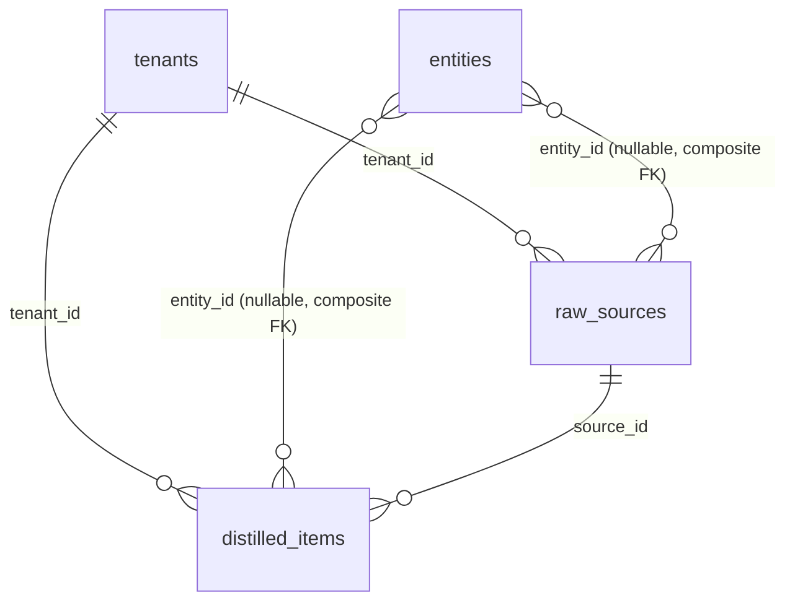
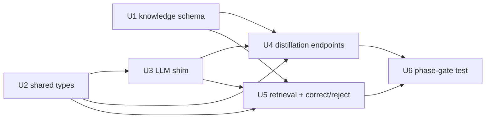
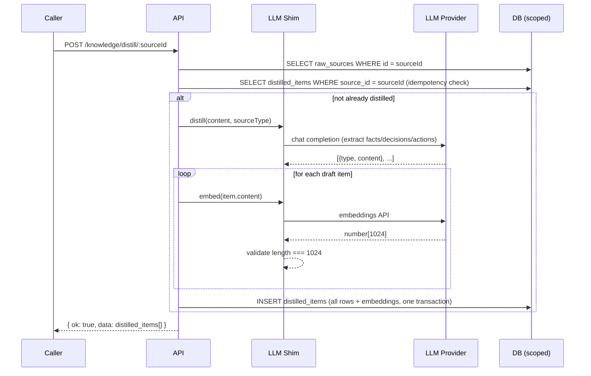
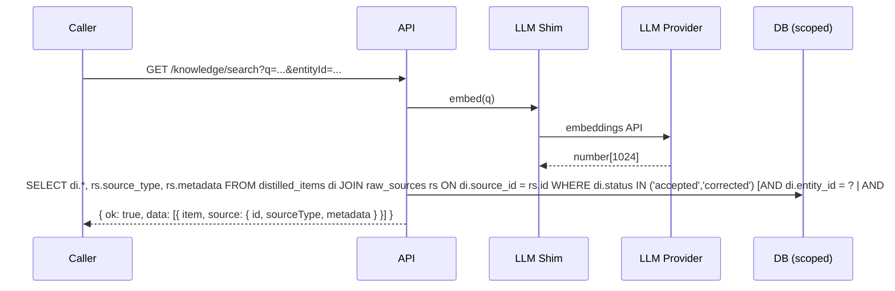

# FelixOS Knowledge Core (Phase 2) - Plan

**Target repo:** FelixOS. All paths are repo-relative.

Read the architecture approach plan and Foundation phase plan before working any unit. The Foundation contracts (RLS pattern, ALS-scoped client, entity spine FK, migration numbering, integration test scaffold) are the direct base for every unit here.

**Product Contract preservation:** Product Contract unchanged from the requirements-only artifact.

---

## Goal Capsule

- **Objective:** Build the Knowledge Core — raw source store, on-demand LLM distillation pipeline, pgvector-backed semantic retrieval, and correct/reject model — so Phase 3 (agent) has a trusted, queryable knowledge base to reason over and cite.
- **Product authority:** Tony Myers (operator, tenant #1).
- **Execution profile:** Six GitHub issues, one PR per unit. U1 and U2 are dependency-zero and can land in parallel. U3 and U5 depend on U2; U4 depends on U1, U2, U3; U6 is the phase gate that depends on U4 and U5.
- **Stop conditions:** Stop and surface if any Foundation contract (RLS strategy, ALS-scoped client, entity spine FK pattern, migration numbering) would need to change. Stop if a proposed distillation schema change would require re-embedding existing rows without a migration plan.

---

## Product Contract

### Summary

Phase 2 builds the knowledge layer Phase 3's agent reads and cites. Raw source material lands in a generic `raw_sources` table (schema only — connectors are Phase 2.x). An on-demand distillation endpoint calls a configured LLM, writes typed fact/decision/action rows to `distilled_items`, and generates 1024-dim pgvector embeddings in the same transaction. A status + correction model lets the operator mark distilled items as wrong and supply a correction; retrieval respects that status. No capture connectors and no review UI ship in this phase.

### Requirements

- **R8.** The knowledge core retains raw ingested content in its original form, indefinitely. Each raw source row records type, content, metadata, tenant, and optionally the entity it concerns.
- **R9.** Each distilled item is tagged with its source (`source_id`) and either the entity it concerns (`entity_id`) or a global flag. The link back to the raw row is always resolvable.
- **R10.** Knowledge is organized into entity-scoped memory (attached to an account) and global business-wide memory. Both are first-class in the schema and retrieval API.
- **R11.** The retrieval API returns distilled items with citations — each result carries `source_id` and enough metadata to resolve back to the originating raw row.
- **R12.** The operator can mark a distilled item as rejected or corrected and supply replacement text. Retrieval excludes rejected items and returns `correction_text` for corrected items. The underlying row is never deleted.

*R13 (capture connectors) is deferred to Phase 2.x.*

### Scope Boundaries

**In scope:** `raw_sources` and `distilled_items` schema + RLS, shared-types additions, thin LLM shim, distillation endpoint, retrieval + correct/reject endpoint, phase-gate integration test.

**Deferred to Phase 2.x:** capture connectors for each source type; re-embed pipeline for model changes.

**Deferred to Phase 3:** full provider abstraction (`packages/agent`); per-tenant inference config in DB.

**Deferred to Phase 5:** review UI for pending distillations.

**Outside this phase:** connector-facing webhooks, scheduled distillation, Voicebox/Deepgram integration.

### Brainstorm Decisions (locked — do not reopen)

- **BD1** — Schema + distillation pipeline only; no connectors.
- **BD2** — Distillation is on-demand via `POST /knowledge/distill/:sourceId`.
- **BD3** — Correct/reject is `status` enum + nullable `correction_text`; no review UI.
- **BD4** — Thin env-configured LLM shim, not the Phase 3 provider abstraction.
- **BD5** — Embeddings generated at distillation time; model name stored with vector.
- **BD6** — Single generic `raw_sources` table with `source_type` discriminator.

---

## Planning Contract

### Key Technical Decisions

- **KTD-P1 — Two migration files.** Follow the Foundation pattern of splitting schema DDL from RLS grants. `0002_knowledge_schema.sql` creates tables, enums, and indexes; `0003_knowledge_rls.sql` enables RLS, creates policies, and grants. Both migration paths must be added to the hard-coded arrays in `packages/db/src/schema.test.ts` and `apps/api/src/api.integration.test.ts`.

- **KTD-P2 — hnsw vector index.** Use hnsw (not ivfflat) for the `distilled_items.embedding` column. ivfflat requires a minimum row count before the index is useful; hnsw is effective at Foundation-scale row counts and has better default recall. Index parameters: `m = 16`, `ef_construction = 64` (defaults); tune if retrieval benchmarks surface a need post-Phase 3.

- **KTD-P3 — LLM shim as Fastify decorator.** Register the shim as `fastify.llm` (interface: `{ distill, embed }`) via the same fp-plugin pattern used for `scopedDb` / `privilegedDb`. `buildServer` accepts an optional `llm` param so integration tests inject a deterministic stub without touching env vars or making real LLM calls.

- **KTD-P4 — Single source_id per distill call.** `POST /knowledge/distill/:sourceId` processes one source at a time. Callers (n8n, future agent) loop if batch processing is needed. Avoids partial-failure complexity.

- **KTD-P5 — Per-call 1024-dim validation.** After each `embed()` call, the shim checks `vector.length === 1024` and throws a descriptive error if not. No startup probe — the per-call guard surfaces misconfiguration on first real use without adding boot latency.

- **KTD-P6 — Idempotent distillation.** If `distilled_items` rows already exist for a source_id with status not `rejected`, the distillation endpoint returns them without calling the LLM again. An explicit `?force=true` query param bypasses the check (for operator re-distillation after corrections).

- **KTD-P7 — Cosine similarity for ranking; no confidence score in Phase 2.** pgvector's `<=>` operator (cosine distance) is the ranking signal. The Phase 3 agent can re-rank from there. A `confidence_score` column is deferred to Phase 3.

- **KTD-P8 — Composite FK for entity_id references.** `distilled_items.entity_id` references entities via the composite `(tenant_id, entity_id)` foreign key, consistent with contacts, deals, and interactions. Never a bare `entity_id` FK.

- **KTD-P9 — pgvector column in Drizzle.** drizzle-orm `^0.45.2`. Check whether `vector` is exported from `drizzle-orm/pg-core`; if not, use `customType`. Enforce 1024-dim at the DB layer with a `CHECK (array_length(embedding, 1) = 1024)` constraint in the migration.

---

## High-Level Technical Design

### Data model

`raw_sources`: `id`, `tenant_id`, `entity_id?`, `source_type` (enum), `content`, `metadata` (jsonb?), `created_at`

`distilled_items`: `id`, `tenant_id`, `source_id`, `entity_id?`, `is_global` (bool, default false), `item_type` (enum: fact/decision/action), `content`, `status` (enum: pending/accepted/rejected/corrected, default pending), `correction_text?`, `embedding` (vector(1024)?), `embedding_model?`, `created_at`, `updated_at`

### Unit dependency graph

### Distillation sequence

### Retrieval sequence

---

## Implementation Units

### U1. Knowledge schema

**Goal:** Add `raw_sources` and `distilled_items` tables with Drizzle schema definitions, two SQL migrations, RLS policies, and registration in the tenant-scoped table registry.

**Requirements:** R8, R9, R10, R12

**Dependencies:** None (Foundation schema and RLS already in place)

**Files:**
- `packages/db/src/schema/knowledge.ts` — create
- `packages/db/src/schema/index.ts` — add export
- `packages/db/migrations/0002_knowledge_schema.sql` — create
- `packages/db/migrations/0003_knowledge_rls.sql` — create
- `packages/db/src/rls.ts` — add `"raw_sources"` and `"distilled_items"` to `tenantScopedTables`
- `packages/db/src/schema.test.ts` — add both new migration URLs to the migration array

**Approach:**
- `knowledge.ts` defines both tables using the repo's Drizzle conventions: `pgTable`, `uuid`, `text`, `timestamp`, `boolean`, `jsonb`, `pgEnum` for `source_type_enum`, `distilled_item_type_enum`, and `distilled_item_status_enum`. For the vector column, check if `vector` is exported from `drizzle-orm/pg-core`; if not, use `customType` (see KTD-P9).
- Both tables carry `(tenant_id, id)` composite unique indexes (required for composite FK references by children).
- `distilled_items.entity_id` uses the composite FK pattern: `foreignKey({ columns: [table.tenantId, table.entityId], foreignColumns: [entities.tenantId, entities.id] })`.
- `0002_knowledge_schema.sql`: `CREATE TYPE` enums → `CREATE TABLE raw_sources` → `CREATE TABLE distilled_items` (with `CHECK (embedding IS NULL OR array_length(embedding, 1) = 1024)`) → `CREATE INDEX` for hnsw → tenant_id indexes.
- `0003_knowledge_rls.sql`: `ALTER TABLE ... ENABLE ROW LEVEL SECURITY`, `FORCE ROW LEVEL SECURITY`, `CREATE POLICY ... USING (tenant_id = nullif(current_setting('app.current_tenant', true), '')::uuid) WITH CHECK (...)` for each table. Extend the existing `GRANT ... ON ALL TABLES` block to cover the new tables, or issue explicit grants following the `0001` pattern.

**Patterns to follow:** `packages/db/src/schema/entities.ts`, `packages/db/src/schema/contacts.ts` (composite FK), `packages/db/migrations/0001_rls_policies.sql` (RLS + grant blocks)

**Test scenarios:**
- Schema smoke: migration applies without error against a fresh Postgres schema; both tables are present with expected columns and types.
- RLS enabled: `pg_class` confirms `relrowsecurity = true` and `relforcerowsecurity = true` for both tables.
- Tenant isolation: with tenant A in ALS, `SELECT * FROM raw_sources` returns only tenant A rows; with no ALS context, returns zero rows.
- Cross-tenant insert: the app role cannot insert a row with a foreign tenant's `tenant_id`.
- Embedding constraint: an insert with `array_length(embedding, 1) != 1024` is rejected.
- `tenantScopedTables` registry: both `"raw_sources"` and `"distilled_items"` appear in the array (RLS test enumerates it).

**Verification:** `pnpm turbo run lint typecheck test build` from repo root; schema tests in `packages/db/src/schema.test.ts` pass with the new migration paths added.

---

### U2. Shared types

**Goal:** Add `KnowledgeSourceType`, `DistilledItemType`, and `DistilledItemStatus` to `packages/shared-types` so DB, API, and future consumers share the same vocabulary.

**Requirements:** R8, R10, R12

**Dependencies:** None

**Files:**
- `packages/shared-types/src/knowledge.ts` — create
- `packages/shared-types/src/index.ts` — add `export * from "./knowledge.js"`

**Approach:**
- `knowledge.ts` is pure TypeScript (no imports from `@felixos/db`). Exports:
  - `KnowledgeSourceType = "email" | "slack" | "transcript" | "youtube" | "doc" | "note"`
  - `DistilledItemType = "fact" | "decision" | "action"`
  - `DistilledItemStatus = "pending" | "accepted" | "rejected" | "corrected"`
  - `RawSourceView` and `DistilledItemView` types for API responses (flat, camelCase, dates as ISO strings, `correctionText: string | null`).
- Follow the existing `TenantScoped` base type from `packages/shared-types/src/entities.ts`.

**Patterns to follow:** `packages/shared-types/src/entities.ts`, `packages/shared-types/src/api.ts`

**Test scenarios:**
- Type-only: no runtime tests needed. Typecheck (`tsc --noEmit`) verifies exports are well-formed.
- Consuming packages (`apps/api`) must import these types without error after wiring.

**Verification:** `pnpm turbo run typecheck` from repo root passes with no errors.

---

### U3. LLM shim

**Goal:** Implement the thin, env-configured LLM module registered as a Fastify decorator (`fastify.llm`). Exposes two methods — `distill` and `embed` — behind a narrow interface swappable in tests.

**Requirements:** R8 (enables distillation), R9, R11

**Dependencies:** U2 (uses `DistilledItemType`)

**Files:**
- `apps/api/src/lib/llm.ts` — create (interface + real implementation)
- `apps/api/src/server.ts` — register `llm` decorator, add `llm?` opt to `buildServer` opts; extend `FastifyInstance` declaration

**Approach:**
- Define interface `LlmShim { distill(content: string, sourceType: string): Promise<Array<{type: DistilledItemType, content: string}>>; embed(text: string): Promise<number[]> }`.
- Real implementation uses the `openai` npm package with `baseURL: process.env.LLM_BASE_URL`, `apiKey: process.env.LLM_API_KEY`. Chat completion model from `process.env.DISTILLATION_MODEL`; embedding model from `process.env.EMBEDDING_MODEL`.
- `distill`: sends a structured prompt instructing the model to extract an array of `{type, content}` objects from the source content. Parses the JSON response. Returns an empty array if extraction yields nothing (not an error).
- `embed`: calls the embeddings API, extracts `data[0].embedding`, validates `length === 1024`, throws `Error("Embedding model returned ${n} dimensions; expected 1024")` if not.
- `buildServer` opts: add optional `llm?: LlmShim`. When provided, register it directly; when absent, build the real shim from env vars. This makes the integration test's stub injection a one-liner.
- Register via the same `fp(async (f) => { f.decorate("llm", llm) })` pattern used for `scopedDb`.
- `declare module "fastify" { interface FastifyInstance { llm: LlmShim } }` alongside the existing `scopedDb` / `privilegedDb` declarations.

**Patterns to follow:** `apps/api/src/server.ts` (decorator pattern), existing env-var config pattern in `apps/api/src/index.ts`

**Test scenarios (unit):**
- `embed` returns a `number[]` of length 1024 given a valid provider response.
- `embed` throws with a clear message when the provider returns a different dimension count.
- `distill` parses a valid JSON completion into `{type, content}[]`, filtering to only known `DistilledItemType` values.
- `distill` returns `[]` when the completion response is empty or unparseable (no throw).
- The interface satisfies TypeScript's structural check so a test stub `{ distill: ..., embed: ... }` is assignable to `LlmShim`.

**Verification:** `pnpm turbo run lint typecheck test` passes; shim unit tests cover the 1024-dim guard and parse paths.

---

### U4. Distillation endpoints

**Goal:** Add `POST /knowledge/sources` (create a raw source row) and `POST /knowledge/distill/:sourceId` (on-demand distillation with embedding) to the API.

**Requirements:** R8, R9, R10

**Dependencies:** U1, U2, U3

**Files:**
- `apps/api/src/routes/knowledge.ts` — create (sources and distill routes)
- `apps/api/src/server.ts` — register `knowledgeRoutes` with prefix `"/knowledge"`

**Approach:**

*`POST /knowledge/sources`*
- Body: `{ sourceType, content, entityId? }`. Validates `sourceType` is a known `KnowledgeSourceType` and `content` is non-empty.
- Wraps insert in `withRequestTenant` + `scopedDb.transaction`. Sets `tenantId: request.tenantId`, generates a UUID for `id`. Returns `{ ok: true, data: toView(row) }` with status 201.

*`POST /knowledge/distill/:sourceId`*
- Query param: `force` (boolean, default false).
- Fetches source row via scoped transaction; returns 404 if not found.
- Idempotency check (KTD-P6): if non-rejected distilled_items exist for this source_id and `?force` is not set, return them directly with status 200.
- Calls `request.server.llm.distill(source.content, source.sourceType)`.
- For each draft item, calls `request.server.llm.embed(item.content)`.
- Inserts all `distilled_items` rows (with embeddings and `embedding_model` from env) in a single scoped transaction.
- Returns `{ ok: true, data: distilled_items[] }` with status 201 (or 200 on idempotent return).
- On LLM error, returns 502 with `{ ok: false, error: { code: "llm_error", message } }`.

**Patterns to follow:** `apps/api/src/routes/entities.ts` (insert + returning pattern, `withRequestTenant`, response shape)

**Test scenarios:**
- `POST /knowledge/sources` with valid body → 201, row present in DB.
- `POST /knowledge/sources` missing `content` → 400.
- `POST /knowledge/sources` with unknown `sourceType` → 400.
- `POST /knowledge/distill/:sourceId` happy path → distilled_items rows created, embeddings stored, 201.
- Idempotent call without `?force` → same rows returned, LLM stub called only once (call count assertion).
- `?force=true` on already-distilled source → LLM stub called again, new rows created.
- Source not found → 404.
- LLM stub throws → 502 with `llm_error` code.
- Tenant isolation: source owned by tenant B is not found when tenant A calls the endpoint.

**Verification:** `pnpm turbo run lint typecheck test` passes.

---

### U5. Retrieval and correct/reject API

**Goal:** Add `GET /knowledge/search` (semantic similarity retrieval with citations) and `PATCH /knowledge/items/:id` (status + correction update) to the knowledge routes.

**Requirements:** R10, R11, R12

**Dependencies:** U1, U2, U3

**Files:**
- `apps/api/src/routes/knowledge.ts` — add retrieval and update routes

**Approach:**

*`GET /knowledge/search`*
- Query params: `q` (required, text to embed), `entityId` (optional UUID), `globalOnly` (boolean, default false), `limit` (integer, default 20, max 100).
- Embeds `q` via `request.server.llm.embed(q)`.
- Scoped query: `SELECT di.*, rs.id AS source_id, rs.source_type, rs.metadata FROM distilled_items di JOIN raw_sources rs ON di.source_id = rs.id WHERE di.status IN ('accepted', 'corrected') [AND di.entity_id = $entityId | AND di.is_global = true] ORDER BY di.embedding <=> $embedding LIMIT $limit`.
- When `entityId` is set, filter `entity_id = $entityId`. When `globalOnly` is true, filter `is_global = true`. Both may not be set simultaneously (return 400).
- For `corrected` items, response includes `correctionText` instead of (not alongside) `content`.
- Response: `{ ok: true, data: [{ id, itemType, content, correctionText, status, entityId, isGlobal, source: { id, sourceType, metadata } }] }`.

*`PATCH /knowledge/items/:id`*
- Body: `{ status, correctionText? }`. `status` must be a known `DistilledItemStatus`. If `status === "corrected"`, `correctionText` must be non-empty.
- Fetches item by `(tenant_id, id)` via scoped transaction; 404 if not found.
- Updates `status`, `correction_text`, and `updated_at`. Returns updated row.

**Patterns to follow:** `apps/api/src/routes/entities.ts` (PATCH pattern, 404 handling), existing query patterns with Drizzle `sql` template for the vector operator.

**Test scenarios:**
- `GET /knowledge/search` with `q` param returns accepted + corrected items in cosine order; excludes pending and rejected.
- `GET /knowledge/search` with `entityId` returns only entity-scoped items for that entity.
- `GET /knowledge/search?globalOnly=true` returns only `is_global = true` items.
- Both `entityId` and `globalOnly` set → 400.
- Missing `q` param → 400.
- `GET /knowledge/search` with corrected item returns `correctionText` in `content` position.
- `PATCH /knowledge/items/:id` sets status to `rejected`; subsequent search excludes the item.
- `PATCH /knowledge/items/:id` sets status to `corrected` with `correctionText`; subsequent search returns `correctionText`.
- `PATCH /knowledge/items/:id` with `status = "corrected"` and no `correctionText` → 400.
- Item not found → 404. Cross-tenant item not found (returns 404, not 403).

**Verification:** `pnpm turbo run lint typecheck test` passes.

---

### U6. Phase-gate integration test

**Goal:** Prove tenant isolation, distillation pipeline, status filtering, and entity-scoped vs. global retrieval against real Postgres 18 + pgvector. Closes the phase when green.

**Requirements:** R8–R12 (all)

**Dependencies:** U4, U5 (full knowledge API must be present)

**Files:**
- `apps/api/src/knowledge.integration.test.ts` — create
- `apps/api/src/api.integration.test.ts` — add both new migration paths (`0002`, `0003`) to the migration URL array

**Approach:**
- Follow the exact same scaffold as `api.integration.test.ts`: isolated Postgres schema per run, dedicated `NOBYPASSRLS` role, `buildServer` with a deterministic stub shim.
- Stub shim: `distill` returns `[{ type: "fact", content: "stub fact" }]`; `embed` returns a `number[1024]` filled with `0` except index 0 (`1`). This lets retrieval work (all vectors are equal, order is stable) without real LLM calls.
- Create two tenants (A and B) for isolation tests.
- Migration URL arrays in both this file and `api.integration.test.ts` must include `0002` and `0003`.

**Test scenarios:**

*Tenant isolation (covers R8, R9)*
- Source created as tenant A is not visible via `GET /knowledge/sources` or `GET /knowledge/search` as tenant B.
- Distilled items created under tenant A are not returned in tenant B's search results.
- `PATCH /knowledge/items/:id` with tenant B cookie on a tenant A item returns 404.

*Distillation happy path (covers R8, R9)*
- `POST /knowledge/sources` → `POST /knowledge/distill/:sourceId` → `GET /knowledge/search?q=stub` returns the distilled item with correct `source_id` citation.
- Distilled item `status` defaults to `pending` before any PATCH; it does not appear in search (only `accepted`/`corrected` are surfaced).
- After `PATCH` to `accepted`, item appears in search.

*Status filtering (covers R12)*
- Rejected item is excluded from search results after `PATCH { status: "rejected" }`.
- Corrected item appears in results; response includes `correctionText`, not original `content`.

*Entity-scoped vs. global (covers R10, R11)*
- Source created with an `entityId` produces a distilled item with that `entity_id`; it appears in `?entityId=` search but not `?globalOnly=true` search.
- Source created with `is_global = true` (or no entity) produces a global item; it appears in `?globalOnly=true` search but not in `?entityId=<other>` search.

*No-context denial*
- Unauthenticated requests to `/knowledge/sources`, `/knowledge/distill/:id`, `/knowledge/search`, and `/knowledge/items/:id` return 401.

**Verification:** `pnpm turbo run lint typecheck test build` from repo root — all tests including this file pass with `DATABASE_URL` and `DATABASE_PRIVILEGED_URL` set (Docker Compose stack from Foundation U9 must be running).

---

## Verification Contract

The phase gate is green when:
1. `pnpm turbo run lint typecheck test build` passes from repo root with the Docker Compose stack running.
2. `knowledge.integration.test.ts` passes all isolation, pipeline, status-filtering, and entity-scoped assertions against real Postgres 18 + pgvector.
3. A raw source row can be inserted, distilled, and retrieved with a source citation in a single session.
4. A rejected distilled item does not appear in retrieval results. A corrected item returns `correction_text`.
5. No retrieval result lacks a resolvable `source_id`.
6. `packages/db/src/rls.ts` `tenantScopedTables` includes `"raw_sources"` and `"distilled_items"`.

---

## Definition of Done

- All six units merged to `main` via PRs that each reference their GitHub issue (`Closes #N`).
- Phase-gate integration test (U6) is green in CI.
- No open Copilot or human review threads on any merged PR.
- `docs/solutions/` entry written via `/ce-compound` after the non-trivial units (U1 RLS pattern for knowledge tables, U3 LLM shim design, U6 isolation test scaffold).

---

## Open Questions (deferred — do not block implementation)

- Which specific distillation prompt template produces the most consistent fact/decision/action extraction for MSP-domain content? (Operator tunes post-Phase 2.)
- Re-embed strategy when Tony changes his embedding model. (Phase 2.x backfill issue.)
- Should `distilled_items` carry a `version` field for tracking re-distillations triggered by `?force`? (Nice-to-have — file a follow-up issue if needed during U4 implementation.)
