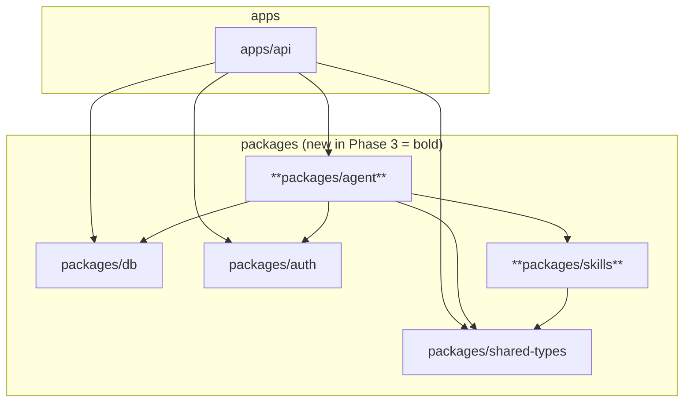
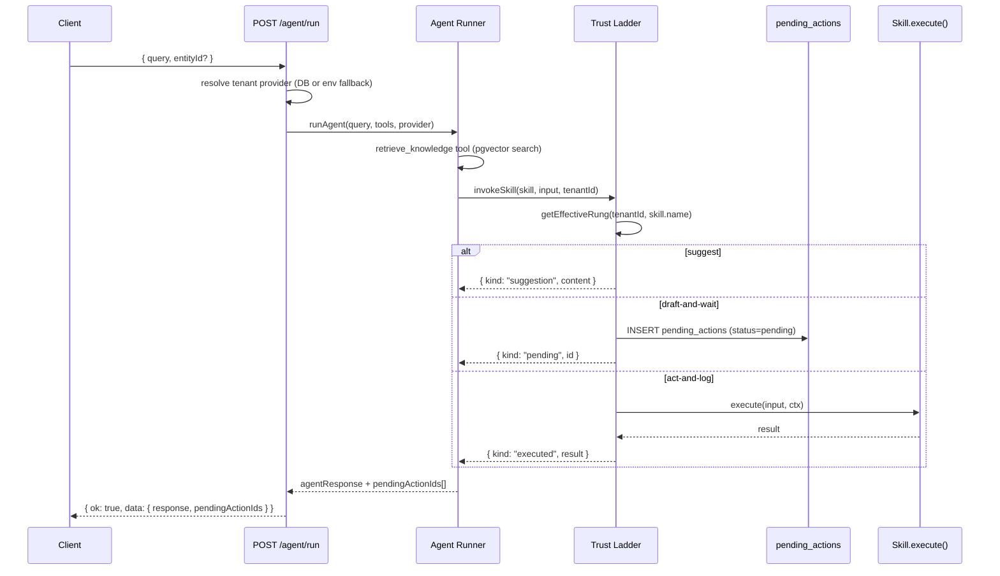
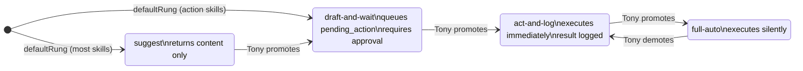
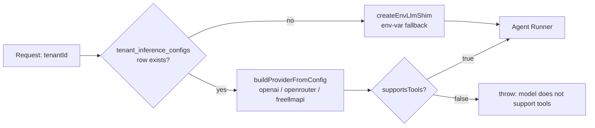

# FelixOS Agent + Skills Registry (Phase 3) — Plan

**Target repo:** FelixOS. All paths are repo-relative.

Read the architecture approach plan and Phase 2 knowledge-core plan before working any unit. Foundation contracts (RLS pattern, ALS-scoped client, composite FK, migration numbering) and Phase 2 contracts (knowledge schema, `LlmShim` interface) are the direct base for every unit here.

**Product Contract preservation:** Product Contract unchanged from the requirements-only artifact. R14–R18 are the governing requirements for this phase.

---

## Goal Capsule

- **Objective:** Build the agent + skills registry layer so FelixOS can reason over tenant knowledge, invoke typed skills through a per-skill autonomy trust ladder, and surface draft-and-wait actions for operator approval — giving Phase 5 a complete backend to render.
- **Product authority:** Tony Myers (operator, tenant #1).
- **Execution profile:** Eight GitHub issues (#25–#32). U1 and U2 are dependency-free and can land in parallel. U3 depends on U1; U4 depends on U1 + U2 + U3; U5 depends on U1 + U3; U6 depends on U2 + U5; U7 depends on U2 + U4; U8 is the phase gate, depends on U3–U7.
- **Stop conditions:** Stop and surface if any Foundation or Phase 2 contract (RLS strategy, ALS context, migration numbering, `LlmShim` interface, knowledge schema) would need to change. Stop if the `SkillDescriptor` shape (frozen in U2) would need to change after U4 or U6/U7 build against it.

---

## Product Contract

### Requirements in scope

- **R14.** The agent is a horizontal capability reaching every layer — reads the foundation, acts on captured input, and renders into the surfaces.
- **R15.** Agent capabilities form a registry of skills with a consistent seam: each skill registers, describes itself to the agent, is invoked uniformly, and routes its results; adding a capability is registering a skill, not modifying a layer.
- **R16.** Every skill is either a capture-skill (pulls knowledge in) or an action-skill (does work out: draft/send email, create task, schedule, update a record).
- **R17.** Each skill sits on a per-skill autonomy trust ladder — suggest, draft-and-wait, act-and-log, full-auto — defaulting conservative, with Tony able to promote a skill up the ladder.
- **R18.** LLM inference is used only where judgment is required; the agent orchestrates and n8n executes deterministic work.

### Acceptance examples in scope

- **AE1. (R17)** Given a skill on the draft-and-wait rung, when the agent prepares an outbound email, then it appears queued for approval and is not sent until Tony approves.
- **AE2. (R12 enforcement in retrieval)** Given a distilled fact Tony rejected, when the agent retrieves for a related query, then the rejected fact is excluded from the grounded answer. (Enforced by Phase 2 search filter; verified in U8.)

### Scope boundaries

**In scope for Phase 3:** `packages/agent` (orchestration, provider abstraction, trust ladder, tools), `packages/skills` (SkillDescriptor contract + registry), three DB schema additions (`tenant_inference_configs`, `tenant_skill_rungs`, `pending_actions`), first capture-skills (YouTube adapter + doc/note drop-in), first action-skills (draft email + create task), agent API routes, phase-gate integration test.

**Deferred to Phase 4:** n8n REST client; actual email send via n8n (approval of `DraftEmailSkill` marks the pending action approved but wires no send path until Phase 4).

**Deferred to Phase 5:** Command-center UI surface for pending approvals; triage queue; account drill-in agent panel.

**Deferred to Phase 2.x / later:** Email, Slack, meeting/audio capture connectors; Voicebox/Deepgram transcription; re-embed pipeline for model changes.

**Outside this phase:** Scheduling, recurring agent tasks, full legacy-registry port (YouTube adapter is the first one — remaining skills mined at that implementation time).

---

## Key Technical Decisions

**KTD-P3-1 — `@openai/agents` as the orchestration runtime.**
The official OpenAI TypeScript Agents SDK (`@openai/agents`) provides `Agent`, `Tool`, and `Runner` primitives. Tools map directly to skill invocations wrapped by the trust ladder. Agent instances are per-request — each `POST /agent/run` instantiates a fresh `Runner` with the tenant's resolved provider and available tools. No long-lived agent process.

This is the fire-and-forget pattern: one request, one runner, tools resolved and executed, result returned. Multi-turn coordination across agent runs (team-style persistent agents with shared task lists and messaging) is deferred to Phase 4+. Phase 3 does not build persistent agent identity or inter-run memory — context is re-derived from the knowledge base on every call.

**KTD-P3-2 — `packages/skills` owns the runtime contract; `packages/shared-types` expands the SkillDescriptor stub.**
`packages/shared-types/src/skills.ts` currently exports `SkillDescriptor = { name: string }`. U2 expands that to the full shape (name, purpose, kind, inputSchema, sideEffectClass, defaultRung) so `shared-types` remains the dependency-zero type contract all consumers already import. `packages/skills` (new workspace) owns the `Skill` interface, `SkillRegistry`, and `SkillContext` — the runtime layer that sits above the types. `packages/agent` depends on `packages/skills`; nothing outside `packages/skills` and `packages/agent` needs the runtime registry.

**KTD-P3-3 — In-memory registry; trust rung overrides in `tenant_skill_rungs`.**
The `SkillRegistry` is a process-global in-memory `Map` — skills are registered at startup, all tenants see the same catalog. Per-tenant autonomy is stored in `tenant_skill_rungs` (tenant_id + skill_name → rung override). Effective rung = `tenant_skill_rungs` row if present, else `SkillDescriptor.defaultRung`. Trust enforcement is in the agent runner, not inside skill `execute()` methods.

**KTD-P3-4 — Three Phase 3 schema additions in one migration pair (0004/0005).**
`tenant_inference_configs`, `tenant_skill_rungs`, and `pending_actions` ship in migration 0004 (schema + enums) and 0005 (RLS grants + `ENABLE` / `FORCE` + policies). All three tables are RLS-isolated by `tenant_id` using the established `nullif(current_setting('app.current_tenant', true), '')::uuid` policy pattern. Both migration paths must be added to the hard-coded arrays in `packages/db/src/schema.test.ts` and `apps/api/src/api.integration.test.ts` and `apps/api/src/knowledge.integration.test.ts`.

**KTD-P3-5 — Phase 2 env-var LLM shim is wrapped, not replaced.**
`packages/agent` defines `InferenceProvider` (OpenAI-compatible client + `supportsTools: boolean` + model names). At request time the API resolves the tenant's provider: reads `tenant_inference_configs`; if no row exists, falls back to `createEnvLlmShim()` from `apps/api/src/lib/llm.ts` wrapped as an `InferenceProvider`. No breaking change to the single-operator setup; the env-var path remains valid until a per-tenant config is written.

**KTD-P3-6 — API key encryption reuses `packages/auth` AES-256-GCM pattern.**
`packages/auth/src/totp.ts` already has `encryptTotpSecret` / `decryptTotpSecret` (AES-256-GCM, 12-byte nonce, GCM auth tag). U3 adds generic `encryptSecret(plaintext, key, keyId)` / `decryptSecret(encrypted, key)` exports to `packages/auth` that extract this logic without the TOTP-specific wrapper. `packages/agent` imports these to encrypt API keys stored in `tenant_inference_configs`. The same `encryptionKey` Fastify decorator is reused.

**KTD-P3-7 — Knowledge retrieval is a direct DB query, not an HTTP self-call.**
The vector search logic is extracted from `apps/api/src/routes/knowledge.ts` into a shared helper `apps/api/src/lib/knowledge-search.ts`. The `KnowledgeRetrievalTool` calls this helper via `runWithTenantContext`, keeping the search in-process with the same ALS context. No HTTP round-trip against `localhost`.

**KTD-P3-8 — Draft-and-wait outputs land in `pending_actions`; execution wired per-skill at approval.**
When the trust ladder enforces `draft-and-wait`, it inserts a `pending_actions` row (`status: 'pending'`, `skill_name`, `payload jsonb`). `POST /agent/pending/:id/approve` looks up the skill by name, calls an optional `afterApproval(payload, context)` hook on the skill implementation, then sets `status: 'executed'`. `DraftEmailSkill` has no `afterApproval` in Phase 3 (marks `approved`; Phase 4 wires the send path). `CreateTaskSkill`'s `afterApproval` inserts an `interactions` row with `kind: 'task'` — this is the only Phase 3 skill with a wired execute-on-approve path.

**KTD-P3-9 — `supportsTools` enforced at runner startup for OpenRouter.**
For `provider: 'openrouter'`, the stored `supports_tools` boolean is checked before instantiating the `Runner`. If `false` and any tools are registered, the runner throws a descriptive error rather than silently sending a model that ignores tool calls. OpenAI and the curated `freellmapi` catalog are always `true`.

---

## High-Level Technical Design

### Package topology



### Agent execution flow



### Trust rung lifecycle



### Provider resolution



---

## Output Structure

New packages created by this phase:

```
packages/
  agent/
    package.json
    tsconfig.json
    src/
      index.ts
      runner.ts          # runAgent(), AgentRunOptions
      provider.ts        # InferenceProvider, createProviderFromConfig(), createEnvFallbackProvider()
      trust-ladder.ts    # getEffectiveRung(), invokeThroughTrustLadder()
      tools/
        knowledge-retrieval.ts   # KnowledgeRetrievalTool
      skills/
        doc-note-capture.ts
        youtube-capture.ts
        draft-email.ts
        create-task.ts
      registry.ts        # Phase 3 MSP profile — registers all Phase 3 skills
  skills/
    package.json
    tsconfig.json
    src/
      index.ts
      descriptor.ts      # SkillDescriptor, TrustRung, SideEffectClass (re-exports from shared-types)
      skill.ts           # Skill<TInput, TOutput> interface, SkillContext, SkillResult
      registry.ts        # SkillRegistry class
```

---

## Implementation Units

### U1. packages/agent scaffold + @openai/agents SDK wiring

**Issue:** #25

**Goal:** Bootstrap `packages/agent` and wire `@openai/agents` as the orchestration runtime. Dependency-zero — all other Phase 3 units build on this.

**Requirements:** R14

**Dependencies:** none

**Files:**
- `packages/agent/package.json` (create)
- `packages/agent/tsconfig.json` (create)
- `packages/agent/src/index.ts` (create)
- `packages/agent/src/runner.ts` (create)
- `pnpm-workspace.yaml` (already covers `packages/*`)
- `tsconfig.json` root references update

**Approach:** Create the `packages/agent` workspace. Add `@openai/agents` as a direct dependency. `runner.ts` exports `runAgent(opts: AgentRunOptions): Promise<AgentRunResult>` where `AgentRunOptions` carries `{ query, tools, provider, tenantId, entityId? }`. `AgentRunResult` is `{ response: string; pendingActionIds: string[] }`. No tools are registered at this unit — the runner accepts them as a parameter. The `Agent` is constructed from `@openai/agents` using the provider's base URL and API key; the `Runner` executes it. Follow the established pattern in `packages/auth` and `packages/db` for tsconfig (no `composite`, source imports only, `transpilePackages` in Next.js if web ever imports it).

**Patterns to follow:** `packages/auth/tsconfig.json`, `packages/auth/package.json` structure; `apps/api/src/lib/llm.ts` for the OpenAI-compatible client pattern.

**Test scenarios:**
- TypeScript compiles cleanly (`pnpm turbo run typecheck --filter=@felixos/agent`)
- `runAgent` with a stub `@openai/agents` client (stub the Runner) returns `{ response, pendingActionIds: [] }`
- Package is importable from `apps/api` via `@felixos/agent` alias

**Verification:** `pnpm turbo run lint typecheck build --filter=@felixos/agent` passes. `apps/api` can import `{ runAgent }` from `@felixos/agent` without a type error.

---

### U2. packages/skills — SkillDescriptor contract + registry

**Issue:** #26

**Goal:** Freeze the `SkillDescriptor` shape and define the `Skill` interface + in-memory registry in `packages/skills`. Contracts-first — nothing else in Phase 3 builds against skills until this lands.

**Requirements:** R15, R16, R17

**Dependencies:** none (parallel with U1)

**Files:**
- `packages/skills/package.json` (create)
- `packages/skills/tsconfig.json` (create)
- `packages/skills/src/index.ts` (create)
- `packages/skills/src/skill.ts` (create) — `Skill<TInput, TOutput>`, `SkillContext`, `SkillResult`
- `packages/skills/src/registry.ts` (create) — `SkillRegistry`
- `packages/shared-types/src/skills.ts` (modify) — expand `SkillDescriptor` to full shape, add `TrustRung`
- `packages/shared-types/src/index.ts` (modify) — add `TrustRung` export

**Approach:**

`SkillDescriptor` in `packages/shared-types/src/skills.ts` expands to:
```
{
  name: string;         // stable slug — must match skill_name in tenant_skill_rungs exactly
  purpose: string;      // LLM-readable routing description (see quality bar below)
  triggers: string[];   // keyword list for catalog search and non-agent routing
  kind: "capture" | "action" | "n8n-workflow";
  inputSchema: Record<string, unknown>;  // JSON Schema object
  sideEffectClass: "none" | "draft" | "write" | "send";
  defaultRung: TrustRung;
  requiresInference: boolean;
}
```
`TrustRung = "suggest" | "draft-and-wait" | "act-and-log" | "full-auto"` also lives in shared-types.

`requiresInference` encodes R18 at the type level: skills where the value comes from LLM judgment (`DraftEmailSkill`, `YouTubeCaptureSkill` post-transcript) set `true`; deterministic operations (`DocNoteCaptureSkill`, which is a DB write, and `KnowledgeRetrievalTool`, which is a pgvector query) set `false`. The agent runner uses this to skip provider resolution for `false` skills and to inform model-tier selection — a `requiresInference: false` skill never needs the tenant's full LLM config to operate.

`triggers` is a separate array from `purpose` — not redundant. `purpose` is a rich prose string the LLM reads when selecting a tool; `triggers` is a machine-readable keyword list used by Phase 5's skills catalog UI (search without spinning up an agent), by test assertions, and by any future non-agent routing path. They are authored together but consumed by different systems.

**`name` slug convention:** `name` must be lowercase, hyphenated (e.g., `"doc-note-capture"`, `"draft-email"`), matching exactly the value stored in `tenant_skill_rungs.skill_name`. Any mismatch between a registered descriptor's `name` and a `tenant_skill_rungs` row causes a silent rung override miss — `getEffectiveRung` won't find the row and will fall back to `defaultRung`. Tests must assert the slug round-trip.

**`purpose` + `triggers` quality bar:** `purpose` is what the agent reads when deciding which tool to invoke — it should answer "when should I call this and why not just do nothing?" following the "USE WHEN" format:
```
"<what the skill does>. USE WHEN <comma-separated trigger phrases>."
```
Examples for Phase 3 skills:
- `DocNoteCaptureSkill` — `"Stores written content from documents or notes into tenant knowledge. USE WHEN user shares written material to save, doc to capture, note to add, save this text."`
- `DraftEmailSkill` — `"Drafts an outbound email for operator approval before any send. USE WHEN compose email, draft message, write email to, send email, email a client."`
- `YouTubeCaptureSkill` — `"Extracts transcript from a YouTube video and ingests it as tenant knowledge. USE WHEN YouTube URL, video to capture, extract from video, watch this, youtube.com."`
- `CreateTaskSkill` — `"Creates a task interaction record linked to an account after operator approval. USE WHEN create task, add task, log task, new task for account."`

`triggers` is the same phrases as the "USE WHEN" list, split into an array: `["create task", "add task", "log task", "new task for account"]`.

`Skill<TInput, TOutput>` interface in `packages/skills`:
- `descriptor: SkillDescriptor`
- `execute(input: TInput, ctx: SkillContext): Promise<TOutput>`
- `afterApproval?(payload: TInput, ctx: SkillContext): Promise<void>` — optional; called by the approval route when a pending action is approved

`SkillContext`: `{ tenantId: string; scopedDb: ScopedDatabaseClient; provider: InferenceProvider }` — `InferenceProvider` is forward-declared as `unknown` here and narrowed in `packages/agent` to avoid a circular dependency.

`SkillRegistry` is a `Map<string, Skill<unknown, unknown>>` with `register(skill)`, `get(name)`, `listDescriptors(): SkillDescriptor[]`.

**Execution note:** Safety-critical — `SkillDescriptor` is frozen here. Any field change after U4 or U6/U7 build against it requires stopping and surfacing. Run `pnpm turbo run typecheck` across all packages after U2 merges to confirm no downstream type breaks.

**Patterns to follow:** `packages/shared-types/src/knowledge.ts` for the type-export shape. `packages/shared-types/src/index.ts` for the re-export pattern.

**Test scenarios:**
- `SkillDescriptor` shape: all eight fields present and typed correctly (`triggers` is `string[]`, `requiresInference` is `boolean`)
- `TrustRung` union: all four values present
- `SkillRegistry.register` + `get` round-trip: `get(descriptor.name)` returns the same skill
- `SkillRegistry.listDescriptors()` returns all registered descriptors, none of which are implementation details
- Slug round-trip: every descriptor's `name` exactly matches the key used in `get()` — catches slug mismatch before it silently breaks rung lookups
- Each Phase 3 skill has `triggers.length >= 3` — a descriptor with zero triggers is not a complete descriptor
- Registering the same skill name twice overwrites the previous registration (last-write-wins; predictable startup order)
- `SkillContext` type is importable by `packages/agent` without circular dep

**Verification:** `pnpm turbo run lint typecheck --filter=@felixos/skills --filter=@felixos/shared-types` passes. Consuming `{ SkillDescriptor, TrustRung }` from `@felixos/shared-types` resolves without error in a test consumer.

---

### U3. Provider abstraction + per-tenant inference config

**Issue:** #27

**Goal:** Full provider abstraction over OpenAI-compatible endpoints, per-tenant inference config in DB (replacing the Phase 2 env-var-only path for tenants that configure it), and the three Phase 3 DB tables.

**Requirements:** R14, R18

**Dependencies:** U1 (provider abstraction lives in `packages/agent`)

**Files:**
- `packages/db/migrations/0004_agent_schema.sql` (create)
- `packages/db/migrations/0005_agent_rls.sql` (create)
- `packages/db/src/schema/agent.ts` (create)
- `packages/db/src/schema/index.ts` (modify — add agent schema exports)
- `packages/db/src/rls.ts` (modify — add `tenant_inference_configs`, `tenant_skill_rungs`, `pending_actions` to `tenantScopedTables`)
- `packages/db/src/schema.test.ts` (modify — add 0004/0005 migration URLs)
- `packages/agent/src/provider.ts` (create)
- `packages/auth/src/totp.ts` (modify — extract and export `encryptSecret` / `decryptSecret`)
- `packages/auth/src/index.ts` (modify — re-export new functions)
- `apps/api/src/routes/agent-config.ts` (create) — `GET /agent/config`, `PUT /agent/config`
- `apps/api/src/server.ts` (modify — register agent-config routes)
- `apps/api/src/api.integration.test.ts` (modify — add 0004/0005)
- `apps/api/src/knowledge.integration.test.ts` (modify — add 0004/0005)
- `packages/db/src/rls.test.ts` (modify — extend coverage to new tables)

**Approach:**

Migration 0004 adds three enums and three tables:

Enums: `inference_provider` (`openai`, `openrouter`, `freellmapi`), `trust_rung` (`suggest`, `draft-and-wait`, `act-and-log`, `full-auto`), `pending_action_status` (`pending`, `approved`, `rejected`, `executed`, `failed`).

`tenant_inference_configs`: `id uuid PK`, `tenant_id uuid NOT NULL → tenants`, `provider inference_provider NOT NULL`, `base_url text`, `api_key_ciphertext text NOT NULL`, `api_key_nonce text NOT NULL`, `api_key_key_id text NOT NULL`, `distillation_model text NOT NULL`, `embedding_model text NOT NULL`, `supports_tools boolean NOT NULL DEFAULT true`, `created_at`, `updated_at`. Unique index on `tenant_id` (one config per tenant for now).

`tenant_skill_rungs`: `tenant_id uuid NOT NULL → tenants`, `skill_name text NOT NULL`, `rung trust_rung NOT NULL`. Primary key on `(tenant_id, skill_name)`.

`pending_actions`: `id uuid PK`, `tenant_id uuid NOT NULL → tenants`, `skill_name text NOT NULL`, `payload jsonb NOT NULL DEFAULT '{}'`, `status pending_action_status NOT NULL DEFAULT 'pending'`, `agent_context text`, `created_at`, `updated_at`. Index on `(tenant_id, status)`.

Migration 0005 grants, enables, and forces RLS on all three tables with the same `app.current_tenant` policy pattern as `raw_sources` and `distilled_items`.

`packages/agent/src/provider.ts` defines:
- `InferenceProvider`: `{ client: OpenAI; supportsTools: boolean; distillationModel: string; embeddingModel: string }`
- `createProviderFromConfig(config: TenantInferenceConfigRow, encryptionKey: Buffer): InferenceProvider` — decrypts API key, constructs `OpenAI({ apiKey, baseURL })`, sets `supportsTools` from the stored field
- `createEnvFallbackProvider(): InferenceProvider` — wraps `createEnvLlmShim()` as an `InferenceProvider`; used when no DB row exists

`apps/api/src/routes/agent-config.ts`:
- `GET /agent/config` — returns current tenant's config (without decrypted key; show masked key)
- `PUT /agent/config` — upserts `tenant_inference_configs` row; encrypts API key before insert

**Patterns to follow:** `packages/db/migrations/0002_knowledge_schema.sql` and `0003_knowledge_rls.sql` for migration shape. `packages/auth/src/totp.ts` for the AES-256-GCM encrypt/decrypt. `apps/api/src/routes/context.ts` for `withRequestTenant`.

**Test scenarios:**
- `tenant_inference_configs` RLS: Tenant A cannot read or write Tenant B's config
- `tenant_skill_rungs` RLS: same isolation
- `pending_actions` RLS: same isolation
- `createProviderFromConfig` decrypts API key to the original plaintext
- `createProviderFromConfig` with `provider: 'openrouter'` and `supports_tools: false` is stored correctly (runner enforcement is in U4/U5 — schema test just verifies the field is persisted)
- `createEnvFallbackProvider()` constructs a provider from `LLM_API_KEY`, `DISTILLATION_MODEL`, `EMBEDDING_MODEL` env vars
- `PUT /agent/config` upserts and `GET /agent/config` returns a masked API key
- `encryptSecret` / `decryptSecret` round-trip in `packages/auth`

**Verification:** `pnpm turbo run lint typecheck test build --filter=@felixos/db --filter=@felixos/agent` passes against real Postgres. All three new tables appear in `tenantScopedTables` coverage test.

---

### U4. Trust ladder enforcement

**Issue:** #28

**Goal:** Enforce the per-skill autonomy trust ladder in the agent runner. The agent may never execute a skill at a higher autonomy level than its effective rung.

**Requirements:** R17

**Dependencies:** U1 (agent runner), U2 (SkillDescriptor, TrustRung), U3 (tenant_skill_rungs + pending_actions tables)

**Files:**
- `packages/agent/src/trust-ladder.ts` (create)
- `packages/agent/src/runner.ts` (modify — call trust ladder for each skill tool invocation)
- `apps/api/src/routes/agent-rungs.ts` (create) — `GET /agent/rungs`, `PUT /agent/rungs/:skillName`
- `apps/api/src/server.ts` (modify — register rung routes)

**Approach:**

`trust-ladder.ts` exports:
- `getEffectiveRung(tenantId, skillName, scopedDb): Promise<TrustRung>` — queries `tenant_skill_rungs` for an override; falls back to the registry's `descriptor.defaultRung`
- `invokeThroughTrustLadder(skill, input, context, pendingActionsDb): Promise<TrustLadderResult>` — calls `getEffectiveRung`, then dispatches:
  - `suggest`: returns `{ kind: "suggestion", content: await skill.execute(input, ctx) }` without side-effects (skill.execute returns content; trust ladder suppresses any write path)
  - `draft-and-wait`: inserts `pending_actions` row, returns `{ kind: "pending", id }`; does NOT call `skill.execute()`
  - `act-and-log`: calls `skill.execute()`, logs result to `pending_actions` with `status: 'executed'`, returns `{ kind: "executed", result }`
  - `full-auto`: calls `skill.execute()`, returns `{ kind: "executed", result }` without logging

The agent runner wraps each registered `Skill` as an `@openai/agents` `Tool`. When the SDK calls the tool function, `invokeThroughTrustLadder` is the entry point — the SDK never gets direct access to `skill.execute()`.

`apps/api/src/routes/agent-rungs.ts`:
- `GET /agent/rungs` — lists all registered skill names with effective rung for the current tenant
- `PUT /agent/rungs/:skillName` — body `{ rung: TrustRung }` — upserts a `tenant_skill_rungs` row; validates `rung` is a valid `TrustRung` value

**Execution note:** Safety-critical. Test-first: write the failing test that asserts a draft-and-wait skill does NOT call `execute()` before writing `invokeThroughTrustLadder`. Then write the failing test for the AE1 contract (skill queued, not sent) before the approval-route wiring.

**Patterns to follow:** `withRequestTenant` + `scopedDb.transaction` pattern for all DB writes inside the trust ladder.

**Test scenarios:**
- `suggest` rung: `skill.execute()` is NOT called; returns `{ kind: "suggestion" }`
- `draft-and-wait` rung: `skill.execute()` is NOT called; `pending_actions` row inserted with `status: 'pending'`; returns `{ kind: "pending", id }`
- `act-and-log` rung: `skill.execute()` called exactly once; result logged
- `full-auto` rung: `skill.execute()` called exactly once; no pending_action row created
- `getEffectiveRung` returns the `tenant_skill_rungs` override when present, else `descriptor.defaultRung`
- `PUT /agent/rungs/:skillName` with an invalid rung value returns 400
- Tenant B cannot modify Tenant A's rung via `PUT /agent/rungs/:skillName` (RLS via `withRequestTenant`)
- Trust ladder bypass attempt (calling `skill.execute()` directly from a fake tool) is not possible via the API surface — the only public entry point is `invokeThroughTrustLadder` (structural enforcement via module boundary)
- AE1: DraftEmailSkill at default `draft-and-wait` rung → pending_action created, execute not called

**Verification:** All test scenarios pass. `pnpm turbo run lint typecheck test` is green across `packages/agent` and `apps/api`.

---

### U5. Agent ↔ knowledge retrieval integration

**Issue:** #29

**Goal:** Wire the agent to Phase 2's knowledge retrieval so it can query distilled facts with citations and ground answers in tenant-scoped knowledge.

**Requirements:** R11, R14

**Dependencies:** U1 (agent runner), U3 (provider — the agent needs to embed queries via the tenant's provider)

**Files:**
- `apps/api/src/lib/knowledge-search.ts` (create) — extracted vector search helper
- `apps/api/src/routes/knowledge.ts` (modify — use shared helper)
- `packages/agent/src/tools/knowledge-retrieval.ts` (create)
- `packages/agent/src/runner.ts` (modify — always include `KnowledgeRetrievalTool` in the tool list)
- `apps/api/src/routes/agent.ts` (create) — `POST /agent/run`
- `apps/api/src/server.ts` (modify — register agent route)

**Approach:**

`apps/api/src/lib/knowledge-search.ts` extracts the pgvector cosine-similarity query from `routes/knowledge.ts` into a function `searchKnowledge(opts: { query: string; embedding: number[]; entityId?: string; globalOnly?: boolean; limit?: number; tenantScopedDb: ScopedDatabaseClient; tenantId: string }): Promise<KnowledgeSearchResult[]>`. The existing knowledge route calls this helper; the agent tool also calls it directly via `runWithTenantContext`.

`KnowledgeRetrievalTool` in `packages/agent/src/tools/knowledge-retrieval.ts` is a factory: `createKnowledgeRetrievalTool(provider, scopedDb, tenantId)` returns an `@openai/agents` `Tool`. On invocation:
1. Embeds the query string using `provider.embed()` (which is the Phase 2 `LlmShim.embed`, now exposed via `InferenceProvider`)
2. Calls `searchKnowledge()` via `runWithTenantContext`
3. Returns results as JSON — the agent includes `source.id` and `source.sourceType` in its reasoning

`apps/api/src/routes/agent.ts` is a new Fastify plugin at prefix `/agent`:
- `POST /agent/run`: body `{ query: string; entityId?: string }` — resolves provider, calls `runAgent()` with KnowledgeRetrievalTool + all registered skills wrapped by trust ladder, returns `{ ok: true, data: { response, pendingActionIds } }`

**Patterns to follow:** `withRequestTenant` / `runWithTenantContext` for ALS context. `apps/api/src/routes/knowledge.ts` select projection pattern (no `embedding` in SELECT — KTD from Phase 2 fix).

**Test scenarios:**
- `KnowledgeRetrievalTool` returns only current tenant's distilled items (ALS isolation)
- Items with `status: 'rejected'` are excluded from results (Phase 2 filter — verified here via agent)
- AE2: rejected distilled fact does not appear in agent's grounded answer
- Empty knowledge base returns `[]` from the retrieval tool, not an error
- `POST /agent/run` with no auth returns 401
- `POST /agent/run` with valid auth and empty knowledge base returns a response (agent gracefully handles no context)
- `POST /agent/run` returns `pendingActionIds: []` when no draft-and-wait skills are invoked

**Verification:** Agent responds to a query with citations sourced only from the calling tenant's knowledge. Isolation confirmed by running the same query as Tenant B with Tenant A's knowledge present — zero results returned.

---

### U6. First capture-skills — YouTube ingestion adapter + doc/note drop-in

**Issue:** #30

**Goal:** Register the first two capture-skills so the agent can pull external content into the knowledge core.

**Requirements:** R13, R15, R16

**Dependencies:** U2 (SkillDescriptor contract), U5 (knowledge search in place; distillation API available for optional trigger)

**Files:**
- `packages/agent/src/skills/doc-note-capture.ts` (create)
- `packages/agent/src/skills/youtube-capture.ts` (create)
- `packages/agent/src/registry.ts` (create) — default registry; registers all Phase 3 skills
- `packages/agent/src/index.ts` (modify — export `defaultRegistry`)

**Approach:**

`DocNoteCaptureSkill`: descriptor `kind: 'capture'`, `sideEffectClass: 'write'`, `defaultRung: 'act-and-log'`, `requiresInference: false`. Input: `{ content: string; sourceType: 'doc' | 'note'; entityId?: string; metadata?: Record<string, unknown> }`. `execute()` inserts a `raw_sources` row via the scoped DB client (using `runWithTenantContext` — no HTTP round-trip), then optionally triggers distillation if `content.length > 0`. This skill is deterministic; it never touches the tenant's LLM config.

`YouTubeCaptureSkill`: descriptor `kind: 'capture'`, `sideEffectClass: 'write'`, `defaultRung: 'act-and-log'`, `requiresInference: true` (distillation is triggered after transcript extraction). Input: `{ youtubeUrl: string; entityId?: string }`.

`execute()` uses a two-step pipeline:
1. **Transcript extraction** — shell out to `yt-dlp` with `--skip-download --write-auto-sub --sub-format json3 --sub-langs en` to extract the auto-generated caption track. If `yt-dlp` is not available on `PATH`, fall back to the YouTube Data API v3 captions endpoint (requires `YOUTUBE_API_KEY` in env). If neither is available, throw a descriptive `ExternalDependencyError` — the adapter does not ship as a silent stub; it fails loudly so the operator knows to install yt-dlp.
2. **Ingest** — parse the caption JSON to plain text, insert a `raw_sources` row with `source_type: 'youtube'`, then call `POST /knowledge/distill/:sourceId` (or the extracted `distill()` helper directly) to trigger distillation. Store the video URL and video ID in `metadata`.

**System dependency note:** `yt-dlp` is the preferred transcript extraction tool (same mechanism as the Fabric `extract_wisdom` pattern). Document the install requirement in the U6 PR body: `pip install yt-dlp` or `brew install yt-dlp`. The integration test stubs the `yt-dlp` call; E2E verification requires yt-dlp installed on the test host.

`packages/agent/src/registry.ts` creates and exports a `defaultRegistry: SkillRegistry` that registers all four Phase 3 skills (YouTube, DocNote, DraftEmail, CreateTask). The agent runner imports `defaultRegistry` and passes its skills to the tool list. This file is the Phase 3 MSP deployment profile — future phases define alternate profiles (e.g., a support-tier profile with a different skill subset) without touching `defaultRegistry`. Treat the export name as stable; any skill set change for Phase 4+ ships as a new named profile export alongside `defaultRegistry`.

**Patterns to follow:** `DocNoteCaptureSkill.execute()` mirrors the POST /knowledge/sources handler logic but uses `runWithTenantContext` + `scopedDb` directly.

**Test scenarios:**
- `DocNoteCaptureSkill` at `act-and-log` rung: `execute()` inserts a `raw_sources` row; returns the inserted row ID
- `DocNoteCaptureSkill` has `requiresInference: false` — calling `execute()` does not invoke any LLM config
- Captured `raw_sources` row is tenant-scoped (Tenant B cannot see it)
- `DocNoteCaptureSkill` with empty `content` returns a validation error before inserting
- `YouTubeCaptureSkill` with a stubbed `yt-dlp` response: inserts a `raw_sources` row with `source_type: 'youtube'` and triggers distillation
- `YouTubeCaptureSkill` with `yt-dlp` absent and no `YOUTUBE_API_KEY`: throws `ExternalDependencyError` before inserting any rows
- `YouTubeCaptureSkill` descriptor is registered with correct `kind`, `sideEffectClass`, `defaultRung`, `requiresInference: true`
- `defaultRegistry.listDescriptors()` returns all four Phase 3 skill descriptors

**Verification:** `DocNoteCaptureSkill` creates a `raw_sources` row via the agent. `YouTubeCaptureSkill` descriptor is present in the registry. Integration test verifies tenant isolation on capture.

---

### U7. First action-skills — draft email + create task (draft-and-wait)

**Issue:** #31

**Goal:** Register the first two action-skills at the `draft-and-wait` rung and wire the approval + rejection endpoints. Proves the end-to-end trust ladder loop.

**Requirements:** R16, R17

**Dependencies:** U2 (SkillDescriptor contract), U4 (trust ladder + `pending_actions` table from U3)

**Files:**
- `packages/agent/src/skills/draft-email.ts` (create)
- `packages/agent/src/skills/create-task.ts` (create)
- `packages/agent/src/registry.ts` (modify — register DraftEmail + CreateTask)
- `apps/api/src/routes/agent-pending.ts` (create) — `GET /agent/pending`, `POST /agent/pending/:id/approve`, `POST /agent/pending/:id/reject`
- `apps/api/src/server.ts` (modify — register agent-pending routes)
- `packages/shared-types/src/agent.ts` (create) — `PendingActionView` type
- `packages/shared-types/src/index.ts` (modify — export agent types)

**Approach:**

`DraftEmailSkill`: descriptor `kind: 'action'`, `sideEffectClass: 'send'`, `defaultRung: 'draft-and-wait'`. Input: `{ to: string; subject: string; body: string; entityId?: string }`. `execute()` returns the draft content as an object — the trust ladder wrapper (U4) creates the `pending_actions` row when rung is `draft-and-wait`. No `afterApproval` hook in Phase 3: approval sets `status: 'approved'`; Phase 4 adds the n8n send path.

`CreateTaskSkill`: descriptor `kind: 'action'`, `sideEffectClass: 'write'`, `defaultRung: 'draft-and-wait'`. Input: `{ accountId: string; summary: string; occurredAt?: string }`. `execute()` returns the task params. `afterApproval(payload, ctx)` inserts an `interactions` row with `kind: 'task'`, `accountId: payload.accountId`, `summary: payload.summary`, `occurredAt: payload.occurredAt ?? new Date().toISOString()`, then sets `pending_actions.status = 'executed'`.

`apps/api/src/routes/agent-pending.ts`:
- `GET /agent/pending?status=pending` — lists current tenant's pending actions, filterable by status
- `POST /agent/pending/:id/approve` — finds the `pending_actions` row (RLS scoped), looks up the skill by `skill_name` in the default registry, calls `skill.afterApproval?.(payload, ctx)`; if no `afterApproval`, sets `status: 'approved'`; if `afterApproval` present, sets `status: 'executed'`. Returns 409 if already approved/executed/rejected.
- `POST /agent/pending/:id/reject` — sets `status: 'rejected'`. Returns 409 if already in a terminal state.

**Patterns to follow:** `withRequestTenant` for all DB access. `toRawSourceView` pattern for `toPendingActionView` serializer (no internal DB fields in response).

**Test scenarios:**
- `DraftEmailSkill` at `draft-and-wait` rung: `execute()` not called; `pending_actions` row created with `status: 'pending'`; body `{ to, subject, body }` stored in `payload` (covers AE1)
- `POST /agent/pending/:id/approve` on a `DraftEmailSkill` pending action: `status → 'approved'`; no interaction row created (no afterApproval wired in Phase 3)
- `CreateTaskSkill` at `draft-and-wait`: pending_action created
- `POST /agent/pending/:id/approve` on a `CreateTaskSkill` pending action: `afterApproval` fires, interaction row with `kind: 'task'` inserted, `status → 'executed'`
- Approving the same pending_action twice returns 409
- Rejecting a pending action and then approving returns 409
- Tenant B cannot list, approve, or reject Tenant A's pending actions (RLS + auth)
- `GET /agent/pending?status=pending` excludes approved/rejected/executed actions
- `POST /agent/pending/:id/reject` on a non-existent ID returns 404

**Verification:** End-to-end: `POST /agent/run` with a query that triggers DraftEmailSkill → `pending_actions` row created → `GET /agent/pending` shows it → `POST /agent/pending/:id/approve` resolves it. All via the HTTP integration test.

---

### U8. Phase-gate integration test

**Issue:** #32

**Goal:** Phase-gate integration test for the Agent phase. Proves tenant-scoped agent retrieval, trust ladder enforcement, skill registration and invocation, and capture/action skill round-trips against real Postgres + pgvector.

**Requirements:** R14–R18

**Dependencies:** U3, U4, U5, U6, U7

**Files:**
- `apps/api/src/agent.integration.test.ts` (create)
- `tests/integration/foundation.test.ts` (modify — add migration 0004/0005 to the migration list if that test runs all migrations)

**Approach:** Follows the same pattern as `apps/api/src/knowledge.integration.test.ts` — ephemeral schema per test run, scoped role, two tenants (A and B), stub LLM, stub agent runner (`@openai/agents` mocked). The stub agent runner allows tests to directly trigger skill invocations and verify trust ladder outcomes without a real LLM in the loop.

**Execution note:** Safety-critical. Every scenario here is a gate — a red test means the phase is not shippable.

**Test scenarios:**
- **Tenant isolation:** Agent running as Tenant A retrieves only Tenant A's distilled knowledge; Tenant B's knowledge items are absent
- **Trust ladder — draft-and-wait:** Invoking DraftEmailSkill does not call `skill.execute()`; creates a `pending_actions` row with `status: 'pending'`
- **Trust ladder — approval:** Approving a CreateTaskSkill pending action inserts the interaction record and sets `status: 'executed'`
- **Trust ladder — rung promotion:** After promoting DraftEmailSkill to `act-and-log` via `PUT /agent/rungs/draft_email`, invoking it calls `execute()` directly (no pending_action created)
- **Trust ladder bypass attempt:** Sending a crafted request directly to `POST /agent/pending/:id/approve` for a different tenant's pending_action returns 404 (RLS)
- **Capture skill isolation:** DocNoteCaptureSkill run as Tenant A inserts a `raw_sources` row that Tenant B cannot see via `GET /knowledge/sources`
- **Rejected fact exclusion (AE2):** Tenant A distills a fact, rejects it via `PATCH /knowledge/items/:id`, then agent retrieval does not include it in the response
- **Phase 3 schema coverage:** All three new tables appear in the `tenantScopedTables` registry and have `relrowsecurity = true` and `relforcerowsecurity = true` (extends the rls.test.ts pattern)

**Verification:** `TEST_DATABASE_URL=... pnpm --filter @felixos/api test` passes 100%. Zero skipped scenarios in the agent integration suite.

---

## Risks and Dependencies

- **`@openai/agents` API surface:** The SDK was released in 2025; the exact `Agent` / `Runner` / `Tool` API call shapes must be verified against the installed version before finalizing U1. The plan treats these as directional — check `@openai/agents` release notes at implementation time.
- **`yt-dlp` system dependency:** `YouTubeCaptureSkill` requires `yt-dlp` on `PATH` for transcript extraction. If absent at runtime, the skill throws `ExternalDependencyError`; the fallback is `YOUTUBE_API_KEY` for the Data API captions endpoint. Integration tests must stub the yt-dlp shell call. Document the install requirement in the U6 PR body. The doc/note skill has no external dependency and ships regardless.
- **`packages/db` migration ordering:** Migrations 0004 and 0005 must be added to the hard-coded URL arrays in `rls.test.ts`, `schema.test.ts`, `api.integration.test.ts`, and `knowledge.integration.test.ts`. Missing any one of these causes test isolation failures.
- **Circular dependency guard:** `packages/skills` must not import from `packages/agent`. `packages/shared-types` must not import from `packages/skills` or `packages/agent`. Enforce at lint time if possible (`import/no-restricted-paths` or equivalent).

---

## Open Questions

- **Deferred — `freellmapi` base URL:** The `freellmapi` provider's URL is referenced in the architecture plan as a specific GitHub project. The base URL to store in `tenant_inference_configs` for this provider type is an operator-supplied value at config time; no URL is hardcoded in this plan.
- **Deferred — OpenRouter `supportsTools` probe:** Whether to probe OpenRouter at config-write time (call the models API) or rely on the stored boolean is left to implementation judgment. The stored boolean is mandatory; the probe is optional.
- **Deferred — Agent session history / memory across calls:** `POST /agent/run` is stateless (fresh runner per call). Conversation continuity is not in Phase 3 scope.

---

## Verification Contract

The phase is shippable when:
1. `pnpm turbo run lint typecheck test build` passes across all affected packages and apps
2. `apps/api/src/agent.integration.test.ts` passes in full against real Postgres 18 + pgvector
3. `packages/db/src/rls.test.ts` confirms `tenant_inference_configs`, `tenant_skill_rungs`, and `pending_actions` have RLS enabled and forced
4. AE1: `DraftEmailSkill` at `draft-and-wait` rung does not call `execute()` and creates a `pending_actions` row — verified by the integration test
5. AE2: A rejected distilled fact is excluded from agent retrieval — verified by the integration test
6. Tenant A's knowledge, pending actions, skill rung overrides, and inference config are invisible to Tenant B — each isolation claim has a named test case

---

## Definition of Done

- `packages/agent` and `packages/skills` exist as workspace packages, importable via `@felixos/agent` and `@felixos/skills`
- Migrations 0004 and 0005 apply cleanly to a fresh Postgres 18 + pgvector schema
- `SkillDescriptor` is frozen at the full eight-field shape in `packages/shared-types` (`name`, `purpose`, `triggers`, `kind`, `inputSchema`, `sideEffectClass`, `defaultRung`, `requiresInference`)
- `POST /agent/run`, `GET /agent/pending`, `POST /agent/pending/:id/approve`, `POST /agent/pending/:id/reject`, `GET /agent/rungs`, `PUT /agent/rungs/:skillName`, `GET /agent/config`, `PUT /agent/config` all return correct responses under auth
- All 8 Phase 3 GitHub issues (#25–#32) closed via `Closes #N` in PR bodies
- `/ce-compound` run for non-trivial learnings from the agent trust-ladder pattern

---

---

## Design References

Patterns from [danielmiessler/LifeOS](https://github.com/danielmiessler/LifeOS) reviewed during planning and their influence on this plan:

### From [danielmiessler/LifeOS](https://github.com/danielmiessler/LifeOS)

| LifeOS Pattern | Where applied in this plan |
|---|---|
| **BPE check** ("would a smarter model make this skill unnecessary?") → keep only anti-fragile elements | `requiresInference: boolean` on `SkillDescriptor` (KTD-P3-2, U2). Capture and retrieval skills that don't need LLM judgment encode that explicitly at the type level. |
| **Fire-and-forget agents vs. persistent team agents** (Delegation SKILL.md: custom agents = one-shot; TeamCreate = multi-turn persistent) | KTD-P3-1 fire-and-forget note. Phase 3 uses per-request runners; multi-turn coordination is explicitly deferred to Phase 4+. |
| **`yt-dlp` for transcript extraction** (Fabric `extract_wisdom` pattern: `fabric -y "URL"` calls yt-dlp under the hood) | `YouTubeCaptureSkill` concrete implementation path (U6). Replaces vague "legacy registry mining" with a self-contained two-step pipeline. |
| **Skill purpose quality bar** (CreateSkill: "don't state the obvious; focus on what breaks default patterns") | `purpose` field quality guidance and "USE WHEN" format in U2. |

LifeOS is a single-operator personal AI infrastructure; FelixOS is multi-tenant. The patterns above were adapted to the multi-tenant RLS context — no voice, personality, or identity concepts were carried over.

### From [txmyer-dev/crowbar-market](https://github.com/txmyer-dev/crowbar-market) (operator's prior skill registry)

| Crowbar Pattern | Where applied in this plan |
|---|---|
| **`triggers: string[]` on `Plugin`** — keyword array separate from `description`, used by `skill-index.json` for routing and catalog search | `triggers: string[]` added to `SkillDescriptor` (U2). `purpose` is LLM-prose for tool selection; `triggers` is keyword-array for Phase 5 catalog search and test routing assertions. Two fields, two consumers. |
| **"USE WHEN" format in SKILL.md frontmatter** — e.g. `"USE WHEN extract wisdom, analyze video, what did I miss"` as explicit routing signal | `purpose` quality bar in U2 mandates `"<what>. USE WHEN <phrases>."` format; `triggers` is those same phrases split into an array. |
| **Profile system** (`paperclip-builder.yaml`, `vps-headless.yaml`) — curated skill subsets for deployment contexts | `packages/agent/src/registry.ts` named as the Phase 3 MSP deployment profile (U6). Future phases add named profile exports alongside `defaultRegistry`; they don't edit it. |
| **Stable slug as registry key** — `slug` is the canonical lookup key, matches `skill_name` in config exactly | `SkillDescriptor.name` slug convention in U2. Slug round-trip test catches mismatch before it silently breaks `tenant_skill_rungs` lookup in U4. |

---

[](https://github.com/EveryInc/compound-engineering-plugin)

