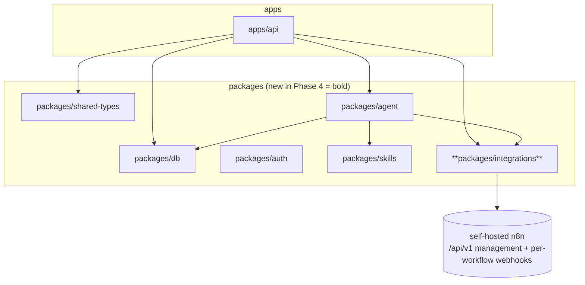
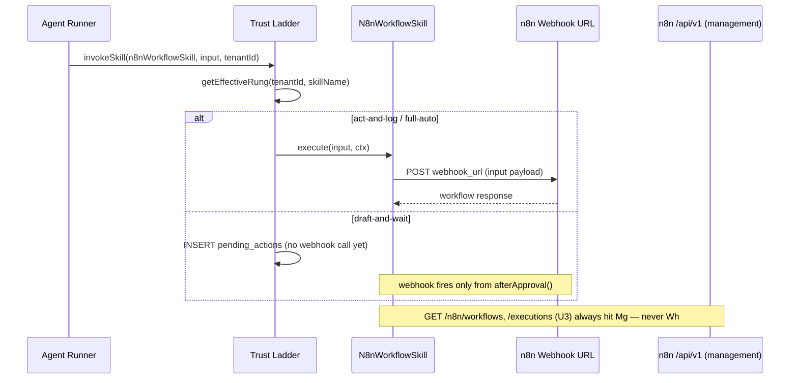
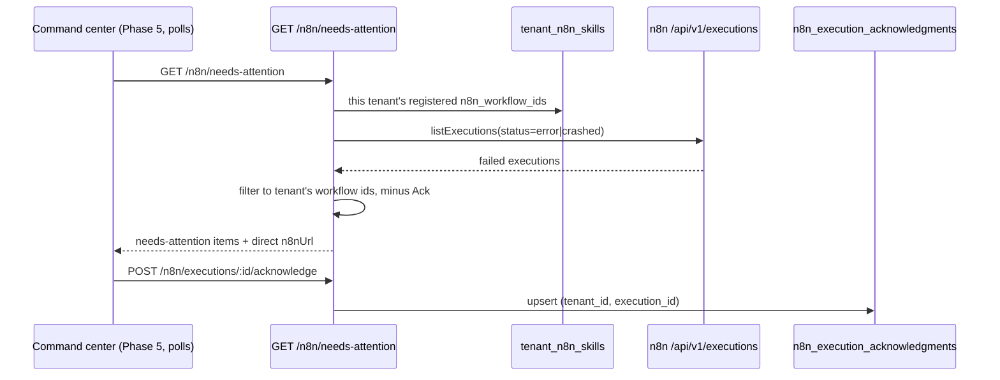

# FelixOS n8n Integration (Phase 4) — Plan

**Target repo:** FelixOS. All paths are repo-relative.

Read the architecture approach plan and the Agent + Skills Registry (Phase 3) plan before working any unit. Phase 3's `SkillDescriptor` contract, `SkillRegistry`, trust ladder (`suggest` / `draft-and-wait` / `act-and-log` / `full-auto`), `pending_actions` table, and `withRequestTenant` / ALS-scoped DB client pattern are the direct base for every unit here.

**Product Contract preservation:** No prior requirements-only artifact exists for this phase — GitHub issues #33–#37 (label `phase-4-n8n`) carry the informal product scope, sourced from R19–R21, R25, and AE5 in the internal-os requirements plan. This plan enriches that issue scope with HOW; it does not change WHAT.

---

## Goal Capsule

- **Objective:** Integrate the self-hosted n8n instance over REST so FelixOS can read workflows/executions for a management surface, invoke n8n workflows as tenant-scoped action-skills on the existing trust ladder, and surface failed runs as "needs you" items — giving Phase 5 a complete backend to render.
- **Product authority:** Tony Myers (operator, tenant #1).
- **Execution profile:** Five GitHub issues (#33–#37). U1 is dependency-free. U2 and U3 both depend only on U1 and can land in parallel. U4 depends on U2 + U3. U5 is the phase gate, depends on U2, U3, U4.
- **Stop conditions:** Stop and surface if the Phase 3 `SkillDescriptor` shape, trust-ladder dispatch, or RLS/ALS-scoped-client contract would need to change. Stop if achieving workflow invocation turns out to require anything beyond a per-workflow webhook call (e.g. a future n8n version exposing a true execute-by-id endpoint) — re-plan rather than silently reinterpreting KTD-P4-3.

---

## Product Contract

### Requirements in scope

- **R18.** LLM inference is used only where judgment is required; the agent orchestrates and n8n executes deterministic work. *(Phase 3 established the agent side; this phase delivers the n8n execution side.)*
- **R19.** FelixOS integrates the self-hosted n8n instance over its REST API on the same VPS.
- **R20.** FelixOS provides an n8n management surface showing workflows, active/inactive state, recent executions, and failures. *(This plan delivers the API; the Phase 5 UI consumes it.)*
- **R21.** n8n workflows are invokable as action-skills on the same trust ladder, and a failed execution surfaces as a "needs you" item linking directly to the failed run.
- **R25.** Direct-action principle: any actionable item anywhere links in one click to the exact object in its context.

### Acceptance examples in scope

- **AE5. (R21, R25)** Given an n8n workflow execution fails, when Tony opens the command center, then a "needs you" item links directly to the failed run. *(Phase 4 delivers the API and data; Phase 5 renders it in the command center.)*

### Scope boundaries

**In scope for Phase 4:** `packages/integrations` (n8n REST client), two new DB tables (`tenant_n8n_skills`, `n8n_execution_acknowledgments`), `N8nWorkflowSkill` registered dynamically per tenant into the agent's tool list, n8n management API routes (`/n8n/workflows`, `/n8n/executions`), workflow-skill registration routes (`/n8n/skills`), needs-attention + acknowledge routes, phase-gate integration test.

**Deferred to Phase 5:** Command-center rendering of needs-attention items; the n8n management surface UI itself (workflow list, execution history views); any polling/refresh cadence for the command center.

**Deferred to later / outside this phase:** Basic-auth or query-param webhook authentication (v1 supports a single custom header only); a webhook receiver for n8n to push failures into FelixOS (polling only); creating, editing, or deleting n8n workflows from FelixOS (read + invoke only; workflow authoring stays in n8n's own UI); multi-instance or per-tenant n8n (one shared instance, per R19/issue #35).

---

## Key Technical Decisions

**KTD-P4-1 — `packages/integrations` as the n8n REST client home, scaffolded like `packages/agent`/`packages/skills`.**
The architecture plan (line 24) names `integrations` as a planned package alongside `db`, `agent`, `skills`, `shared-types`. `packages/integrations/package.json` and `tsconfig.json` mirror `packages/agent`'s shape exactly — source-only resolution (`main`/`types` → `src/index.ts`, no `dist`), registered in `tsconfig.base.json`'s `paths` map alongside the other four internal packages.

**KTD-P4-2 — The client surface is n8n's management API (`/api/v1`) only.**
Confirmed against n8n's own OpenAPI spec (`github.com/n8n-io/n8n`, `packages/cli/src/public-api/v1/openapi.yml`, fetched 2026-06-30): auth via `X-N8N-API-KEY` header, base path `/api/v1`, security schemes `ApiKeyAuth`/`BearerAuth`. Endpoints used: `GET /workflows` (filters: `active`, `tags`, `name`, `projectId`, `limit`, `cursor`), `GET /workflows/{id}`, `POST /workflows/{id}/activate`, `POST /workflows/{id}/deactivate`, `GET /executions` (filters: `status` enum `canceled|crashed|error|new|running|success|unknown|waiting`, `workflowId`, `projectId`, `limit`, `cursor`), `GET /executions/{id}`, `POST /executions/{id}/retry`, `POST /executions/{id}/stop`. Pagination is cursor-based: requests take a `cursor` query param, responses return `{ data: [...], nextCursor: string | null }` (max `limit` 250, default 100). The client's typed wrapper passes this shape through rather than reinventing it.

**KTD-P4-3 — Workflow invocation goes through the workflow's own webhook URL, not the management API. This is the single most important correction this plan makes to the original issue framing.**
n8n's public REST API has **no generic "run workflow by id" endpoint** — the full path list under `/api/v1/workflows` is limited to CRUD, activate/deactivate, tags, and transfer; the only execution-related writes are `retry` and `stop` on an *existing* execution. Issues #33/#34 describe `triggerWorkflow(id, payload)` as if it were a management-API call; it is not. Programmatic invocation requires the workflow to have a Webhook-trigger node configured in n8n, reachable at its own URL (`{n8nHost}/webhook/{path}`), with its own independent auth (header, basic, or none — configured per-node in n8n, not via `X-N8N-API-KEY`). `N8nWorkflowSkill.execute()` therefore POSTs to a per-registration `webhook_url`, never to `/api/v1`. The management client (U1/U3) remains useful for discovery (workflow name/active-state) and execution introspection (U3/U4) but cannot itself trigger a run.

**KTD-P4-4 — `tenant_n8n_skills` is DB-backed, explicit per-tenant opt-in — not auto-exposed.**
Per the confirmed scoping default: a tenant registers which n8n workflows become skills; FelixOS does not enumerate and auto-register every workflow on the shared n8n instance (n8n itself has no tenant concept, so indiscriminate exposure would hand every tenant's agent every other tenant's automations). Schema (migration 0006): `tenant_n8n_skills` — `id uuid PK`, `tenant_id uuid NOT NULL → tenants`, `n8n_workflow_id text NOT NULL`, `skill_name text NOT NULL`, `webhook_url text NOT NULL`, `webhook_auth_header text`, `webhook_auth_ciphertext text`, `webhook_auth_nonce text`, `webhook_auth_key_id text` (encrypted value reuses `packages/auth`'s `encryptSecret`/`decryptSecret`, extracted in Phase 3 KTD-P3-6), `input_schema jsonb NOT NULL DEFAULT '{"type":"object"}'`, `default_rung trust_rung NOT NULL DEFAULT 'act-and-log'`, `created_at`, `updated_at`. Unique `(tenant_id, skill_name)`. `n8n_execution_acknowledgments` ships in the same migration pair (mirrors Phase 3 KTD-P3-4's "ship related tables in one pair"): `id uuid PK`, `tenant_id uuid NOT NULL → tenants`, `n8n_execution_id text NOT NULL`, `acknowledged_at timestamptz NOT NULL DEFAULT now()`. Unique `(tenant_id, n8n_execution_id)`. Migration 0007 grants, enables, and forces RLS on both tables using the established `app.current_tenant` policy pattern.

**KTD-P4-5 — n8n workflow-skills are constructed per-request, not statically registered in `defaultRegistry`.**
Unlike Phase 3's code-defined skills (`DraftEmailSkill`, `CreateTaskSkill`, …), an n8n workflow-skill is tenant-specific *data*, not code, so it cannot live in the process-global `SkillRegistry` Map (KTD-P3-3) keyed only by name. Instead, `POST /agent/run` additionally calls a factory — `createN8nWorkflowSkills(tenantId, scopedDb, n8nClient): Promise<Skill[]>` — that reads the tenant's `tenant_n8n_skills` rows and builds one `Skill` per row, mirroring the existing `createKnowledgeRetrievalTool` factory pattern from Phase 3 (KTD-P3-7). These join the static registry's tools for that request only. `getEffectiveRung`/`invokeThroughTrustLadder` (Phase 3, unmodified) work unchanged — they key purely on `skill_name`, which `tenant_n8n_skills.skill_name` supplies directly, so no Phase 3 trust-ladder code changes.

**KTD-P4-6 — n8n is one shared instance, not per-tenant; `N8N_BASE_URL`/`N8N_API_KEY` are env vars.**
Per R19 and issue #35, n8n itself is not multi-tenant. The client config mirrors `createEnvLlmShim()`: `createEnvN8nClient()` reads `N8N_BASE_URL`/`N8N_API_KEY` once at boot and is decorated onto the Fastify instance (`request.server.n8n`), injectable in tests the same way `llm` is injected into `buildServer(opts)`. Tenant isolation is enforced entirely in FelixOS's own tables (`tenant_n8n_skills`, `n8n_execution_acknowledgments`) — never in n8n itself.

**KTD-P4-7 — In-process TTL cache for read endpoints; no new infrastructure.**
`GET /n8n/workflows` and `GET /n8n/executions` are cached in-memory inside the `packages/integrations` client (short TTL, e.g. 15s, keyed by resolved query params) to absorb repeated polling from a future Phase 5 dashboard. No Redis or other new datastore — introducing one would violate the AGENTS.md stop condition against new infrastructure not in the plan.

**KTD-P4-8 — n8n downtime is a typed, surfaced failure, not a thrown 500.**
Client calls use a short timeout (e.g. 5s) and wrap network failures or non-2xx responses in `N8nUnavailableError`. Routes catch this and return `503 { ok: false, error: { code: "n8n_unavailable", message } }`. No retry-with-backoff loop in v1 — n8n is same-VPS and expected to be reliably reachable; fail fast and let the operator see it rather than masking an outage.

**KTD-P4-9 — Failure detection is polling-based; acknowledgment lives in FelixOS, not n8n.**
`GET /n8n/needs-attention` calls `listExecutions({ status: "error" })` (and `"crashed"`), filters to the tenant's registered `n8n_workflow_id`s (from `tenant_n8n_skills`), and excludes executions already present in `n8n_execution_acknowledgments`. `POST /n8n/executions/:id/acknowledge` is an idempotent upsert. No webhook receiver from n8n into FelixOS in v1 — that would require n8n-side workflow changes, ruled out by the confirmed scoping default.

**KTD-P4-10 — Phase-gate test stubs n8n with an in-process HTTP server, not a real instance.**
Mirrors the established `LlmShim`-injection pattern confirmed during research (`apps/api/src/lib/llm.ts`, injected via `buildServer({ llm })`): `buildServer({ n8n })` accepts an injected client/stub for tests. No Docker Compose n8n service is required in CI.

---

## High-Level Technical Design

### Package topology



### Workflow-skill invocation — two separate n8n surfaces, never conflated



### Needs-attention and acknowledge flow



---

## Output Structure

New package created by this phase:

```
packages/
  integrations/
    package.json
    tsconfig.json
    src/
      index.ts
      n8n/
        client.ts     # createN8nClient(), createEnvN8nClient()
        types.ts       # N8nWorkflow, N8nExecution, paginated list types
        errors.ts       # N8nUnavailableError
```

---

## Implementation Units

### U1. `packages/integrations` scaffold + n8n REST client

**Issue:** #33

**Goal:** Bootstrap `packages/integrations` and build the n8n management-API client — workflow/execution reads and activate/deactivate/retry/stop — with env-backed config, caching, and typed downtime handling. Dependency-zero.

**Requirements:** R19

**Dependencies:** none

**Files:**
- `packages/integrations/package.json` (create)
- `packages/integrations/tsconfig.json` (create)
- `packages/integrations/src/index.ts` (create)
- `packages/integrations/src/n8n/client.ts` (create)
- `packages/integrations/src/n8n/types.ts` (create)
- `packages/integrations/src/n8n/errors.ts` (create)
- `tsconfig.base.json` (modify — add `@felixos/integrations` path alias)
- `apps/api/src/server.ts` (modify — decorate `request.server.n8n` via `createEnvN8nClient()` fallback; accept an injected client in `buildServer(opts)`)

**Approach:** Scaffold mirrors `packages/agent/package.json`/`tsconfig.json` exactly (source-only resolution, no `dist`). Client exports `createN8nClient(config: { baseUrl, apiKey })` and `createEnvN8nClient()`. Methods: `listWorkflows(filters)`, `getWorkflow(id)`, `activateWorkflow(id)`, `deactivateWorkflow(id)`, `listExecutions(filters)`, `getExecution(id)`, `retryExecution(id)`, `stopExecution(id)`. Auth header `X-N8N-API-KEY`; base URL `${N8N_BASE_URL}/api/v1`. Pagination passthrough per KTD-P4-2 (`{ items, nextCursor }`). In-memory TTL cache wraps `listWorkflows`/`listExecutions` per KTD-P4-7. Timeout + `N8nUnavailableError` per KTD-P4-8.

**Patterns to follow:** `apps/api/src/lib/llm.ts`'s `createEnvLlmShim()` for the env-config + injectable-client shape. `packages/agent/package.json`/`tsconfig.json` for workspace scaffold.

**Test scenarios:**
- `createEnvN8nClient()` throws a descriptive error when `N8N_BASE_URL` or `N8N_API_KEY` is missing
- `listWorkflows()` sends the `X-N8N-API-KEY` header and calls `GET {base}/api/v1/workflows`; parses `{ data, nextCursor }` into the typed result
- `listExecutions({ status: 'error', workflowId })` passes both filters as query params
- A non-2xx response or network timeout throws `N8nUnavailableError`, not a raw fetch error
- A second `listWorkflows()` call within the TTL window does not issue another HTTP request; a call after TTL expiry does
- `activateWorkflow`/`deactivateWorkflow`/`retryExecution`/`stopExecution` issue the correct `POST` paths
- Package is importable via `@felixos/integrations` from `apps/api` and `packages/agent` without a type error

**Verification:** `pnpm turbo run lint typecheck build --filter=@felixos/integrations` passes. `apps/api` can import `{ createEnvN8nClient }` cleanly.

---

### U2. n8n workflow-as-skill registration

**Issue:** #34

**Goal:** Let an operator register a specific n8n workflow as a tenant-scoped action-skill on the existing trust ladder, and wire those registrations into the agent's per-request tool list.

**Requirements:** R18, R21

**Dependencies:** U1 (n8n client), Phase 3 `packages/skills` (#26) and agent registry (#25) — both already shipped

**Files:**
- `packages/db/migrations/0006_n8n_schema.sql` (create)
- `packages/db/migrations/0007_n8n_rls.sql` (create)
- `packages/db/src/schema/n8n.ts` (create) — `tenant_n8n_skills`, `n8n_execution_acknowledgments`
- `packages/db/src/schema/index.ts` (modify)
- `packages/db/src/rls.ts` (modify — add both tables to `tenantScopedTables`)
- `packages/db/src/schema.test.ts` (modify — add 0006/0007 to the migration URL array)
- `packages/db/src/rls.test.ts` (modify — extend coverage to both tables)
- `packages/agent/package.json` (modify — add `@felixos/integrations` dependency)
- `packages/agent/src/skills/n8n-workflow.ts` (create) — `Skill` factory wrapping one `tenant_n8n_skills` row
- `packages/agent/src/skills/n8n-registry.ts` (create) — `createN8nWorkflowSkills(tenantId, scopedDb, n8nClient)`
- `apps/api/src/routes/n8n-skills.ts` (create) — `GET/POST/DELETE /n8n/skills`
- `apps/api/src/server.ts` (modify — register n8n-skills routes)
- `apps/api/src/api.integration.test.ts`, `apps/api/src/knowledge.integration.test.ts`, `apps/api/src/agent.integration.test.ts` (modify — add 0006/0007)

**Approach:** Per KTD-P4-4/KTD-P4-5. `POST /n8n/skills` body `{ n8nWorkflowId, skillName, webhookUrl, webhookAuthHeader?, webhookAuthValue?, defaultRung? }` — encrypts `webhookAuthValue` via `packages/auth`'s `encryptSecret`, upserts a `tenant_n8n_skills` row through `withRequestTenant`. `GET /n8n/skills` lists the tenant's registrations (auth value never returned in plaintext). `DELETE /n8n/skills/:skillName` removes a registration.

`createN8nWorkflowSkills()` builds one `Skill` per row: `descriptor = { name: row.skillName, purpose: <auto-generated from the n8n workflow's name via n8nClient.getWorkflow()>, kind: 'n8n-workflow', inputSchema: row.inputSchema, sideEffectClass: 'write', defaultRung: row.defaultRung, requiresInference: false }`. Both `execute(input, ctx)` (used directly by the trust ladder for `act-and-log`/`full-auto`) and `afterApproval(payload, ctx)` (used when a `draft-and-wait` pending action is approved) call a shared private helper that decrypts the webhook auth value if present and `POST`s `input`/`payload` to `webhook_url` with the configured header — this dual-method shape is required because Phase 3's trust ladder (KTD-P3-8) calls `execute()` directly for immediate rungs but only `afterApproval()` for previously-queued ones, and both paths must actually fire the same webhook.

**Patterns to follow:** `packages/agent/src/skills/create-task.ts` for the `execute`/`afterApproval` split. `packages/agent/src/tools/knowledge-retrieval.ts`'s `createKnowledgeRetrievalTool` factory shape. `packages/auth/src/totp.ts`'s `encryptSecret`/`decryptSecret`. `packages/db/migrations/0004_agent_schema.sql`/`0005_agent_rls.sql` for migration shape.

**Test scenarios:**
- `POST /n8n/skills` registers a `tenant_n8n_skills` row; `webhookAuthValue` is stored encrypted and never returned in plaintext from `GET /n8n/skills`
- `tenant_n8n_skills` RLS: Tenant A cannot read or write Tenant B's registrations
- `n8n_execution_acknowledgments` RLS: same isolation
- `createN8nWorkflowSkills(tenantId, ...)` returns one `Skill` per registered row, each with `descriptor.name === row.skillName`
- `N8nWorkflowSkill` at `act-and-log` rung: `execute()` POSTs the input payload to the registered `webhook_url` with the decrypted auth header
- `N8nWorkflowSkill` at `draft-and-wait` rung: `execute()` is not called (trust ladder withholds it); approving the pending action calls `afterApproval()`, which performs the same webhook POST exactly once
- Registering a second workflow under the same `skill_name` for the same tenant overwrites the prior registration (upsert)
- `DELETE /n8n/skills/:skillName` removes the registration; a subsequent agent run's tool list no longer includes it
- Both new tables appear in the `tenantScopedTables` registry with `relrowsecurity = true` and `relforcerowsecurity = true`

**Verification:** `pnpm turbo run lint typecheck test build --filter=@felixos/db --filter=@felixos/agent --filter=@felixos/api` passes against real Postgres. An agent run for a tenant with one registered workflow-skill includes it in the tool list; a tenant with none does not.

---

### U3. n8n management API — workflows, executions

**Issue:** #35

**Goal:** Expose n8n workflow/execution read data through FelixOS's own API so the Phase 5 management surface and the agent never call n8n directly.

**Requirements:** R20

**Dependencies:** U1

**Files:**
- `apps/api/src/routes/n8n.ts` (create) — `GET /n8n/workflows`, `GET /n8n/workflows/:id`, `GET /n8n/executions`, `GET /n8n/executions/:id`
- `apps/api/src/server.ts` (modify — register n8n routes)
- `packages/shared-types/src/n8n.ts` (create) — `N8nWorkflowView`, `N8nExecutionView`
- `packages/shared-types/src/index.ts` (modify — export n8n types)

**Approach:** Thin pass-through routes calling the shared `request.server.n8n` client (decorated in U1), wrapped in the standard response envelope (`sendSuccess`/`sendError` from `apps/api/src/lib/responses.ts`) and auth-gated like every other route. `GET /n8n/workflows` supports the same filters the n8n API exposes (`active`, `name`, `tags`, `cursor`, `limit`) and passes them straight through — FelixOS does not store or duplicate workflow/execution data, it always live-reads via the cached client (KTD-P4-7). On `N8nUnavailableError`, respond `503` per KTD-P4-8. Read access here is operator-wide (any authenticated tenant can read n8n's workflow/execution catalog) — distinct from `tenant_n8n_skills`, which gates which workflows a tenant has registered as *invocable skills*.

**Patterns to follow:** `apps/api/src/routes/knowledge.ts` for route module shape and `withRequestTenant` usage. `apps/api/src/lib/responses.ts` and `apps/api/src/lib/validation.ts` for the envelope and query validation.

**Test scenarios:**
- `GET /n8n/workflows` with no auth returns 401
- `GET /n8n/workflows` proxies filters and returns the client's typed result in the standard `{ ok: true, data }` envelope
- `GET /n8n/workflows/:id` for a nonexistent id returns 404
- `GET /n8n/executions?status=error&workflowId=X` passes both filters through to the client
- `GET /n8n/executions/:id` returns full execution detail
- When the injected n8n client throws `N8nUnavailableError`, the route returns `503` with `code: "n8n_unavailable"`
- Reading workflows/executions does not require any `tenant_n8n_skills` registration to exist

**Verification:** All `n8n.ts` routes pass their integration tests against the stub n8n server (KTD-P4-10).

---

### U4. "Needs you" failed-run items

**Issue:** #36

**Goal:** Surface unacknowledged failed n8n executions as actionable items, scoped to each tenant's registered workflows, with a direct one-click link to the failed run. Covers AE5.

**Requirements:** R21, R25

**Dependencies:** U2 (`tenant_n8n_skills` for tenant-scoping, `n8n_execution_acknowledgments` table), U3 (management API / n8n client)

**Files:**
- `apps/api/src/routes/n8n.ts` (modify — add `GET /n8n/needs-attention`, `POST /n8n/executions/:id/acknowledge`)
- `packages/shared-types/src/n8n.ts` (modify — add `NeedsAttentionItem`)
- `apps/api/src/lib/n8n-needs-attention.ts` (create) — shared helper computing the filtered, unacknowledged failure list

**Approach:** Per KTD-P4-9. `GET /n8n/needs-attention` reads the tenant's `tenant_n8n_skills.n8n_workflow_id` set, calls `n8nClient.listExecutions({ status: 'error' })` (and `'crashed'`, paginating until exhausted or a sane cap), filters to that workflow-id set, excludes ids present in `n8n_execution_acknowledgments`, and shapes each into `{ workflowName, n8nWorkflowId, executionId, failedAt, errorSummary, n8nUrl }` — `n8nUrl` built from `N8N_BASE_URL` plus the execution's UI path (not the API path), satisfying R25's direct-action principle. `POST /n8n/executions/:id/acknowledge` upserts an `n8n_execution_acknowledgments` row (idempotent on conflict).

**Patterns to follow:** `apps/api/src/lib/knowledge-search.ts`-style extraction of a shared query helper used by both a route and (potentially) a future agent tool. `toRawSourceView`-style serializer pattern for `NeedsAttentionItem`.

**Test scenarios:**
- A failed execution for a tenant's registered workflow appears in `GET /n8n/needs-attention` (Covers AE5)
- A failed execution for a workflow the tenant has **not** registered as a skill does not appear (tenant-scoping via `tenant_n8n_skills`, since n8n itself has no tenant concept)
- Acknowledging an execution removes it from subsequent `GET /n8n/needs-attention` calls
- Acknowledging the same execution twice is a no-op, not an error (idempotent upsert)
- Acknowledging an execution id with no matching failed run still records the acknowledgment without erroring
- Tenant B cannot acknowledge or see Tenant A's needs-attention items (RLS on `n8n_execution_acknowledgments` + tenant-scoped `tenant_n8n_skills` join)
- Each item includes a direct `n8nUrl` requiring no further navigation (Covers AE5 / R25)

**Verification:** Integration test runs a stub n8n returning a mixed set of executions across two tenants' registered/unregistered workflows; only the correct tenant-scoped, unacknowledged failures appear per tenant.

---

### U5. Phase-gate integration test

**Issue:** #37

**Goal:** Phase-gate integration test for the n8n integration phase, proving the REST client, workflow-as-skill trust-ladder flow, management API, and needs-attention/acknowledge loop all work together against a stubbed n8n.

**Requirements:** R19–R21

**Dependencies:** U1, U2, U3, U4

**Files:**
- `apps/api/src/n8n.integration.test.ts` (create)
- `tests/integration/foundation.test.ts` (modify — add 0006/0007 if it enumerates all migrations)

**Approach:** Follows `apps/api/src/agent.integration.test.ts`'s shape — ephemeral schema per run, scoped role, two tenants (A and B), a stub n8n HTTP server implementing the subset of `/api/v1` used (KTD-P4-10), plus an ephemeral webhook receiver to assert `N8nWorkflowSkill.execute()`/`afterApproval()` actually POST.

**Execution note:** Safety-critical (mirrors Phase 3's U8) — every scenario here is a gate; a red test means the phase is not shippable.

**Test scenarios:**
- Tenant isolation: Tenant A's registered workflow-skills, acknowledgments, and needs-attention items are invisible to Tenant B
- Workflow-as-skill end-to-end: register a workflow-skill at `act-and-log` → invoke via an agent run → the stub webhook receiver confirms the POST arrived with the expected payload and auth header
- Trust ladder — `draft-and-wait`: invoking a `draft-and-wait` workflow-skill does not call the webhook; approving the pending action triggers the webhook exactly once
- Management API: `GET /n8n/workflows` and `GET /n8n/executions` proxy correctly and respect filters against the stub
- n8n unavailable: stub server returns a connection failure → `GET /n8n/workflows` returns `503` with `code: "n8n_unavailable"`, not a `500`
- Needs-attention + acknowledge round-trip (Covers AE5): a failed execution appears, gets acknowledged, and disappears from subsequent listings
- `tenant_n8n_skills` and `n8n_execution_acknowledgments` are confirmed RLS-enabled and forced

**Verification:** `TEST_DATABASE_URL=... pnpm --filter @felixos/api test` passes 100%. Zero skipped scenarios in the n8n integration suite.

---

## Risks and Dependencies

- **n8n public API surface drift:** This plan is built against n8n's current OpenAPI spec (`n8n-io/n8n`, master branch, fetched 2026-06-30). Verify the operator's actual self-hosted n8n version matches this spec before implementing U1 — endpoint shapes are directional, not contractual, across n8n releases.
- **Webhook auth model varies per workflow:** n8n supports header auth, basic auth, or no auth per Webhook-trigger node. U2's schema supports header-based auth only in v1; basic-auth-protected webhooks are an open question.
- **Migration ordering:** 0006/0007 must be added to the same five hard-coded migration-URL arrays Phase 3 flagged (`schema.test.ts`, `rls.test.ts`, `api.integration.test.ts`, `knowledge.integration.test.ts`, `agent.integration.test.ts`) plus the new `n8n.integration.test.ts`. Missing any one causes test isolation failures.
- **Same-VPS latency assumption:** KTD-P4-6/KTD-P4-8 assume n8n is reachable on the same VPS with low latency. If n8n ever moves off-VPS, the 5s timeout and no-retry stance in KTD-P4-8 should be revisited.

---

## Open Questions

- **Deferred — basic-auth / no-auth webhook support:** v1 supports a single custom header for webhook auth only; expand `tenant_n8n_skills` if the operator's workflows need basic auth or query-param tokens.
- **Deferred — needs-attention polling cadence:** `GET /n8n/needs-attention` is pull-based; the Phase 5 command center decides how often to call it. No server-side polling job in Phase 4.
- **Deferred — Phase 5 rendering:** The needs-attention list and the management-surface UI itself are out of scope here (Phase 5: Surfaces).
- **Deferred — n8n workflow authoring from FelixOS:** This phase is read + invoke only; creating/editing n8n workflows stays in n8n's own UI.

---

## Verification Contract

The phase is shippable when:
1. `pnpm turbo run lint typecheck test build` passes across all affected packages and apps
2. `apps/api/src/n8n.integration.test.ts` passes in full against real Postgres 18 + pgvector and a stub n8n
3. `packages/db/src/rls.test.ts` confirms `tenant_n8n_skills` and `n8n_execution_acknowledgments` have RLS enabled and forced
4. AE5: a failed n8n execution for a tenant-registered workflow surfaces as a needs-attention item with a direct link — verified by integration test
5. Tenant A's workflow-skill registrations, acknowledgments, and needs-attention items are invisible to Tenant B — each isolation claim has a named test case
6. `N8nWorkflowSkill` respects the trust ladder identically to Phase 3's action-skills (`draft-and-wait` withholds the webhook call until approval)

---

## Definition of Done

- `packages/integrations` exists as a workspace package, importable via `@felixos/integrations`
- Migrations 0006 and 0007 apply cleanly to a fresh Postgres 18 + pgvector schema
- `GET /n8n/workflows`, `GET /n8n/workflows/:id`, `GET /n8n/executions`, `GET /n8n/executions/:id`, `GET/POST/DELETE /n8n/skills`, `GET /n8n/needs-attention`, `POST /n8n/executions/:id/acknowledge` all return correct responses under auth
- A registered n8n workflow-skill is invocable by the agent and observes the same trust ladder as Phase 3's action-skills
- All 5 Phase 4 GitHub issues (#33–#37) closed via `Closes #N` in PR bodies
- `/ce-compound` run for the "workflow invocation is webhook, not management API" learning — the most reusable finding from this phase

---

## Sources & Research

- **n8n public REST API OpenAPI spec** — `github.com/n8n-io/n8n`, `packages/cli/src/public-api/v1/openapi.yml` (master branch, fetched 2026-06-30). Confirmed the `X-N8N-API-KEY` auth header, `/api/v1` base path, the full workflows/executions path list, cursor-based pagination shape (`{ data, nextCursor }`, `limit` max 250 default 100) — and, critically, the absence of any generic workflow-execute endpoint, which directly informed KTD-P4-3.
- **n8n rate-limit documentation** (`docs.n8n.io`) — no documented rate limit on a self-hosted instance's own public API (the rate-limit guidance that exists concerns nodes calling third-party services, not n8n's own API). Informs KTD-P4-8's no-retry-storm stance.

---

[](https://github.com/EveryInc/compound-engineering-plugin)
