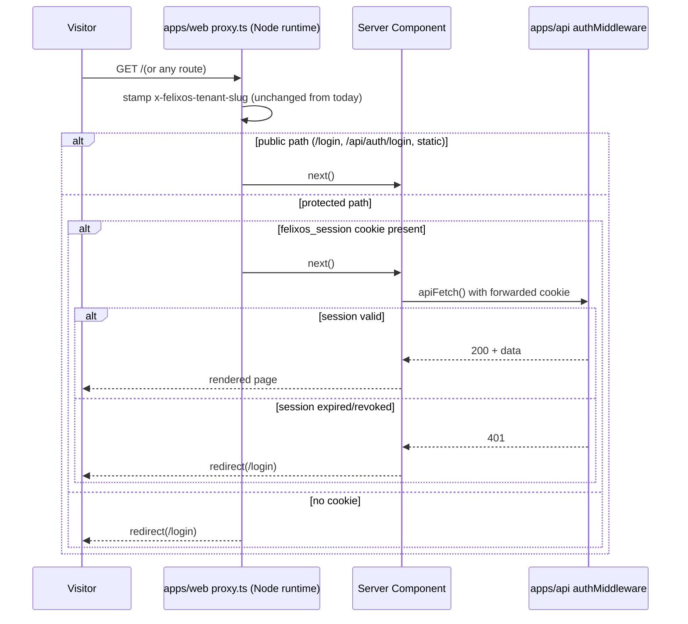

# FelixOS Surfaces (Phase 5) - Plan

## Goal Capsule

- **Objective:** Build Phase 5 ("Surfaces") — the command-center, account drill-in, triage, n8n management, and knowledge-distillation review UI that Phases 1-4 deliberately deferred backend-only — giving Tony a working operational front end for the MSP.
- **Product authority:** Tony Myers (founder, operator, and tenant #1), per `docs/plans/2026-06-28-001-feat-felixos-internal-os-plan.md`.
- **Open blockers:** None. All product decisions resolved during brainstorming; all planning-time technical decisions resolved below. Two implementation-time questions remain (see Open Questions) — neither blocks starting work.
- **Product Contract preservation:** unchanged. The Product Contract's `Outstanding Questions` subsection (all three items were "Deferred to Planning") has been resolved by this Planning Contract and removed to avoid duplication; its content lives in Key Technical Decisions and Open Questions below.

---

## Product Contract

### Summary

Phase 5 builds FelixOS's first real authenticated app shell and renders the five surfaces already specified in R22-R25 of the product plan: command-center (home), account drill-in, triage, n8n management, and knowledge-distillation review — each backed by APIs Phases 1-4 already built (plus three small additions this phase makes), with honest empty states wherever an upstream capture source doesn't exist yet.

### Problem Frame

Phases 1-4 built the multi-tenant foundation, knowledge core, agent + skills registry, and n8n integration entirely backend-first, each phase explicitly deferring its UI to "Phase 5: Surfaces" (see the "Deferred to Phase 5" notes in each phase plan). Today, `apps/web` has no authenticated app shell — no navigation, no design-system components — and its one real page is Foundation's placeholder accounts list, reachable without a valid session since nothing redirects unauthenticated visitors. All the backend value built so far — agent draft-and-wait approvals, n8n failure tracking, distilled knowledge — is invisible to Tony.

### Key Decisions

- **Command-center becomes home; sidebar navigation.** The root route changes from the Foundation-era accounts list to the command-center "today" view. A persistent left sidebar — not top tabs — reaches Accounts, Triage, n8n, and Knowledge review, leaving room to grow as later phases add nav destinations.
- **Triage and account drill-in ship full layout now, with honest empty states.** Both surfaces render every section named in R23/R24 even though email, Slack, meeting-capture, and task-management backends don't exist yet. This avoids redesigning the layout when those connectors land in later phases.
- **Knowledge review is a scannable list with inline actions, not a one-at-a-time queue.** Pending distilled items render as a dense list where Tony can accept, correct, or reject any row in any order, matching the operational density AGENTS.md's Frontend Expectations call for.
- **The n8n management surface is read + acknowledge only.** Workflow list, execution history, and needs-attention items are read-only from FelixOS; acknowledging a failed execution is the only write action available. Workflow creation, editing, activate/deactivate, retry, and stop all stay in n8n's own UI — Phase 4 already built the backend this way (no generic "run workflow," activate/deactivate, retry, or stop route is exposed through FelixOS's own API).
- **The auth-gate redirect is in scope for this phase.** Protected routes currently don't redirect unauthenticated visitors to `/login` (`apps/web/middleware.ts` only stamps a tenant-slug header today). Closing this gap is part of building the first real authenticated shell, not a separate issue.
- **This phase also establishes the app's first UI component primitives.** `apps/web` has no design system today — no Tailwind/shadcn/Radix, no `components/` directory, one hand-written CSS file. The buttons, tabs, status badges, tables, and empty states needed across all five surfaces are new groundwork this phase carries, not something to assume already exists.

### Shell and surface map

```mermaid
flowchart TB
  Login[/login] --> Shell
  subgraph Shell["Authenticated shell — sidebar nav"]
    CC[Command-center — home]
    ACC[Accounts list]
    DRILL[Account drill-in]
    TRI[Triage]
    N8N[n8n management]
    KR[Knowledge review]
  end
  CC -->|click needs-you item| DRILL
  CC -->|click failed run| N8N
  TRI -->|click item| DRILL
  ACC -->|open account| DRILL
  N8N -->|acknowledge| CC
  N8N -->|investigate| ExtN8N["n8n's own UI"]
```

### Actors

- A1. Tony — operator and tenant #1; the sole user of every Phase 5 surface.
- A2. The Agent — produces the draft-and-wait items, act-and-log entries, and distilled knowledge that command-center, triage, and knowledge review render.
- A4. n8n — source of workflow and execution data for the n8n management surface.

### Requirements

**Shell and navigation**

- R1. An authenticated app shell replaces the current unguarded layout: a persistent left sidebar reaches command-center (home), Accounts, Triage, n8n, and Knowledge review.
- R2. Visiting any protected route without a valid session redirects to `/login`.

**Command-center (home)**

- R3. Command-center is the root route and shows, per product plan R22: items needing Tony (draft-and-wait approvals with citations, and failed n8n executions), what the agent already did under act-and-log, today's meetings with prep, and freshly distilled knowledge.
- R4. Every actionable item on command-center links in one click to the exact object it concerns (product plan R25, the direct-action principle) — never through account → contact → thread navigation. The one exception: a draft-and-wait item whose skill produced no resolvable target renders with no link rather than a broken one.
- R5. A draft-and-wait item can be approved, edited, or dismissed directly from command-center; approval executes the underlying action-skill.

**Account drill-in**

- R6. The account drill-in is one screen per product plan R23, pulling contacts, deal stage, interactions, and knowledge for the account; sections for email, Slack, meetings, and tasks render as clearly-labeled empty states until their backends exist.
- R7. Navigating to an account's drill-in from anywhere in the app (command-center, triage, accounts list) is one click, honoring R25.

**Triage**

- R8. Triage is a distinct, agent-ranked queue view (product plan R24) — not merely a filtered re-render of command-center's needs-you list — that will be empty or near-empty until later-phase capture skills (email, Slack) exist to populate it.

**n8n management**

- R9. The n8n surface lists workflows (name, active/inactive state) and recent executions, and shows a needs-attention list of failed or crashed runs (product plan R20).
- R10. Each needs-attention item links directly to that execution's page in n8n's own UI and can be acknowledged/dismissed from FelixOS (product plan R21, R25, AE5).
- R11. FelixOS does not expose workflow create, edit, activate, deactivate, retry, or stop actions in Phase 5 — those stay in n8n's own UI.

**Knowledge review**

- R12. A review screen lists distilled items pending review as a scannable list; each row supports accept, correct (with correction text), or reject inline, without leaving the list (product plan R12).
- R13. A corrected or rejected item is excluded from future agent retrieval (product plan R12, AE2).

### Key Flows

- F1. Morning command-center triage
  - **Trigger:** Tony opens FelixOS.
  - **Actors:** A1, A2
  - **Steps:** Command-center loads; agent-ranked needs-you items, overnight act-and-log entries, today's meetings, and freshly distilled knowledge render; each item is one click to its source.
  - **Covered by:** R3, R4, R5

- F2. Reviewing a distilled fact
  - **Trigger:** Tony opens Knowledge review.
  - **Actors:** A1, A2
  - **Steps:** Pending distilled items render as a list; Tony accepts, corrects (with text), or rejects a row inline; the item's status updates and corrected/rejected items stop surfacing in future retrieval.
  - **Covered by:** R12, R13

- F3. n8n failure to resolution
  - **Trigger:** An n8n workflow execution fails.
  - **Actors:** A1, A4
  - **Steps:** The failure appears on both command-center's needs-you list and the n8n needs-attention list; Tony clicks through to n8n's own UI to investigate or retry, then acknowledges the item in FelixOS.
  - **Covered by:** R9, R10, R11

- F4. Unauthenticated access
  - **Trigger:** A visitor without a valid session requests any protected route.
  - **Actors:** A1
  - **Steps:** The app redirects to `/login` before rendering any protected content.
  - **Covered by:** R2

### Acceptance Examples

- AE1. **Covers R2.** Given no session cookie, when a visitor requests `/` (command-center) or any other protected route, then they're redirected to `/login` without any protected data being fetched or rendered.
- AE2. **Covers R4, R5.** Given a skill on the draft-and-wait rung, when the agent prepares an outbound email, then it appears on command-center for approval and is not sent until Tony approves, with one click to the drafted object (product plan AE1) when one is resolvable.
- AE3. **Covers R10.** Given an n8n workflow execution fails, when Tony opens the n8n needs-attention list or command-center, then the item links directly to that execution in n8n's own UI (product plan AE5).
- AE4. **Covers R12, R13.** Given a distilled fact Tony rejects from the knowledge review list, when the agent next retrieves for a related query, then the rejected fact is excluded from the grounded answer (product plan AE2).
- AE5. **Covers R6.** Given an account with no email, Slack, meeting, or task data yet, when Tony opens its drill-in, then those sections render a clearly-labeled empty state rather than being hidden or erroring.

### Scope Boundaries

**Deferred for later**

- Task management, email capture, Slack capture, and meeting/audio capture — no backend exists yet; their command-center, drill-in, and triage sections stay empty until those connectors land in later phases.
- n8n workflow create/edit/delete and activate/deactivate from FelixOS — workflow authoring stays in n8n's own UI (Phase 4 scoping decision, carried forward).
- Logout — no explicit logout affordance is built in Phase 5; sessions expire naturally per `packages/auth`'s existing TTL.

**Outside this product's identity**

- Working *in* the business — client-facing service delivery or ticketing. Phase 5's surfaces are exclusively for Tony working *on* the business (carried from the product plan).

### Dependencies / Assumptions

- Depends on the API routes already built in Phases 1-4: `/entities`, `/contacts`, `/deals`, `/interactions`, `GET /agent/pending`, `POST /agent/pending/:id/approve`, `POST /agent/pending/:id/reject`, `/knowledge/sources`, `PATCH /knowledge/items/:id`, `/n8n/workflows`, `/n8n/executions`, `/n8n/needs-attention`, `POST /n8n/executions/:id/acknowledge`.

---

## Planning Contract

### Key Technical Decisions

**KTD-P5-1 — shadcn/ui (Radix primitives) + Tailwind CSS v4 + TanStack Table as the design-system foundation.**
For single-operator internal tooling, this is a real dependency commitment (Tailwind, unified `radix-ui`, `@tanstack/react-table` all become long-term maintenance surface) — justified because AGENTS.md already mandates dense, scannable, established controls (tabs, tables, badges) that would otherwise be hand-rolled five times across U4-U8; a lighter hand-rolled approach trades a one-time setup cost for repeated per-screen invention. Confirmed via 2026 framework research: shadcn/ui remains the dominant choice for dense internal/admin tools and is fully compatible with this repo's Next.js 16.2.9 / React 19.2.7. Setup path: Tailwind v4's CSS-first config (no `tailwind.config.js`; `@theme` directives inside `app/styles.css`), `postcss.config.mjs` with `@tailwindcss/postcss`, and shadcn CLI v4 (`npx shadcn@latest init`), which as of Feb 2026 collapsed the separate `@radix-ui/react-*` packages into one unified `radix-ui` dependency. `apps/web/app/styles.css`'s `:root` block today sets plain hex values directly (`color: #172026`, `background: #f6f7f4`, and 7 more scattered across selectors) — there are no existing CSS custom properties to carry forward. The first step is extracting those hardcoded hex values into a small set of named custom properties (e.g. `--background`, `--foreground`, `--accent`), then wiring Tailwind's `@theme` to consume them, keeping AGENTS.md's "one quiet palette" intact rather than reintroducing hex literals inside new shadcn components. Pair shadcn's `<Table>` with TanStack Table (headless state: sort/filter/pagination) for the dense lists U6-U8 need — the de facto pairing for shadcn-based admin UIs and a clean fit for the no-nested-cards style AGENTS.md mandates.

**KTD-P5-2 — `apps/web/middleware.ts` migrates to `apps/web/proxy.ts` (Next.js 16 convention); auth-gate does a cookie-presence check only, and continues today's tenant-slug stamping.**
Next.js 16 renamed the middleware convention to `proxy.ts`, running on the Node.js runtime (the old `middleware.ts`/Edge convention is deprecated and slated for removal). Official Next.js guidance for this exact shape — session validated by an external backend, not Next's own auth — is an optimistic presence/shape check in the proxy layer only; real validation happens in the data-fetching layer (Server Components, Server Actions, Route Handlers), never a network call from the proxy itself. This matches FelixOS's session design exactly: the `felixos_session` cookie (`packages/auth/src/session.ts:9`) is an opaque token requiring a privileged DB lookup to validate (`validateSession`, `session.ts:42-59`) — work the Node-runtime proxy has no business doing per-request. `apps/api/src/middleware/auth.ts` already does full validation on every API call, so the proxy only needs to catch the common case (no cookie at all) before rendering starts. Protect everything except an explicit public allowlist (`/login`, `/api/auth/login`, static assets) so new routes are protected by default, not by omission. `middleware.ts` today also stamps the `x-felixos-tenant-slug` header via `requestTenantSlug()` (`apps/web/lib/tenant.ts`), which `app/login/page.tsx` reads to resolve the tenant — `proxy.ts` must continue that stamping alongside the new auth-gate check; it's relocated, not replaced.

**KTD-P5-3 — Shared `apiFetch<T>()` helper replaces silent-failure fetch calls; a 401 redirects to `/login`; every protected page calls it at least once.**
`apps/web/lib/api.ts`'s existing `fetchAccounts()` pattern (server-only, cookie-forwarding, `cache: "no-store"`, `ApiResult<T>` unwrap) is the right shape to extend, but it currently swallows both empty-data and auth-failure into the same `[]` return (`lib/api.ts:14-16`). Extract a shared `apiFetch<T>(path)` that keeps the pattern but distinguishes a 401 (redirect to `/login` via `next/navigation`) from a genuine empty result. Every new data-fetching module (U4-U8) is built on this helper, not a bespoke fetch call per screen. Because KTD-P5-2 deliberately keeps `proxy.ts` to a cookie-presence check, `apiFetch` is the sole point that actually catches an expired or revoked session — every protected page must call it at least once so the auth boundary isn't silently bypassed by a future page that renders without fetching anything.

**KTD-P5-4 — Three small additions to `apps/api`: all of this phase's new backend surface.**
1. `GET /knowledge/items` (`apps/api/src/routes/knowledge.ts`) with `status`/`entityId`/`limit`/`cursor` query params (mirroring the n8n client's cursor-pagination shape already established in `packages/integrations`), defaulting to `status=pending`, returning `ListResponse<DistilledItemView>` (`packages/shared-types`) — needed for Knowledge review (U8) and reused by command-center's freshly-distilled-knowledge feed (U4, via `status=accepted`).
2. `GET /agent/pending` gains an optional `status` query param (defaulting to today's `pending`-only behavior) so command-center's act-and-log section (R3) can fetch executed items from the same endpoint, and gains a server-computed `targetEntityId: string | null` field per row — normalizing the divergent per-skill payload shapes (`create-task` uses `accountId`; `draft-email`/`youtube-capture`/`doc-note-capture` use `entityId`, sometimes absent) into one field the web layer links from directly (R4). When `targetEntityId` is `null`, the item renders with no direct-action link — the one acknowledged exception to R4.
3. `PATCH /agent/pending/:id` (new route) persists an edit to a pending item's primary text field before approval (R5's "edited" action), separate from the existing `POST /pending/:id/approve|reject`.
Everything else in this phase consumes routes that already exist.

**KTD-P5-5 — Triage ranking is a simple recency-then-severity sort, not new ranking infrastructure.**
Given Triage will be empty or near-empty until later-phase capture skills exist (R8), a pure sort function (n8n failures rank above draft-and-wait items; recency breaks ties within a tier) is sufficient. Avoids building ranking infrastructure for data that doesn't exist yet.

**KTD-P5-6 — Playwright E2E test infrastructure is introduced in this phase, including a repeatable demo-tenant seed and secret-safe session storage.**
`apps/web` has no component-test or E2E infra today (only two pure-function Vitest tests exist: `lib/login.test.ts`, `lib/tenant.test.ts` — no jsdom, no testing-library). This phase is the first multi-page, auth-gated, route-level-chrome change in the repo — AGENTS.md's pre-merge gate makes Playwright E2E coverage mandatory for exactly this class of change, and the README already names this phase as the trigger point ("Playwright — to be set up when multi-page auth flows land"). Introduce `@playwright/test` and `apps/web/playwright.config.ts` rather than substituting component tests or ad-hoc `/ce-test-browser` checks alone. Two prerequisites this phase must also cover: (a) `packages/db/src/seed.ts` exists but nothing currently invokes it — add a `pnpm db:seed` script so the Docker Compose stack can be seeded repeatably for both `/ce-test-browser` manual checks and the E2E suite; (b) Playwright's `storageState` persists a live, valid session cookie to disk to avoid re-logging-in per spec — that file must live under a repo-root-gitignored path (`apps/web/playwright/.auth/`) and must never be uploaded as a retained CI artifact, since it is equivalent to a bearer credential for the seeded tenant. The E2E login derives its TOTP code from a known secret exposed only via a non-committed env var consumed by the seed script, never hardcoded in a spec file.

**KTD-P5-7 — Account drill-in fetches the tenant's full contacts/deals/interactions and filters by account in `apps/web`, not via new API query params.**
`GET /contacts`, `GET /deals`, and `GET /interactions` (`apps/api/src/routes/{contacts,deals,interactions}.ts`) take no query parameters and return the whole tenant's rows unfiltered — there is no account-scoped variant. Given FelixOS today has one real tenant (Tony) with a small seeded dataset, filtering by `accountId` in `apps/web/lib/entities.ts` after a full-tenant fetch is simpler than adding three new query-param-scoped API routes, and keeps this phase's backend surface to the three additions in KTD-P5-4. Revisit server-side filtering if tenant data volume grows enough to make full-tenant fetches costly — not a concern at current scale.

**KTD-P5-8 — Shared list/screen UX conventions: "Load more" pagination, inline expand-in-row correction, no loading skeleton, desktop-only layout.**
Four small UX decisions apply uniformly across U4-U8 rather than being invented per-screen: (1) pagination for the cursor-paginated lists (U6 triage, U7 executions, U8 knowledge review) is a "Load more" button appending the next page — no infinite scroll, no page-number control, consistent with the dense/quiet style; (2) knowledge review's inline correction (R12) expands the row in place to reveal a textarea with save/cancel, rather than a modal or popover, so the row stays in list context — correction text is required (matches existing API validation) with no enforced max length in Phase 5; (3) Server Component pages that fetch on render (U4, U5) render directly with no `loading.tsx` skeleton — a deliberate choice favoring fast blank-to-full render over added skeleton machinery, acceptable at current data volumes; (4) the sidebar shell (U3) targets desktop-only fixed layout for Phase 5 — Tony operates FelixOS from a desktop, and responsive/mobile behavior is explicitly deferred rather than guessed at.

**KTD-P5-9 — Accessibility relies on shadcn/Radix's built-in ARIA behavior; U9 adds one keyboard-navigation check rather than a dedicated audit.**
Radix primitives (which shadcn wraps) ship reasonable keyboard-nav and ARIA defaults out of the box. This phase doesn't add a formal accessibility audit or new ARIA work beyond not overriding those defaults when composing custom row actions (approve/reject buttons, inline correction). U9's manual verification adds one check — tabbing through the sidebar and command-center's approve/reject controls without a mouse — as a baseline regression guard rather than full audit coverage.

### High-Level Technical Design

Auth-gate request flow (KTD-P5-2, KTD-P5-3):



### Assumptions

- Full brainstorm scope is implemented as one plan (all five surfaces, all of R1-R13) — not narrowed to a subset — matching the brainstorm's confirmed "all five, one Phase 5" scope decision.
- The three backend additions in KTD-P5-4 are built within this same plan rather than filed as separate follow-up issues, since command-center (R3, R4, R5) and Knowledge review (R12) cannot function without them.
- Playwright E2E setup, including the demo-tenant seed script (KTD-P5-6), is in-scope for this plan's PR, not a separate infrastructure ticket, since it's a direct consequence of the mandatory-coverage gate this plan's own changes trigger.

### Implementation Constraints

- No new production dependencies beyond what KTD-P5-1 requires: `tailwindcss`, `@tailwindcss/postcss`, the unified `radix-ui` package (via shadcn CLI), `@tanstack/react-table`, plus small shadcn-convention helpers (`class-variance-authority`, `clsx`, `tailwind-merge`). `@playwright/test` is a devDependency only. KTD-P5-4's backend additions are new routes on the existing Fastify app, not new packages.
- Internal package resolution stays source-only (no `dist`), per AGENTS.md's module-resolution contract — this phase doesn't touch that boundary but must not violate it when wiring new `apps/web` code against `@felixos/shared-types`.

### Sequencing

U1 and U2 have no dependencies and start immediately in parallel. U3 depends on both. U5 (accounts move + drill-in) depends on U1-U3 and must land before U4, since both units touch `apps/web/app/(app)/page.tsx` — U5 relocates the existing accounts list out of that file before U4 rewrites it into command-center. U6 and U7 depend only on U1-U3 and are independently parallelizable with each other and with U5. U8 depends on U1-U3; U4 additionally depends on U8, since command-center's freshly-distilled-knowledge feed reuses U8's `GET /knowledge/items` endpoint (KTD-P5-4). U9 depends on all of U1-U8 and runs last, exercising the full stack.

---

## Implementation Units

### U1. Design system foundation (Tailwind v4 + shadcn/ui + TanStack Table)

**Goal:** Establish `apps/web`'s first UI component primitives so every subsequent screen has buttons, tabs, status badges, tables, and empty states to compose from.
**Requirements:** R1, R3, R6, R8, R9, R12 (every surface depends on these primitives)
**Dependencies:** none
**Files:**
- `apps/web/postcss.config.mjs` (new)
- `apps/web/app/styles.css` (modify — extract the ~9 hardcoded hex values into named custom properties, then layer Tailwind's `@import`/`@theme` on top)
- `apps/web/components.json` (new, shadcn config)
- `apps/web/lib/utils.ts` (new, `cn()` helper — shadcn convention)
- `apps/web/components/ui/button.tsx`, `badge.tsx`, `table.tsx`, `tabs.tsx`, `empty-state.tsx` (new)
- `apps/web/package.json` (modify — add `tailwindcss`, `@tailwindcss/postcss`, `radix-ui`, `@tanstack/react-table`, `class-variance-authority`, `clsx`, `tailwind-merge`)

**Approach:** Extract `app/styles.css`'s existing hardcoded hex values (`#172026`, `#245b47`, `#344139`, `#59655b`, `#a5382b`, `#b9c4ba`, `#d7ddd2`, `#f6f7f4`, `#ffffff`) into named custom properties (`--background`, `--foreground`, `--accent`, etc.), then run shadcn CLI v4 init and wire Tailwind's `@theme` to consume those properties rather than reintroducing hex literals (KTD-P5-1). Review the CLI's proposed diff rather than accepting a wholesale overwrite of the file. Generate only the primitives immediately needed (button, badge, table, tabs) plus one repo-specific `EmptyState` component (icon/text/optional action) reused across every "no data yet" section named in R6/R8. Pair shadcn's `<Table>` with `@tanstack/react-table` for U6-U8's dense lists, following the "Load more" pagination convention in KTD-P5-8.

**Patterns to follow:** the token names chosen here become the palette every later unit consumes — keep it to the existing 9-color set, no new colors, preserving AGENTS.md's "one quiet palette" requirement.

**Test scenarios:**
Test expectation: none -- pure scaffolding/styling with no independent behavior; U9's E2E suite exercises the rendered result.

**Verification:** `pnpm --filter @felixos/web build` succeeds; `pnpm --filter @felixos/web lint` passes on new files; `/ce-test-browser` confirms the existing login page still renders without visual regression.

---

### U2. Auth-gate: `proxy.ts` migration + cookie-presence redirect + `apiFetch` 401 handling

**Goal:** Close the gap where protected routes render without a valid session (R2), migrating to Next.js 16's `proxy.ts` convention in the process, without losing today's tenant-slug header stamping.
**Requirements:** R2, AE1
**Dependencies:** none
**Files:**
- `apps/web/proxy.ts` (new, replaces `middleware.ts`; continues stamping `x-felixos-tenant-slug` via `requestTenantSlug()` alongside the new auth-gate check)
- `apps/web/middleware.ts` (delete)
- `apps/web/package.json` (modify — update the `lint` script's `"middleware.ts"` argument to `"proxy.ts"`)
- `apps/web/lib/api.ts` (modify — extract shared `apiFetch<T>()` helper with 401 → redirect)
- `apps/web/lib/api.test.ts` (new)
- `apps/web/lib/proxy-rules.ts` (new — pure `isPublicPath(pathname)` function)
- `apps/web/lib/proxy-rules.test.ts` (new)

**Execution note:** Start with a failing test for `isPublicPath()` and the redirect decision before wiring it into `proxy.ts` — this is session-gating behavior; treat it with the same rigor as safety-critical auth code even though it lives outside `packages/auth`.

**Approach:** Rename `middleware.ts` to `proxy.ts` (exported function `proxy`, not `middleware`) per KTD-P5-2. Check `request.cookies.get('felixos_session')` presence only against an explicit public-path allowlist (`/login`, `/api/auth/login`, static assets); redirect to `/login` when the path isn't public and the cookie is absent. `proxy.ts` continues today's tenant-slug header stamping unchanged — the auth-gate check is additive, not a replacement. Never call the backend from `proxy.ts`. Extract the redirect decision into a pure, testable `isPublicPath()` function mirroring `apps/web/lib/tenant.ts`'s existing style. Extend `lib/api.ts` into a shared `apiFetch<T>(path)` (KTD-P5-3): on a 401, call `redirect('/login')`; on other non-2xx, throw so Next.js's error boundary surfaces it (U4 adds the `(app)` route group's `error.tsx`); on success, unwrap `ApiResult<T>` as today.

**Technical design** (directional):
```
isPublicPath(pathname): boolean
  // "/login", "/api/auth/login", static asset prefixes

proxy(request):
  requestHeaders.set(tenantSlugHeader, requestTenantSlug(request))  // unchanged from today
  if isPublicPath(request.nextUrl.pathname): return NextResponse.next({ request: { headers: requestHeaders } })
  if !request.cookies.has(SESSION_COOKIE_NAME): return NextResponse.redirect('/login')
  return NextResponse.next({ request: { headers: requestHeaders } })
```

**Patterns to follow:** `apps/web/lib/login.ts` / `lib/tenant.ts`'s existing style of a pure, testable function plus a thin Next.js-specific wrapper.

**Test scenarios:**
- Happy path: `isPublicPath('/login')` and `isPublicPath('/api/auth/login')` return `true`; a protected path returns `false`.
- Happy path: the tenant-slug header is still set on every response, public or protected, matching today's behavior.
- Edge case: a request to `/login` with no cookie is not redirected (no loop) — Covers AE1.
- Edge case: a request to `/api/auth/login` with no cookie passes through unblocked (the login POST that sets the cookie must not be gated).
- Error path: a request to a protected path with no `felixos_session` cookie redirects to `/login` without fetching protected data — Covers AE1.
- Integration: `apiFetch()` receiving a 401 from the API triggers `redirect('/login')` rather than returning a silently empty result.

**Verification:** `apps/web/lib/api.test.ts` and `apps/web/lib/proxy-rules.test.ts` pass under `pnpm --filter @felixos/web test`; `pnpm --filter @felixos/web lint` passes with the updated script; `/ce-test-browser` confirms visiting `/` with cleared cookies redirects to `/login` and that `/login` itself still resolves the tenant slug correctly.

---

### U3. Authenticated shell: sidebar navigation layout

**Goal:** Give every surface a consistent entry point (R1) — a sidebar reaching command-center, Accounts, Triage, n8n, and Knowledge review.
**Requirements:** R1
**Dependencies:** U1, U2
**Files:**
- `apps/web/app/(app)/layout.tsx` (new)
- `apps/web/components/shell/sidebar.tsx` (new, `'use client'` for active-route highlighting)
- `apps/web/components/shell/nav-item.tsx` (new)

**Approach:** The layout is a Server Component; `Sidebar` is a small client leaf (`usePathname` for active-link state) so surrounding layout and each page's data-fetching stay server-side. Nav items: Today (`/`), Accounts (`/accounts`), Triage (`/triage`), n8n (`/n8n`), Knowledge (`/knowledge`). Fixed desktop-only layout per KTD-P5-8; responsive/mobile is explicitly deferred.

**Patterns to follow:** U1's Tabs/nav primitive styling for nav-item shape.

**Test scenarios:**
Test expectation: none -- layout/navigation scaffolding with no independent business logic; covered by U9's shell-navigation E2E scenario.

**Verification:** Every nav item routes to a real page; the active nav item highlights per current route, confirmed via `/ce-test-browser` at a standard desktop viewport.

---

### U4. Command-center (home)

**Goal:** Render R3-R5 — needs-you items (draft-and-wait + n8n needs-attention), act-and-log summary, meetings (always-empty), freshly distilled knowledge, one-click direct-action links, approve/edit/dismiss on draft-and-wait items.
**Requirements:** R3, R4, R5, AE2
**Dependencies:** U1, U2, U3, U5, U8
**Files:**
- `apps/web/app/(app)/page.tsx` (rewrite — was the accounts list, becomes command-center; U5 must land first since it relocates the accounts list out of this file)
- `apps/web/lib/agent.ts` (new — `fetchPendingActions(status?)`, `approvePendingAction`, `rejectPendingAction`, `editPendingAction`, built on `apiFetch`)
- `apps/web/lib/agent.test.ts` (new)
- `apps/web/components/command-center/pending-item.tsx` (new — renders approve/edit/reject controls; omits the direct-action link when `targetEntityId` is `null`)
- `apps/web/components/command-center/meetings-empty.tsx` (new, uses U1's `EmptyState`)
- `apps/web/app/(app)/error.tsx` (new — shared error boundary for the `(app)` route group)

**Approach:** Server Component fetches `GET /agent/pending` (needs-you slice, default `status=pending`), `GET /agent/pending?status=executed` (act-and-log slice, per KTD-P5-4), `GET /n8n/needs-attention`, and `GET /knowledge/items?status=accepted` (recent knowledge, reusing U8's endpoint per KTD-P5-4) in parallel; renders each as a grouped section. Approve/reject/edit are client-side forms calling Server Actions against `POST /agent/pending/:id/approve|reject` and the new `PATCH /agent/pending/:id` (edit), then revalidate the page. Each pending item's direct-action link uses its `targetEntityId` (KTD-P5-4); when `null`, the item renders with no link rather than a broken one. Meetings section always renders `EmptyState` — no backend exists.

**Patterns to follow:** `apiFetch` (U2) for all data-fetching.

**Test scenarios:**
- Happy path: a pending action with status `pending` and a resolvable `targetEntityId` renders with approve/edit/reject controls and a link to its source object — Covers AE2.
- Happy path: a pending action with `targetEntityId: null` renders approve/edit/reject controls with no direct-action link, not a broken one.
- Happy path: an executed (act-and-log) item renders in its own section, distinct from the needs-you list.
- Happy path: an n8n needs-attention item renders and links directly to n8n's own UI via its `n8nUrl` field — Covers R4.
- Edge case: zero pending items, zero act-and-log items, and zero needs-attention items each render an honest empty state, not a blank section.
- Integration: approving a pending action calls `POST /agent/pending/:id/approve`, and the item is absent from the needs-you list and present in act-and-log on the next render — Covers AE2.
- Integration: editing a pending action calls `PATCH /agent/pending/:id` and the updated content renders before approval — Covers R5.
- Error path: an approve/reject/edit call that returns a non-2xx surfaces an inline error and does not remove the item from the list.

**Verification:** `apps/web/lib/agent.test.ts` passes; `/ce-test-browser` walkthrough of approve/edit/reject against seeded demo-tenant data.

---

### U5. Accounts list (moved) + account drill-in

**Goal:** Render R6-R7 — move the existing accounts list off root, add the one-screen drill-in.
**Requirements:** R6, R7, AE5
**Dependencies:** U1, U2, U3
**Files:**
- `apps/web/app/(app)/accounts/page.tsx` (new — moved from `app/(app)/page.tsx`; lands before U4 rewrites that file)
- `apps/web/app/(app)/accounts/[id]/page.tsx` (new, drill-in)
- `apps/web/app/(app)/accounts/[id]/not-found.tsx` (new — renders on an unresolvable account id)
- `apps/web/lib/entities.ts` (new — `fetchAccount`, `fetchContacts`, `fetchDeals`, `fetchInteractions`, extending the `fetchAccounts` pattern via `apiFetch`; filters the full-tenant response by `accountId` client-side per KTD-P5-7)
- `apps/web/lib/entities.test.ts` (new)
- `apps/web/components/drill-in/section.tsx` (new — reusable section wrapper for both populated and empty sections)

**Approach:** The drill-in composes contacts, deal stage, and interactions (real, filtered from the full-tenant fetch per KTD-P5-7) alongside email, Slack, meetings, and tasks (`EmptyState`) using the same section component so the layout's shape doesn't change when those backends land later. A nonexistent account id calls Next.js `notFound()` to render `not-found.tsx`.

**Test scenarios:**
- Happy path: an account with contacts, a deal, and interactions renders all three sections populated — Covers R6.
- Edge case: an account with no email/Slack/meeting/task data renders those four sections as labeled empty states, not hidden or erroring — Covers AE5.
- Edge case: navigating to a nonexistent account id renders the `not-found.tsx` boundary, not a crash.
- Integration: clicking an account from the accounts list or from command-center's needs-you list lands directly on that account's drill-in in one click — Covers R7.

**Verification:** `apps/web/lib/entities.test.ts` passes; `/ce-test-browser` check against a demo-tenant account with and without deal/contact data, and against a nonexistent account id.

---

### U6. Triage

**Goal:** Render R8 — a distinct, agent-ranked queue view.
**Requirements:** R8
**Dependencies:** U1, U2, U3
**Files:**
- `apps/web/app/(app)/triage/page.tsx` (new)
- `apps/web/lib/triage.ts` (new — combines `GET /agent/pending` + `GET /n8n/needs-attention`; ranks per KTD-P5-5)
- `apps/web/lib/triage.test.ts` (new)

**Approach:** Triage runs its own data-fetching path — not a client-side filter of command-center's data — so it can grow independent sources later without re-plumbing command-center (R8's "distinct" requirement). Ranking is a pure function: severity tier first (n8n failures above draft-and-wait items), recency breaks ties within a tier (KTD-P5-5). Paginate via "Load more" per KTD-P5-8.

**Test scenarios:**
- Happy path: mixed pending-actions and n8n-failures rank with failures first, then by recency — Covers R8.
- Edge case: zero items renders an honest empty state (the expected common case per the brainstorm).
- Unit: the ranking function is tested in isolation against a table of mixed-severity, mixed-timestamp inputs, independent of the page component.

**Verification:** `apps/web/lib/triage.test.ts` passes; manual check confirms Triage's item set comes from its own fetch, not a re-render of command-center's needs-you list.

---

### U7. n8n management

**Goal:** Render R9-R11 — workflow list, execution history, needs-attention with direct link-out and acknowledge.
**Requirements:** R9, R10, R11, AE3
**Dependencies:** U1, U2, U3
**Files:**
- `apps/web/app/(app)/n8n/page.tsx` (new)
- `apps/web/lib/n8n.ts` (new — `fetchWorkflows`, `fetchExecutions`, `fetchNeedsAttention`, `acknowledgeExecution`)
- `apps/web/lib/n8n.test.ts` (new)

**Approach:** Three sections (or U1's Tabs) on one page: workflow list (name + active/inactive badge), recent executions (TanStack Table with "Load more" pagination per KTD-P5-8), needs-attention (list with an "Investigate in n8n" external link plus an "Acknowledge" action calling `POST /n8n/executions/:id/acknowledge`). No activate/deactivate/retry/stop control exists anywhere in this unit (R11).

**Test scenarios:**
- Happy path: the workflow list renders name and active/inactive state.
- Happy path: a needs-attention item's "Investigate" link points at its `n8nUrl` field, opening n8n's own UI — Covers AE3.
- Integration: acknowledging an item calls `POST /n8n/executions/:id/acknowledge`, and the item is absent from the needs-attention list on the next render.
- Edge case: zero workflows or zero needs-attention items renders empty states.
- Non-goal check: no create/edit/activate/deactivate/retry/stop control exists anywhere on the page — Covers R11 (verify by absence).

**Verification:** `apps/web/lib/n8n.test.ts` passes; `/ce-test-browser` check against a registered n8n skill with at least one failed execution.

---

### U8. Knowledge review

**Goal:** Render R12-R13 — a scannable pending-review list with inline accept/correct/reject.
**Requirements:** R12, R13, AE4
**Dependencies:** U1, U2, U3
**Files:**
- `apps/api/src/routes/knowledge.ts` (modify — add `GET /knowledge/items`, per KTD-P5-4)
- `apps/api` test file covering the new route (exact path follows this repo's existing `apps/api` test convention — confirm during implementation)
- `apps/web/app/(app)/knowledge/page.tsx` (new)
- `apps/web/lib/knowledge.ts` (new — `fetchPendingItems`, `reviewItem` for accept/correct/reject)
- `apps/web/lib/knowledge.test.ts` (new)

**Execution note:** Add a failing integration test for `GET /knowledge/items` before wiring the frontend to it — new API surface follows this repo's test-first default for new endpoints.

**Approach:** Backend: add `GET /knowledge/items` supporting `status`/`entityId`/`limit`/`cursor`, defaulting to `status=pending`, returning `ListResponse<DistilledItemView>` (KTD-P5-4). Frontend: a TanStack Table-backed list with "Load more" pagination; each row's correction input expands in place with save/cancel per KTD-P5-8, calling the existing `PATCH /knowledge/items/:id`. Corrected/rejected items drop out of the pending view on the next render since they're no longer `status=pending` — the retrieval-exclusion itself (R13) is already enforced by the Phase 2 distillation/search backend, not new work here.

**Test scenarios:**
- Happy path (API): `GET /knowledge/items?status=pending` returns only the tenant's pending items, paginated.
- Edge case (API): `GET /knowledge/items` with no query params defaults to `status=pending`.
- Integration (API): tenant isolation — a second tenant's pending items never appear in the response, mirroring the existing RLS test pattern.
- Happy path (web): an accept action calls `PATCH .../items/:id` with `status=accepted`, and the row disappears from the list — Covers AE4.
- Happy path (web): a reject action with no correction text succeeds (correction text is only required for `status=corrected`, per existing API validation).
- Edge case (web): zero pending items renders an empty state.

**Verification:** the new API test passes under `pnpm turbo run test --filter=@felixos/api`; `apps/web/lib/knowledge.test.ts` passes; `/ce-test-browser` walkthrough of accept/correct/reject against seeded pending distillations.

---

### U9. Playwright E2E: authenticated shell and cross-surface navigation

**Goal:** Satisfy AGENTS.md's mandatory Playwright E2E gate for multi-page auth-gated, route-level-chrome work — first E2E infrastructure in the repo (KTD-P5-6).
**Requirements:** R1, R2, R4, R7 (cross-cutting verification, not new product behavior)
**Dependencies:** U1, U2, U3, U4, U5, U6, U7, U8
**Files:**
- `apps/web/playwright.config.ts` (new — `storageState` output under `apps/web/playwright/.auth/`, excluded from CI artifact retention)
- `.gitignore` (modify — add `apps/web/playwright/.auth/` and Playwright's default report/output dirs)
- `apps/web/package.json` (modify — add `@playwright/test` devDependency, `test:e2e` script)
- `package.json` (modify — add a root `db:seed` script invoking `packages/db/src/seed.ts` against the running Docker Compose stack, per KTD-P5-6)
- `apps/web/e2e/auth-gate.spec.ts` (new)
- `apps/web/e2e/shell-navigation.spec.ts` (new)
- `apps/web/e2e/command-center-approve.spec.ts` (new)

**Approach:** Playwright drives a real browser against the dev/build server plus the real API/DB stack (Docker Compose, seeded via the new `db:seed` script) — no mocking, extending this repo's "no mocks for security claims" convention to auth flows. The E2E login derives its TOTP code from a known seed-provisioned secret read from a non-committed env var (KTD-P5-6); auth state is saved via Playwright's `storageState` after one login and reused across specs, per AGENTS.md.

**Test scenarios:**
- E2E: an unauthenticated visit to `/` redirects to `/login` — Covers AE1.
- E2E: logging in via TOTP lands on command-center; the sidebar shows all five nav destinations — Covers R1.
- E2E: clicking a needs-you item on command-center navigates directly to its source object in one click — Covers R4.
- E2E: approving a draft-and-wait item on command-center removes it from the needs-you list and adds it to act-and-log — Covers AE2, cross-checking U4's server-side test at the browser level.
- E2E: navigating Accounts → an account → its drill-in works in one click — Covers R7.
- E2E: tabbing through the sidebar and command-center's approve/reject controls reaches every control without a mouse (KTD-P5-9 baseline accessibility check).

**Verification:** `pnpm db:seed` populates the demo tenant; `pnpm --filter @felixos/web exec playwright test` passes locally against the Docker Compose stack. Note in the PR whether CI wiring for this suite is done now or filed as an explicit follow-up (see Documentation/Operational Notes).

---

## System-Wide Impact

- This phase introduces `apps/web`'s first production frontend dependency footprint (Tailwind, shadcn/Radix, TanStack Table) — sets the precedent later phases follow rather than re-deciding.
- The auth-gate redirect (U2) is a UX correction, not a new security boundary: `apps/api`'s `authMiddleware` already enforces real authorization on every request. Because `proxy.ts` only checks cookie presence (KTD-P5-2), `apiFetch` (KTD-P5-3) is the sole point that actually catches an expired or revoked session — every protected page must call it at least once.
- Meetings sections (command-center, drill-in) are permanently empty until a future phase adds meeting-capture — expected, not a regression, and shouldn't read as broken in review.
- This phase adds three small backend surfaces to `apps/api` (KTD-P5-4: a knowledge items list, a pending-actions status filter plus normalized target field, and a pending-action edit route).

## Documentation / Operational Notes

- `.github/workflows/ci.yml` has no browser-test job today; wiring Playwright into CI (headless browser install, service dependencies) is real setup work beyond writing the specs. If not completed within this plan's PR, file it as an explicit follow-up issue rather than leaving the new E2E suite silently uncovered by CI.
- The new `pnpm db:seed` script (U9) is the first documented, repeatable way to populate the demo tenant in this repo — mention it in the PR description so future contributors don't rediscover the need independently.

## Open Questions

**Deferred to Implementation**

- Whether CI wiring for the new Playwright suite (U9) lands in this plan's PR or as an immediate follow-up.
- Whether knowledge-review correction text (KTD-P5-8) needs an enforced max length beyond "required, non-empty" — left unenforced in Phase 5 pending real usage data.

---

## Verification Contract

| Command | Applicability |
|---|---|
| `pnpm install` | Always, before any other step |
| `pnpm db:seed` | Populates the demo tenant; required before manual or E2E verification |
| `pnpm turbo run build lint typecheck` | Repo-wide gate, per AGENTS.md Standard Commands |
| `pnpm turbo run test` | Repo-wide; includes new `apps/api` (U8) and `apps/web` (U2, U4-U8) unit/integration tests |
| `pnpm format:check` | Repo-wide formatting gate |
| `pnpm --filter @felixos/web exec playwright test` | New E2E suite (U9); requires the Docker Compose stack running with a seeded demo tenant |
| `/ce-test-browser` | Manual pass across all 5 surfaces plus login, per AGENTS.md's pre-merge gate for route-level chrome. Logout is out of scope for Phase 5 (Scope Boundaries) — not part of this check. |

## Definition of Done

- All 9 units implemented; every listed test scenario passes.
- `pnpm turbo run lint typecheck test build` green at the repo root.
- `pnpm --filter @felixos/web exec playwright test` green locally.
- No new production dependency outside KTD-P5-1's package list (`tailwindcss`, `@tailwindcss/postcss`, `radix-ui`, `@tanstack/react-table`, plus shadcn-convention helpers); `@playwright/test` remains a devDependency only.
- Root route (`/`) is command-center; the accounts list lives at `/accounts` with no broken internal links.
- Tenant-slug header stamping (`x-felixos-tenant-slug`) still works identically to today's behavior after the `proxy.ts` migration.
- `pnpm db:seed` populates a working demo tenant usable by both manual and E2E verification.
- Cleanup: `apps/web/middleware.ts` is deleted (not left alongside `proxy.ts`); no unused scaffolding components remain from the shadcn init beyond what's actually composed into a screen.
- CI wiring for the new Playwright suite is either done, or explicitly logged as a deferred follow-up in the PR body — not silently left uncovered.
