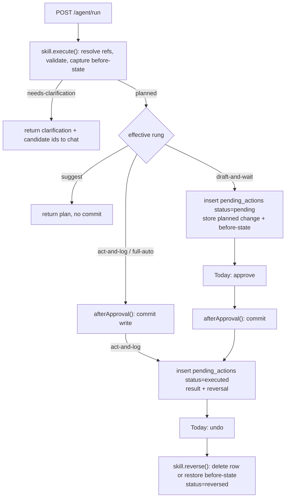

# FelixOS Record-Management Agent - Plan

**Target repo:** FelixOS. All paths are repo-relative.

This plan extends the Phase 3 agent + skills framework (`docs/plans/2026-06-30-004-feat-felixos-agent-skills-phase3-plan.md`) and the Phase 5 surfaces (`docs/plans/2026-06-30-006-feat-felixos-surfaces-phase5-plan.md`). Read both before working any unit. Foundation contracts (RLS, ALS-scoped client, composite FKs, migration numbering) and the Phase 3 trust-ladder / `SkillDescriptor` contract are the direct base.

**Product Contract preservation:** unchanged. R1–R7 and AE1–AE5 are carried verbatim from the requirements-only artifact; this pass adds the Planning Contract, Implementation Units, Verification Contract, and Definition of Done, and resolves the three Outstanding Questions into KTDs.

---

## Goal Capsule

- **Objective:** Make the FelixOS agent the primary writer of the entity spine (accounts, contacts, deals, interactions) — driven by in-app conversation — under a per-skill trust ladder with a reversible audit trail. The UI becomes review-and-override, with a thin manual-edit fallback.
- **Product authority:** Tony Myers (founder, operator, tenant #1).
- **Open blockers:** None. The three brainstorm Outstanding Questions are resolved in KTD-2/KTD-4/KTD-5. One frozen-contract change is required and was approved during planning (KTD-1 — trust-ladder unification).
- **Stop conditions:** Stop and surface if RLS strategy, the ALS-scoped client, the privileged-client boundary, or the frozen `SkillDescriptor` field shape would need to change. KTD-1 deliberately changes trust-ladder *behavior* (not the `SkillDescriptor` shape) — that change is in scope and approved; any further Phase 3 contract change is not.

---

## Product Contract

### Problem Frame

FelixOS already has the machinery to be agent-operated but doesn't use it for the CRM spine. Phase 3 built the agent + skills framework (trust ladder: `suggest` → `draft-and-wait` → `act-and-log` → `full-auto`, `pending_actions`, provider abstraction, `POST /agent/run`). Phase 5 built the review surface (command-center "Today" with approve/edit/reject, one click to source). The entity spine has write APIs (`POST/PATCH /entities`, `POST /contacts`, `POST/PATCH /deals`, `POST /interactions`).

Two things are missing for Tony's vision: (1) **action-skills that mutate the entity spine** — today only `CreateTaskSkill` and `DraftEmailSkill` exist; and (2) **a conversational front door** — `POST /agent/run` is a stateless one-shot HTTP call with no chat UI and no inbound messaging connectors.

The "should the human edit records, or the agent?" question is a false binary. The trust ladder already resolved it into a spectrum: records are mutated by skills, and *who is in the loop* is a per-skill rung. This phase supplies the missing skills and the front door, sets conservative-but-useful default rungs, and adds the reversibility that makes lower-friction rungs safe.

### Actors

- **A1. Tony** — operator and tenant #1; talks to the agent to manage records, and reviews/overrides/undoes on Today.
- **A2. The Record-Management Agent** — the existing Phase 3 agent, now equipped with entity-mutation skills; proposes or performs record changes per each skill's effective rung.

### Key Decisions (from brainstorm)

- **Agent is the primary writer; UI is review + thin fallback.** Conversational is the main mutation path; the UI keeps a small set of quick manual controls as a fallback. Full CRUD-everywhere buttons are out.
- **In-app chat is the first front door.** External connectors (SMS/email/Slack) are a deliberate later phase.
- **Default rungs are risk-tiered.** Additive/low-risk skills default to `act-and-log`; edits, deal-stage changes, and destructive skills default to `draft-and-wait`. Every rung remains promotable per-skill via `PUT /agent/rungs/:skillName`.
- **Act-and-log requires reversibility.** Every agent-performed write records enough state to be undone, and is undoable from Today.

### Requirements in scope

- **R1. Entity-mutation skills.** The agent gains action-skills wrapping the entity spine: create-account, update-account, create-contact, update-contact, create-deal, update-deal-stage, log-interaction. Each is a registered `Skill` consistent with Phase 3 R15/R16.
- **R2. Risk-tiered default rungs.** Additive skills (log-interaction, create-contact, create-account) ship at `act-and-log`; edit skills (update-account, update-contact, update-deal-stage) ship at `draft-and-wait`. Defaults are promotable/demotable per-skill.
- **R3. Reversible audit trail.** Every agent-performed entity mutation records enough before/after state to be undone, and is undoable from Today. Draft-and-wait items continue through the existing `pending_actions` approve/edit/reject loop.
- **R4. In-app conversational surface.** A chat surface in the authenticated shell drives `POST /agent/run`; context-aware on account drill-in (passes `entityId`).
- **R5. Ambiguity is confirmed, not guessed.** An instruction referencing an entity that doesn't uniquely resolve surfaces a disambiguation/confirmation rather than silently creating a duplicate or editing the wrong row.
- **R6. Thin manual UI fallback.** A small set of direct-edit controls remains (create account, edit a single field, change deal stage).
- **R7. Tenant isolation preserved.** Every new skill executes through the ALS-scoped non-privileged client under RLS; no new privileged-client surface.

### Acceptance examples in scope

- **AE1 (R1, R2, R4).** "Log that I had a kickoff call with Acme today" → `log-interaction` runs at `act-and-log`, an interaction row is created for Acme, and it appears on Today as a reversible act-and-log entry.
- **AE2 (R2, R3).** "Move the Acme deal to negotiation" → a `pending_actions` item is queued (not applied) and appears on Today for approve/edit/reject.
- **AE3 (R3).** An act-and-log mutation the agent performed → clicking undo on Today restores the record to its prior state, and the reversal is itself audited.
- **AE4 (R5).** "Add Jordan as a contact at Acme" when two accounts match "Acme" → the agent asks which account (or to create one) before writing anything.
- **AE5 (R7).** Tenant B data present → tenant A's agent mutation reads/writes no tenant B row — verified against real Postgres.

### Scope Boundaries

**Deferred for later**
- External inbound connectors — SMS, email, Slack ingestion (webhooks, sender→tenant identity mapping, async result delivery).
- Multi-turn conversation memory / session continuity — Phase 3 is stateless; v1 works single-turn.
- Full CRUD-everywhere UI buttons.
- Bulk / batch record operations from a single instruction.

**Outside this product's identity**
- Working *in* the business (client-facing service delivery / ticketing). These surfaces are for Tony working *on* the business.

**Deferred to Follow-Up Work**
- `full-auto` reversibility ledger rows: KTD-2 records act-and-log reversals; wiring undo for `full-auto` (not a default here) is deferred until a skill actually ships at that rung.
- Streaming chat responses — v1 is request/response (KTD-4).

---

## Planning Contract

### Key Technical Decisions

**KTD-1 — Unify the trust ladder so `execute()` plans and `afterApproval()` commits; the rung controls only *timing* (approved during planning).**
Today, write-placement is coupled to the rung: `CreateTaskSkill` (draft-and-wait) does its DB write in `afterApproval`, while the trust ladder's `act-and-log` branch calls `execute()` **only** (`packages/agent/src/trust-ladder.ts:52`). Promoting a draft-and-wait skill to `act-and-log` would therefore log an "executed" action **without writing the row** — a latent bug that R2's promotable rungs make live. Fix: make every skill rung-agnostic.
- `execute(input, ctx)` — resolve entity references, validate, and (for edits) capture before-state. Returns a discriminated result: `{ kind: "planned", change, before? }` or `{ kind: "needs-clarification", question, options }`. **No commit.**
- `afterApproval(planned, ctx)` — perform the actual DB write. This is the sole commit path.
- Trust ladder branches: `suggest` → `execute()`, return the plan, never commit. `draft-and-wait` → `execute()`; if `needs-clarification`, surface it and queue nothing; else insert a `pending_actions` row (status `pending`) carrying the planned change + before-state, deferring `afterApproval` to the approval route. `act-and-log`/`full-auto` → `execute()` then `afterApproval()` immediately; `act-and-log` writes a ledger row (status `executed`) with result + reversal.
This corrects `CreateTaskSkill` to the new model and makes the existing approve route (`apps/api/src/routes/agent.ts:200`, which already calls `afterApproval` on approval) correct for every skill. Safety-critical, **test-first**. It changes trust-ladder *behavior* only — the frozen `SkillDescriptor` field shape is untouched.

**KTD-2 — Reversible audit via extended `pending_actions` + a per-skill `reverse()` (resolves Outstanding Question: audit/undo storage shape).**
`pending_actions` is already the executed-action ledger (act-and-log inserts status `executed`; approved draft-and-wait becomes `executed`). It lacks structured result and before-state — the store currently stringifies `result` into `agentContext` (`packages/agent/src/trust-ladder-store.ts:42`). Extend rather than add a parallel table:
- Migration `0008`/`0009`: add `result jsonb`, `reversal jsonb` (inverse-operation data / before-state), `reversed_at timestamptz` to `pending_actions`; add `reversed` to the `pending_action_status` enum. Same RLS policy pattern as the existing table (isolated by `tenant_id`); no new `tenantScopedTables` entry needed, but the migration pair must be added to the hard-coded arrays in `packages/db/src/schema.test.ts`, `apps/api/src/api.integration.test.ts`, `apps/api/src/knowledge.integration.test.ts`, and `apps/api/src/agent.integration.test.ts`.
- Add optional `reverse?(record, ctx)` to the `Skill` interface — only the skill knows how to undo its own write. Creates reverse by deleting the created row (id in `result`); edits reverse by restoring `reversal` (before-state). `POST /agent/actions/:id/reverse` looks up the executed row, calls the skill's `reverse`, sets status `reversed`, stamps `reversed_at`.

**KTD-3 — Seven entity-mutation skills, risk-tiered, all committing in `afterApproval()`.**
Post-KTD-1, write placement is uniform (commit in `afterApproval`), so risk tiering lives entirely in `defaultRung`:
- `act-and-log`: `log-interaction` (`sideEffectClass: write`), `create-contact` (`write`), `create-account` (`write`).
- `draft-and-wait`: `update-account` (`write`), `update-contact` (`write`), `update-deal-stage` (`write`).
- `create-deal` defaults `draft-and-wait` (creating a deal is a commitment worth a glance), promotable.
Each skill's `execute` resolves refs via KTD-6, validates against the same enum guards the REST routes use (e.g. `deal_stage`, `account_lifecycle_stage`, `interaction_kind`), and captures before-state for edits. `requiresInference` is `false` for these skills (deterministic writes; the LLM chooses *which* skill and *what* arguments, but the write itself needs no inference).

**KTD-4 — In-app chat is a docked shell panel calling `POST /agent/run` via a Server Action, request/response (resolves Outstanding Question: chat surface placement + transport).**
A client `ChatPanel` docked in the `(app)` shell posts to a Next Server Action that calls `POST /agent/run` through the existing `apiFetch` helper (cookie-forwarding, 401→`/login`). v1 is request/response — no streaming (deferred). The panel renders the trust-ladder outcome inline: a `pending` outcome shows "Queued for your approval — see Today"; an `executed` (act-and-log) outcome shows a confirmation plus an inline **Undo**; a `needs-clarification` outcome renders the question + options (KTD-5). On account drill-in the panel passes that account's `entityId` so "log a call" resolves to the open account without naming it.

**KTD-5 — Ambiguity confirmation is a structured `needs-clarification` skill result carried through the stateless run (resolves Outstanding Question).**
Within stateless `POST /agent/run`, a skill's `execute` returns `{ kind: "needs-clarification", question, options }` where each option carries the resolved candidate id (e.g., `{ label: "Acme Corp (client)", accountId: "…" }`) or a "create new" sentinel. The agent surfaces this to chat; Tony's reply is a **new** run turn whose instruction includes the chosen id — self-contained, so no server-side session state is needed. `POST /agent/run`'s response gains a `clarification?` field alongside `response` and `pendingActionIds`.

**KTD-6 — Shared entity-reference resolver.**
A helper `resolveEntityRef` (and `resolveContactRef`) in `packages/agent` resolves a natural-language name to a tenant-scoped id: exact match → single hit; multiple/fuzzy → candidate list for KTD-5; no match → "create new" path where valid. Runs through `runWithTenantContext` + the scoped client (RLS-enforced). Every mutation skill uses it so disambiguation behaves identically everywhere.

**KTD-7 — Thin manual fallback reuses existing write APIs; no new endpoints.**
The fallback controls (create account, edit a single field, change deal stage) call the existing `POST /entities`, `PATCH /entities/:id`, `PATCH /deals/:id` via `apiFetch` + Server Actions. No new backend surface — this is UI wiring only, mirroring the Phase 5 command-center action pattern (`apps/web/app/(app)/actions.ts`).

### High-Level Technical Design

Unified trust-ladder flow (KTD-1) with clarification and audit branches:



Skill result contract (KTD-1/KTD-5), directional:

```
execute(input, ctx) -> Promise<
  | { kind: "planned"; change: TChange; before?: TBefore }
  | { kind: "needs-clarification"; question: string; options: ClarificationOption[] }
>
afterApproval(planned, ctx) -> Promise<{ result: TResult; reversal?: TReversal }>
reverse?(record: { result; reversal? }, ctx) -> Promise<void>
```

### Output Structure

New skill files (Phase 3 registry layout):

```
packages/agent/src/
  skills/
    create-account.ts
    update-account.ts
    create-contact.ts
    update-contact.ts
    create-deal.ts
    update-deal-stage.ts
    log-interaction.ts
  lib/
    entity-ref.ts        # KTD-6 resolveEntityRef / resolveContactRef
apps/web/
  components/chat/
    chat-panel.tsx       # KTD-4 docked client panel
  app/(app)/
    chat-actions.ts      # Server Action -> POST /agent/run
```

---

## Implementation Units

### U1. Audit/undo schema — extend `pending_actions`

**Goal:** Give the executed-action ledger structured result, reversal state, and a `reversed` status so agent writes are undoable (R3).
**Requirements:** R3
**Dependencies:** none
**Files:**
- `packages/db/migrations/0008_record_agent_audit.sql` (create — add `result jsonb`, `reversal jsonb`, `reversed_at timestamptz` to `pending_actions`; `ALTER TYPE pending_action_status ADD VALUE 'reversed'`)
- `packages/db/migrations/0009_record_agent_audit_rls.sql` (create — no new table; include only if grants need re-affirming, else a no-op documented as such)
- `packages/db/src/schema/agent.ts` (modify — add the three columns; extend `pendingActionStatusEnum`)
- `packages/db/src/schema.test.ts` (modify — add 0008/0009 to the migration URL array)
- `apps/api/src/api.integration.test.ts`, `apps/api/src/knowledge.integration.test.ts`, `apps/api/src/agent.integration.test.ts` (modify — add 0008/0009 to their migration arrays)
- `packages/shared-types/src/agent.ts` (modify — add `reversed` to `PendingActionStatus`; add `reversedAt` to `PendingActionView`)

**Execution note:** Safety-critical, real Postgres. Enum-value additions in Postgres cannot run inside a transaction with subsequent use of the value in older PG; verify the migration applies cleanly on a fresh Postgres 18 schema before proceeding.
**Patterns to follow:** `packages/db/migrations/0004_agent_schema.sql`; the enum + column shapes in `packages/db/src/schema/agent.ts`.
**Test scenarios:**
- Migration applies cleanly to a fresh Postgres 18 + pgvector schema; `pending_actions` has the three new columns and the enum has `reversed`.
- `Covers AE5.` RLS unchanged: tenant B cannot read/write tenant A `pending_actions` rows (existing isolation still green with new columns).
- `PendingActionView` serializes `reversedAt` (null when unset).

**Verification:** `pnpm turbo run test --filter=@felixos/db` green against real Postgres; all four integration-test migration arrays include 0008/0009.

---

### U2. Skill contract extension — planned/needs-clarification result + `reverse()`

**Goal:** Extend the `Skill` runtime contract so skills can plan-without-committing, request clarification, and describe how to reverse themselves (R1, R3, R5).
**Requirements:** R1, R3, R5
**Dependencies:** none (parallel with U1)
**Files:**
- `packages/skills/src/skill.ts` (modify — add the `execute` result union `{ kind: "planned" … } | { kind: "needs-clarification" … }`, `afterApproval` returning `{ result, reversal? }`, optional `reverse?(record, ctx)`)
- `packages/skills/src/index.ts` (modify — export new types)
- `packages/shared-types/src/agent.ts` (modify — add `ClarificationOption` and `AgentClarification` view types)
- `packages/shared-types/src/index.ts` (modify — export new types)

**Execution note:** Safety-critical (contract freeze). Run `pnpm turbo run typecheck` across all packages after this lands to confirm no downstream break; this is the shape U3/U5/U6 build against.
**Patterns to follow:** `packages/skills/src/skill.ts` existing `Skill`/`SkillContext`/`SkillResult`; `packages/shared-types/src/agent.ts` type-export shape.
**Test scenarios:**
- Type-level: a skill returning `{ kind: "planned", change }` and one returning `{ kind: "needs-clarification", question, options }` both satisfy `Skill`.
- `ClarificationOption` carries a resolved id field and/or a create-new sentinel.
- Backward-compat: `CreateTaskSkill`/`DraftEmailSkill` still typecheck (adjusted in U3).

**Verification:** `pnpm turbo run typecheck` green across `@felixos/skills`, `@felixos/shared-types`, `@felixos/agent`, `@felixos/api`.

---

### U3. Unify the trust ladder (execute=plan, afterApproval=commit)

**Goal:** Make skills rung-agnostic and correct across promotion/demotion; fix the latent act-and-log-no-write bug (R2, R3).
**Requirements:** R2, R3
**Dependencies:** U1, U2
**Files:**
- `packages/agent/src/trust-ladder.ts` (modify — new branch semantics per KTD-1; short-circuit on `needs-clarification`; act-and-log/full-auto call `execute` then `afterApproval`; draft-and-wait plans via `execute` and stores planned change + before-state)
- `packages/agent/src/trust-ladder-store.ts` (modify — persist structured `result` and `reversal` into the new columns instead of stringifying into `agentContext`)
- `packages/agent/src/skills/create-task.ts` (modify — migrate to plan/commit model: `execute` returns `{ kind: "planned" }`, `afterApproval` returns `{ result }`)
- `packages/agent/src/trust-ladder.test.ts` (modify — cover the new branch semantics)
- `apps/api/src/routes/agent.ts` (verify — approve route already calls `afterApproval`; adjust to persist returned `result`/`reversal` and handle the `needs-clarification`/`clarification` field on `/run`)

**Execution note:** Safety-critical. **Test-first**: write the failing test asserting an `act-and-log` skill both commits (via `afterApproval`) **and** logs a ledger row, and that a `draft-and-wait` skill plans (captures before-state) without committing, before changing `trust-ladder.ts`. This is the approved frozen-contract change (KTD-1).
**Patterns to follow:** existing `invokeThroughTrustLadder` structure in `packages/agent/src/trust-ladder.ts`; `runWithTenantContext` + `scopedDb.transaction` for writes.
**Test scenarios:**
- `suggest`: `execute` called, no commit, no ledger row.
- `draft-and-wait`: `execute` called (plans + captures before-state), `pending_actions` row `pending` with planned change stored, `afterApproval` NOT called.
- `act-and-log`: `execute` then `afterApproval` both called exactly once; ledger row `executed` with `result` + `reversal` populated.
- `full-auto`: `execute` then `afterApproval` called; no ledger row.
- `needs-clarification` from `execute`: nothing queued, nothing committed; outcome carries the clarification.
- Promotion correctness: a skill at `draft-and-wait` promoted to `act-and-log` (via `PUT /agent/rungs/:skillName`) now actually writes — the regression this unit fixes.
- `Covers AE2.` A `draft-and-wait` skill run creates a `pending_actions` row and does not mutate the target table.

**Verification:** `pnpm turbo run lint typecheck test` green across `@felixos/agent` and `@felixos/api`; migrated `CreateTaskSkill` still produces an interaction on approval.

---

### U4. Entity-reference resolver

**Goal:** Shared, RLS-scoped resolution of natural-language names to tenant entity/contact ids, returning candidates for disambiguation (R5).
**Requirements:** R5
**Dependencies:** U2
**Files:**
- `packages/agent/src/lib/entity-ref.ts` (create — `resolveEntityRef`, `resolveContactRef`: exact → single; multiple/fuzzy → candidates; none → create-new eligibility)
- `packages/agent/src/lib/entity-ref.test.ts` (create)
- `packages/agent/src/index.ts` (modify — export resolvers)

**Patterns to follow:** `runWithTenantContext` + scoped select against `entities`/`contacts` (`packages/db/src/schema/entities.ts`, `contacts.ts`).
**Test scenarios:**
- Exact unique name → single resolved id.
- Two accounts match → candidate list with both ids (feeds `needs-clarification`).
- No match on an editable ref → returns "no match" (skill decides create-new vs clarify).
- `Covers AE5.` Resolver run as tenant A never returns tenant B entities.

**Verification:** `pnpm turbo run test --filter=@felixos/agent` green; resolver isolation confirmed against real Postgres via the U10 gate.

---

### U5. Additive entity skills (act-and-log): create-account, create-contact, log-interaction

**Goal:** First entity-mutation skills at `act-and-log`, committing in `afterApproval`, reversible by deleting the created row (R1, R2, R3).
**Requirements:** R1, R2, R3
**Dependencies:** U3, U4
**Files:**
- `packages/agent/src/skills/create-account.ts`, `create-contact.ts`, `log-interaction.ts` (create)
- matching `*.test.ts` for each (create)
- `packages/agent/src/registry.ts` (modify — register the three skills in `defaultRegistry`)

**Approach:** Each `execute` validates input (reusing the same enum guards as the REST routes — `interaction_kind`, `account_lifecycle_stage`), resolves account/contact refs (U4), returns `{ kind: "planned", change }` or `{ kind: "needs-clarification" }`. `afterApproval` inserts the row via `runWithTenantContext` + scoped `transaction` and returns `{ result: { id }, reversal: { deletedId: id } }`. `reverse` deletes by id. `defaultRung: "act-and-log"`, `requiresInference: false`.
**Patterns to follow:** `packages/agent/src/skills/create-task.ts` (post-U3 model); route insert shapes in `apps/api/src/routes/contacts.ts`, `entities.ts`, `interactions.ts`.
**Test scenarios:**
- `Covers AE1.` `log-interaction` at `act-and-log`: interaction row created for the resolved account; ledger row `executed` with reversal.
- `create-contact`/`create-account` create the row; `reverse` deletes it and sets status `reversed`.
- `Covers AE4.` Ambiguous account name → `needs-clarification`, no row written.
- Invalid enum (bad `interaction_kind`) → validation error before any write.
- `Covers AE5.` Created rows are tenant-scoped; tenant B cannot see them.

**Verification:** `pnpm turbo run lint typecheck test --filter=@felixos/agent` green; the three skills appear in `defaultRegistry.listDescriptors()`.

---

### U6. Edit entity skills (draft-and-wait): update-account, update-contact, update-deal-stage

**Goal:** Edit skills that queue for approval, capturing before-state at plan time and reversing by restoring it (R1, R2, R3).
**Requirements:** R1, R2, R3
**Dependencies:** U3, U4
**Files:**
- `packages/agent/src/skills/update-account.ts`, `update-contact.ts`, `update-deal-stage.ts`, `create-deal.ts` (create)
- matching `*.test.ts` for each (create)
- `packages/agent/src/registry.ts` (modify — register the four skills)

**Approach:** `execute` resolves the target ref, reads current row (before-state), validates the change (e.g. `deal_stage` guard), returns `{ kind: "planned", change, before }`. `afterApproval` applies the update and returns `{ result, reversal: before }`. `reverse` restores `before`. `defaultRung: "draft-and-wait"` (incl. `create-deal`), `requiresInference: false`.
**Patterns to follow:** `PATCH` handlers in `apps/api/src/routes/entities.ts`, `deals.ts`; enum guards via `apps/api/src/lib/validation.ts` `createSetGuard`.
**Test scenarios:**
- `Covers AE2.` `update-deal-stage` at `draft-and-wait`: `pending_actions` row `pending` with `before` captured; deal unchanged until approval.
- `Covers AE3.` After approval commits an edit, `reverse` restores the prior field values and sets status `reversed`.
- Editing a nonexistent target → error/clarification, nothing queued.
- Invalid stage value → validation error before queueing.
- `Covers AE5.` Tenant B cannot queue/approve/reverse tenant A edits.

**Verification:** `pnpm turbo run lint typecheck test --filter=@felixos/agent` green; four skills registered.

---

### U7. Undo endpoint + Today undo affordance

**Goal:** Expose reversal over HTTP and let Tony undo an act-and-log write from Today (R3).
**Requirements:** R3, AE3
**Dependencies:** U5, U6
**Files:**
- `apps/api/src/routes/agent.ts` (modify — add `POST /agent/actions/:id/reverse`: load executed row, look up skill, call `reverse`, set status `reversed` + `reversed_at`; 409 if not `executed`, 404 if missing/cross-tenant)
- `apps/api/src/agent.integration.test.ts` (modify — reverse-path scenarios)
- `apps/web/lib/agent.ts` (modify — `reversePendingAction(id)`)
- `apps/web/app/(app)/actions.ts` (modify — `reverseAction` Server Action)
- `apps/web/components/command-center/pending-item.tsx` (modify — show Undo on executed act-and-log items)
- `apps/web/app/(app)/page.tsx` (modify — surface an "executed (undoable)" slice; reuse `GET /agent/pending?status=executed`)

**Execution note:** Safety-critical (mutation endpoint). Test-first for the reverse route: assert a reversed create deletes the row and a reversed edit restores prior values.
**Patterns to follow:** the approve/reject handlers in `apps/api/src/routes/agent.ts`; the command-center Server Action pattern.
**Test scenarios:**
- `Covers AE3.` Reversing an executed create deletes the created row; reversing an executed edit restores before-state; status → `reversed`.
- Reversing a non-`executed` action → 409; nonexistent/cross-tenant id → 404.
- Double-reverse → 409.
- `Covers AE5.` Tenant B cannot reverse tenant A actions (RLS + auth).

**Verification:** `pnpm turbo run test --filter=@felixos/api` green; Today shows Undo on act-and-log items and it works end-to-end against seeded data.

---

### U8. In-app chat surface

**Goal:** A docked chat panel that drives `POST /agent/run`, renders trust-ladder outcomes and clarifications, and is account-context-aware (R4, R5).
**Requirements:** R4, R5, AE4
**Dependencies:** U7
**Files:**
- `apps/web/components/chat/chat-panel.tsx` (create — `'use client'` docked panel)
- `apps/web/app/(app)/chat-actions.ts` (create — Server Action → `POST /agent/run` via `apiFetch`)
- `apps/web/lib/agent.ts` (modify — `runAgent(query, entityId?)` wrapper)
- `apps/web/app/(app)/layout.tsx` (modify — mount the panel in the shell)
- `apps/web/app/(app)/accounts/[id]/page.tsx` (modify — pass `entityId` context to the panel)

**Approach:** Request/response, no streaming (KTD-4). Render a `pending` outcome as "Queued — see Today", an `executed` outcome with inline Undo, and a `needs-clarification` outcome as the question + option buttons; selecting an option submits a follow-up run turn including the chosen id (KTD-5). On drill-in, the panel is seeded with the account `entityId`.
**Execution note:** Multi-page / route-level-chrome change — Playwright E2E is mandatory per AGENTS.md (covered in U10).
**Patterns to follow:** `apps/web/app/(app)/actions.ts` Server Actions; `apiFetch`/`apiPost` in `apps/web/lib/api.ts`.
**Test scenarios:**
- `runAgent` posts query (+ entityId when present) and returns the parsed outcome; unit-tested in `apps/web/lib/agent.test.ts`.
- `Covers AE4.` A `needs-clarification` response renders options; selecting one submits a follow-up run carrying the id.
- A `pending` outcome renders the "see Today" affordance; an `executed` outcome renders Undo.
- On drill-in, the panel includes the account `entityId` in its run call.

**Verification:** `apps/web/lib/agent.test.ts` green; `/ce-test-browser` walkthrough of a chat instruction producing an act-and-log write and a draft-and-wait queue.

---

### U9. Thin manual fallback controls

**Goal:** Keep a small set of direct-edit controls for when the agent is overkill/unavailable (R6).
**Requirements:** R6
**Dependencies:** U8 (shell chat present; independent otherwise)
**Files:**
- `apps/web/app/(app)/accounts/page.tsx` (modify — "New account" control → `POST /entities`)
- `apps/web/app/(app)/accounts/[id]/page.tsx` (modify — inline single-field edit + deal-stage control → `PATCH /entities/:id`, `PATCH /deals/:id`)
- `apps/web/app/(app)/actions.ts` (modify — Server Actions for the above)
- `apps/web/lib/entities.ts` (modify — `createAccount`, `updateAccountField`, `updateDealStage` wrappers)
- `apps/web/lib/entities.test.ts` (modify)

**Approach:** UI wiring only, reusing existing write APIs (KTD-7). No new backend surface.
**Patterns to follow:** existing `apps/web/lib/entities.ts` fetchers; command-center Server Action pattern.
**Test scenarios:**
- `createAccount` posts to `/entities` and revalidates the list.
- `updateDealStage` patches `/deals/:id`; invalid stage rejected client-side before the call.
- Single-field account edit patches and re-renders.

**Verification:** `apps/web/lib/entities.test.ts` green; `/ce-test-browser` confirms create/edit fallback works without the agent.

---

### U10. Phase-gate integration test

**Goal:** Prove tenant isolation, trust-ladder correctness, undo round-trips, and the ambiguity flow against real Postgres (R1–R7).
**Requirements:** R1–R7, AE1–AE5
**Dependencies:** U5, U6, U7, U8
**Files:**
- `apps/api/src/agent.integration.test.ts` (modify — add record-management scenarios)
- `apps/web/e2e/chat-record-management.spec.ts` (create — Playwright, per AGENTS.md pre-merge gate for multi-page/chrome work)

**Execution note:** Safety-critical — every scenario is a gate; a red test means the phase is not shippable. Real Postgres 18 + pgvector; no mocks for isolation claims.
**Test scenarios:**
- `Covers AE1.` Chat "log a call with Acme" → interaction created, act-and-log ledger row, undoable.
- `Covers AE2.` "Move Acme deal to negotiation" → queued, deal unchanged until approval.
- `Covers AE3.` Undo an executed create and an executed edit → row deleted / before-state restored; status `reversed`.
- `Covers AE4.` Ambiguous "Acme" → clarification before any write; follow-up with chosen id completes it.
- `Covers AE5.` Every new skill: tenant A run leaves tenant B rows untouched and invisible.
- Promotion: `update-deal-stage` promoted to `act-and-log` commits immediately (no pending row) — regression guard for KTD-1.

**Verification:** `TEST_DATABASE_URL=… pnpm --filter @felixos/api test` passes 100%; `pnpm --filter @felixos/web exec playwright test` green locally against the seeded stack.

---

## Verification Contract

| Command | Applicability |
|---|---|
| `pnpm install` | Before any other step |
| `pnpm turbo run lint typecheck test build` | Repo-wide gate (AGENTS.md Standard Commands) |
| `pnpm turbo run test --filter=@felixos/db` | U1 migration + schema tests against real Postgres |
| `TEST_DATABASE_URL=… pnpm --filter @felixos/api test` | U3, U7, U10 integration + isolation tests |
| `pnpm --filter @felixos/web exec playwright test` | U10 chat E2E (Docker Compose stack + `pnpm db:seed`) |
| `pnpm format:check` | Repo-wide formatting gate |
| `/ce-test-browser` | Manual pass on chat + Today undo + manual fallback |

---

## Definition of Done

- All 10 units implemented; every listed test scenario passes.
- `pnpm turbo run lint typecheck test build` green at the repo root; `pnpm format:check` clean.
- Migrations 0008/0009 apply cleanly to a fresh Postgres 18 + pgvector schema and are present in all four integration-test migration arrays.
- Trust ladder is unified (KTD-1): `act-and-log` skills both commit and log; promoting a `draft-and-wait` skill to `act-and-log` actually writes — proven by the U10 regression test. `CreateTaskSkill` migrated to the plan/commit model.
- Seven entity-mutation skills registered in `defaultRegistry` at their risk-tiered default rungs (R2).
- Every agent entity write is reversible from Today; reversal is audited (`reversed` status + `reversed_at`) — AE3 verified.
- Ambiguous references produce a clarification before any write — AE4 verified.
- In-app chat drives record mutations end-to-end and is account-context-aware on drill-in; thin manual fallback works without the agent.
- Tenant isolation holds for every new skill and the reverse endpoint — AE5 verified against real Postgres.
- All GitHub issues for this phase closed via `Closes #N`; `/ce-compound` run for the trust-ladder unification learning.

---

## Open Questions

**Deferred to Implementation**
- Fuzzy-match strategy for `resolveEntityRef` (exact + case-insensitive contains for v1; trigram/pg_trgm only if seeded data proves it necessary).
- Whether the `0009` RLS migration is a documented no-op (no new table) or re-affirms grants — confirm against the 0005 pattern at implementation time.
- Chat panel visual placement (right-docked drawer vs bottom bar) — resolve during `/ce-frontend-design`, within the dense/quiet AGENTS.md style.

---

[](https://github.com/EveryInc/compound-engineering-plugin)
